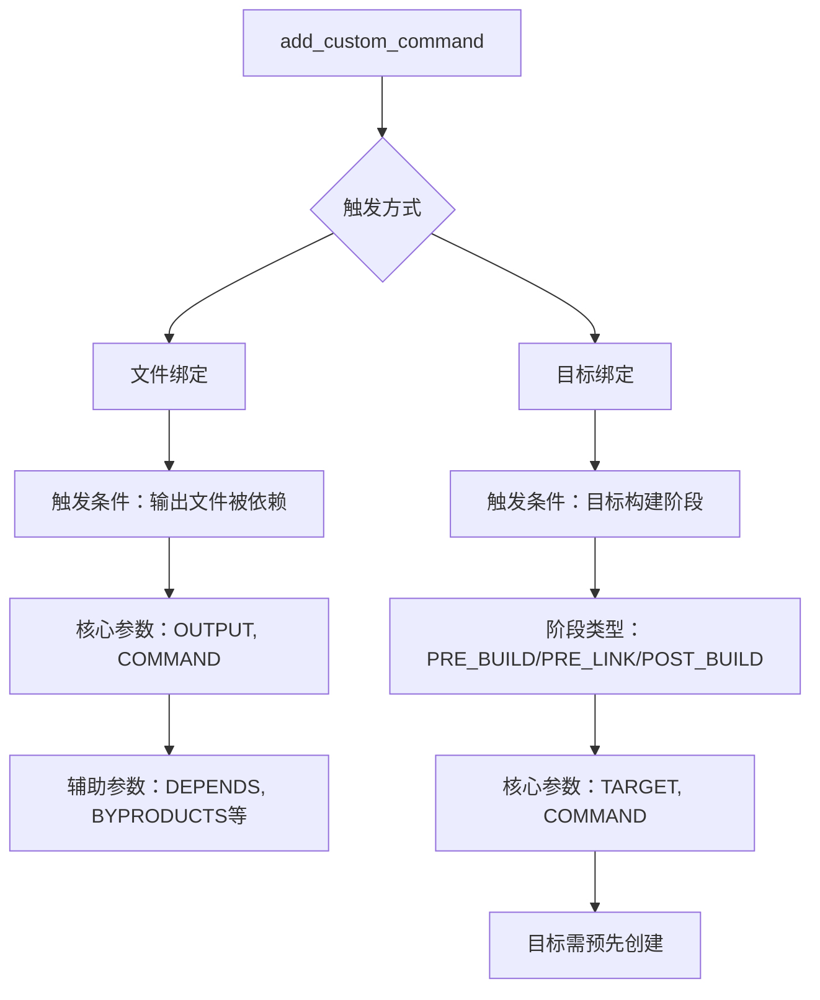

## 一、前言

CMake作为C++的跨平台构建工具，需要应对C++语言本身的多范式特性带来的构建复杂性。由于同一功能在C++中常存在多种实现路径，CMake必须提供灵活的扩展机制来满足个性化构建需求。为此，CMake引入了接口命令的设计模式：用户可以通过自定义命令实现特定功能，CMake则负责将这些自定义逻辑集成到构建流程中，最终转换为具体的构建指令（如生成Makefile或直接执行操作）。

这种设计理念与Linux的 `ioctl` 机制形成巧妙类比：两者都是在基础功能框架（CMake的标准构建流程/Linux的基础文件操作）之上，通过用户可定义的扩展接口来覆盖多样化场景。CMake的接口命令机制既保持了核心构建流程的稳定性，又通过开放扩展点实现了对复杂需求的适应性，最终在标准化与个性化之间取得平衡。

### 1.1 感性认知  

在介绍具体的参数等详细内容之前，先想想在编译时有哪些场景需求：

1. 需要在某些文件或目标操作前执行特定动作（如条件检查）。
2. 希望CMake自动安排执行时机，避免手动调用导致的遗漏。
3. 不明确具体执行时间，仅需保证在目标或条件之前完成。

在编程中，当遇到某些操作执行时机不确定（如文件生成后、构建完成时等）的情况时，一种常见的解决方案是采用回调函数机制：先将回调函数注册到能够感知条件变化的模块（如操作系统），待条件满足时自动触发执行。类似地，在 C/C++ 的编译构建过程中，CMake 需要承担类似“操作系统”的角色，提供编译时感知变化和执行操作的能力。为此，CMake 设计了 add_custom_command 命令，允许开发者注册自定义命令，并在特定构建条件（如文件依赖、目标生成等）满足时自动执行，从而增强编译时的灵活性和控制力。

## 二、命令详解

CMake提供了一种类似回调函数的编译机制，允许用户在特定编译阶段插入自定义操作。与传统的回调函数类似，其执行内容由用户定义，而执行时机由CMake在编译过程中自动触发。该机制的核心在于解决两个关键问题：触发方式以及用户可执行的操作范围。

1. __触发方式__: CMake通过以下两种方式触发用户定义的命令：  
    + 与文件绑定：当特定文件（如源文件或配置文件）被修改或参与编译时，相关命令自动执行。
    + 与目标（Target）绑定：将命令关联到具体编译目标（如可执行文件或库），在目标构建的特定阶段（如编译前、链接后）触发。

2. __可执行操作__  
    用户通过COMMAND关键字指定需要运行的命令，支持调用外部工具、脚本或CMake内置函数，从而实现对编译流程的灵活干预。

### 2.1 与文件绑定的触发方式

命令参数如下：

```cmake
add_custom_command(OUTPUT output1 [output2 ...]
                   COMMAND command1 [ARGS] [args1...]
                   [COMMAND command2 [ARGS] [args2...] ...]
                   [MAIN_DEPENDENCY depend]
                   [DEPENDS [depends...]]
                   [BYPRODUCTS [files...]]
                   [IMPLICIT_DEPENDS <lang1> depend1
                                    [<lang2> depend2] ...]
                   [WORKING_DIRECTORY dir]
                   [COMMENT comment]
                   [DEPFILE depfile]
                   [JOB_POOL job_pool]
                   [JOB_SERVER_AWARE <bool>]
                   [VERBATIM] [APPEND] [USES_TERMINAL]
                   [COMMAND_EXPAND_LISTS]
                   [DEPENDS_EXPLICIT_ONLY])
```

命令参数解释：

> ***
> 
> 引自泡沫o0 [CMake深度解析：掌握add_custom_command，精通Makefile生成规则（一）](https://developer.aliyun.com/article/1465043)
> 
> 这个命令的主要作用是定义一条自定义的构建规则，这条规则可以在构建过程中执行一系列的命令。下面我们来详细解析这个命令的各个参数:
>
>   + OUTPUT output1 [output2 ...]：这个参数用于指定自定义命令的输出文件。这些文件在构建过程中会被生成，如果这些文件不存在，那么CMake就会执行这条自定义命令。
>   + COMMAND command1 [ARGS] [args1...]：这个参数用于指定要执行的命令。你可以提供任何有效的命令，包括系统命令、脚本，或者其他的构建工具。ARGS关键字后面可以跟随一系列的参数，这些参数会被传递给命令  。
>   + MAIN_DEPENDENCY depend：这个参数用于指定自定义命令的主要依赖。如果这个依赖的文件被修改，那么自定义命令就会被执行。
>   + DEPENDS [depends...]：这个参数用于指定自定义命令的其他依赖。如果这些依赖的文件被修改，那么自定义命令也会被执行。
>   + BYPRODUCTS [files...]：这个参数用于指定自定义命令的副产品。如果你指定了一个或多个文件作为副产品，那么这些文件将会被添加到构建系统的清理列表中。
>   + WORKING_DIRECTORY dir：这个参数用于指定自定义命令的工作目录。如果你没有指定这个参数，那么自定义命令将会在当前的源码目录中执行。
>   + COMMENT comment：这个参数用于指定一个注释，这个注释将会在执行自定义命令时被打印出来。
>   + VERBATIM：这个参数用于控制命令参数的处理方式。如果你指定了VERBATIM，那么命令参数将会被按照字面意义处理，而不会被解析为变量或表达式
> 
> ***

该形式通过 `OUTPUT` 参数定义命令生成的输出文件，当其他构建目标依赖这些文件时自动触发命令执行。其语法包含大量可选参数，但核心逻辑聚焦于三个关键问题：

#### 2.1.1 触发时机（何时执行）

当 `OUTPUT` 指定的文件被其他目标直接或间接引用时（类似Makefile的依赖链机制），命令自动执行。例如：若目标 A 依赖文件 B，而文件B由该命令的 `OUTPUT` 定义，则构建 `A` 时触发命令以生成 `B`。

#### 2.1.2 执行内容（执行什么操作）

通过 `COMMAND` 参数指定具体操作，支持多命令顺序执行。

操作类型包括：

+ 跨平台命令：使用`${CMAKE_COMMAND} -E`调用`CMake`内置工具（如文件复制、打印等）。
+ 脚本执行：运行Python或其他解释器命令。
+ 平台相关工具：直接调用系统命令或第三方构建工具。

#### 2.1.3 条件约束与输出结果

__依赖管理__：`DEPENDS`参数声明输入文件依赖，其变更会触发命令重新执行。

__副产品标记__：`BYPRODUCTS`用于指定非核心输出文件（如日志或临时文件），这些文件不影响触发逻辑，但可用于监控执行状态。

__其他控制参数__：如`WORKING_DIRECTORY`（设置执行目录）、`COMMENT`（输出日志）等，用于细化执行环境。

### 2.2 与目标绑定的触发方式

语法格式：

```cmake
add_custom_command(TARGET <target>
                   PRE_BUILD | PRE_LINK | POST_BUILD
                   COMMAND command1 [ARGS] [args1...]
                   [COMMAND command2 [ARGS] [args2...] ...]
                   [BYPRODUCTS [files...]]
                   [WORKING_DIRECTORY dir]
                   [COMMENT comment]
                   [VERBATIM]
                   [COMMAND_EXPAND_LISTS])
```

该形式将命令直接绑定到已创建的构建目标（如库或可执行文件），并通过构建阶段参数精确控制执行时机：

+ __触发机制__：命令与单个目标（通过`add_library`，`add_excutable`等命令预先创建）绑定，在指定构建阶段自动执行：  
    - `PRE_BUILD`：目标编译开始前（注意：实际在Visual Studio中于编译前执行，其他生成器可能略有差异）。
    - `PRE_LINK`：目标文件编译完成、链接操作开始前，适用于生成或更新链接依赖文件。
    - `POST_BUILD`：目标构建完成后，用于后处理任务（如文件复制、测试验证）。

+ __参数兼容性__：支持`COMMAND`、`BYPRODUCTS`等参数，逻辑与文件绑定方式一致。

+ __关键限制__：仅支持绑定到单个目标，且目标必须在命令定义前已存在。

### 2.3 总结

CMake的 `add_custom_command` 命令通过两种互补的触发机制，实现了构建流程的灵活定制：

+ 文件绑定方式基于依赖链的被动触发，适用于生成中间文件的场景，通过OUTPUT和依赖关系控制执行时机。
+ 目标绑定方式基于构建阶段的主动触发，通过`PRE_BUILD、PRE_LINK、POST_BUILD`精准嵌入目标生命周期。

两种方式均通过 `COMMAND` 定义操作内容，并支持丰富的参数细化执行环境。这一设计平衡了自动化构建与用户定制需求，使CMake在维护构建可靠性的同时具备高度可扩展性。




## 三、参考文献  

1. [CMake深度解析：掌握add_custom_command，精通Makefile生成规则（一）](https://developer.aliyun.com/article/1465043)  
2. [CMAKE官方](https://cmake.org/cmake/help/latest/command/add_custom_command.html)  
