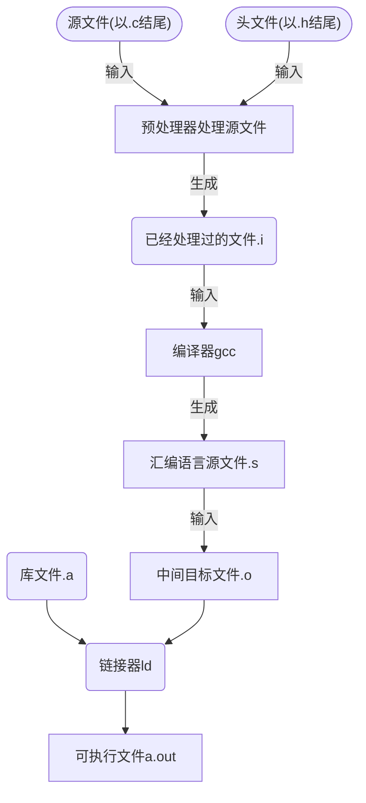

```mermaid
flowchart TD
    A(["源文件(以.c结尾)"]) --"输入"--> C["预处理器处理源文件"]
    B(["头文件(以.h结尾)"]) --"输入"--> C
    
    C --"生成" --> D("已经处理过的文件.i")

    D --"输入"-->E["编译器gcc"]
    
    E --"生成"--> F["汇编语言源文件.s"]

    F --"输入"--> G["中间目标文件.o"]

    H("库文件.a") -->I("链接器ld")
    G-->I

    I-->J["可执行文件a.out"]

```
