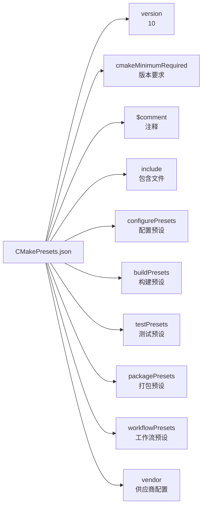

## 一、前言

CMake项目通常需要管理多套编译参数配置。官方提出了两个核心需求：

1. 配置共享：便于团队成员间共享通用的项目配置设置。
2. CI/CD一致性：在持续集成环境中确保构建配置的一致性。

但官方说明未能充分体现预设功能的真正价值。在实际开发中：

+ 一个项目往往包含正式版本和多个测试版本。
+ 不同版本需要不同的编译参数配置。
+ 版本间的参数差异是常态化需求。

在传统解决方案中，常见的做法是编写本地脚本（Shell/PowerShell等），通过命令行参数传递不同版本的配置。这种方法虽然可行，但存在维护复杂、可移植性差等问题。

最重要的优势在于：不同的配置项可由熟悉这套编译的人来维护，其他人只需要知道功能需求，然后传入对应的预设项即可完成项目的编译和使用。

## 二、读取方式

要掌握CMake Presets（预设）功能，我们首先要弄明白两个核心问题。

### 2.1 CMake怎么知道我们要使用Preset功能？

这个问题很简单直接。CMake本身并不知道你“想”做什么，它只认你“输入”的命令。

+ <b>使用Preset</b>：当你在命令行中明确使用 --preset 参数时，例如：  
    ```bash
     cmake --preset my_linux_config  # 配置阶段
     cmake --build --preset my_debug_build  # 编译阶段
    ```  
    这条命令就明确地告诉CMake：“请激活并使用名为 my_linux_config 的预设。”

+ <b>不使用Preset</b>：如果你像传统方式一样，直接使用 -D 等参数来配置，例如：  
    ```bash
    cmake -B build -DCMAKE_BUILD_TYPE=Release -DOPTION_A=ON ...
    ```  
    那么CMake就会按照你提供的这些零散参数进行配置，完全不会去理会Preset功能。

所以，结论是：Preset功能的开关完全由用户通过 --preset 参数控制，CMake被动响应。

### 2.2 CMake去哪里找、又怎么找到我指定的那个Preset呢？

这是Preset功能的核心。CMake会严格按照既定规则在项目根目录下寻找两个特定名称的JSON配置文件：

1. CMakePresets.json：这是项目级共享配置。
   + 它通常由项目维护者创建，包含的是为这个项目定义好的、标准的构建配置（比如“Release”、“Debug”、“CI-Build”等）。
   + 这个文件应该被纳入Git/SVN等版本控制系统，确保所有开发者看到的预设都是一致的。

2. CMakeUserPresets.json：这是用户级私有配置。  
    + 它用于存放开发者个人的、实验性的或与本机环境强相关的配置（比如你个人的开发调试配置、链接特定路径的库等）。
    + 这个文件通常会被添加到 .gitignore 中，避免被意外提交，从而不影响他人。

__为什么要有两个文件？__

这是一种非常巧妙的设计，它完美地区分了**“团队约定”和“个人偏好”**。项目规定的配置大家共用，而你的个人魔改则只影响你自己，互不干扰。

<b>非常重要的是</b>：

+ CMake只认上面这两个文件名。它们的名字是固定的，不能随意更改。
+ 如果你创建了一个 CMakeMyPresets.json，CMake在运行时是完全不会去读取它的。这个设计是为了避免配置文件的混乱，保证工具能准确定位到配置信息。

## 三、配置文件

cmake如何识别哪些配置项呢？先看cmake官方提供的一个样例:

```json
{
  "version": 10,
  "cmakeMinimumRequired": {
    "major": 3,
    "minor": 23,
    "patch": 0
  },
  "$comment": "An example CMakePresets.json file",
  "include": [
    "otherThings.json",
    "moreThings.json"
  ],
  "configurePresets": [
    {
      "$comment": [
        "This is a comment row.",
        "This is another comment,",
        "just because we can do it"
      ],
      "name": "default",
      "displayName": "Default Config",
      "description": "Default build using Ninja generator",
      "generator": "Ninja",
      "binaryDir": "${sourceDir}/build/default",
      "cacheVariables": {
        "FIRST_CACHE_VARIABLE": {
          "type": "BOOL",
          "value": "OFF"
        },
        "SECOND_CACHE_VARIABLE": "ON"
      },
      "environment": {
        "MY_ENVIRONMENT_VARIABLE": "Test",
        "PATH": "$env{HOME}/ninja/bin:$penv{PATH}"
      },
      "vendor": {
        "example.com/ExampleIDE/1.0": {
          "autoFormat": true
        }
      }
    },
    {
      "name": "ninja-multi",
      "inherits": "default",
      "displayName": "Ninja Multi-Config",
      "description": "Default build using Ninja Multi-Config generator",
      "generator": "Ninja Multi-Config"
    },
    {
      "name": "windows-only",
      "inherits": "default",
      "displayName": "Windows-only configuration",
      "description": "This build is only available on Windows",
      "condition": {
        "type": "equals",
        "lhs": "${hostSystemName}",
        "rhs": "Windows"
      }
    }
  ],
  "buildPresets": [
    {
      "name": "default",
      "configurePreset": "default"
    }
  ],
  "testPresets": [
    {
      "name": "default",
      "configurePreset": "default",
      "output": {"outputOnFailure": true},
      "execution": {"noTestsAction": "error", "stopOnFailure": true}
    }
  ],
  "packagePresets": [
    {
      "name": "default",
      "configurePreset": "default",
      "generators": [
        "TGZ"
      ]
    }
  ],
  "workflowPresets": [
    {
      "name": "default",
      "steps": [
        {
          "type": "configure",
          "name": "default"
        },
        {
          "type": "build",
          "name": "default"
        },
        {
          "type": "test",
          "name": "default"
        },
        {
          "type": "package",
          "name": "default"
        }
      ]
    }
  ],
  "vendor": {
    "example.com/ExampleIDE/1.0": {
      "autoFormat": false
    }
  }
}
```

从json中主要分为了配置文件对cmake的版本要求以及如何读取它，configure阶段，build阶段，以及打包、测试等等功能。总体如下：



### 3.1 项目要求

1. `version`，表示当前json使用哪个版本，这是由于不同版本新增的功能不一样，有些只需要旧版本即可。
2. `cmakeMinimumRequired`，表示cmake的版本最低要求，这个和前面的版本分开的，应该是cmake本身的版本和配置文件版本进行分离吧。
3. `comment`，这个就是对整个项目的注释说明。

### 3.2 引入外部功能

`CMake Presets` 中的 `include` 指令用于集成外部预先定义好的配置集合，这是一种高效的配置管理范式。其核心思想是将配置按不同维度（如目标平台、构建环境）进行物理隔离，每个独立的JSON文件仅封装一个完整的配置单元（例如，从 configurePresets 到 packagePresets 的所有设置）。

以下是一种推荐的项目结构，它清晰地体现了这种模块化思想：

```bash
my_project/
├── CMakePresets.json           # 主文件，只负责 include
├── cmake/presets/
│   ├── windows.json            # 配置项1：纯 Windows 配置
│   ├── linux.json              # 配置项2：纯 Linux 配置  
│   ├── macos.json              # 配置项3：纯 macOS 配置
│   └── ci.json                 # 配置项4：纯 CI 配置
└── CMakeLists.txt
```

每个配置单元文件都是自包含的。例如，`windows.json` 中定义了该平台下完整的预设：

```json
{
  "version": 8,
  "configurePresets": [
    {
      "name": "windows-dev",
      "displayName": "Windows Development",
      "generator": "Visual Studio 17 2022",
      "architecture": "x64",
      "cacheVariables": {
        "CMAKE_C_COMPILER": "cl",
        "CMAKE_CXX_COMPILER": "cl",
        "CMAKE_BUILD_TYPE": "Debug"
      }
    }
  ]
  // 可根据需要继续定义 buildPresets, testPresets 等
}
```

主配置文件 `CMakePresets.json` 的结构因此变得非常简洁，其唯一职责就是通过 `include` 指令引入这些分散的配置单元：

```json
{
  "version": 8,
  "include": [
    "cmake/presets/windows.json",
    "cmake/presets/linux.json",
    "cmake/presets/macos.json",
    "cmake/presets/ci.json"
  ]
}
```

值得注意的是，主文件自身无需再定义任何具体的预设（presets），所有预设都已在其引入的各个文件中声明完毕。

这种架构的优势在于实现了配置的极致解耦与高可维护性。当需要增删或修改某个特定环境（如放弃对macOS的支持）的配置时，只需直接操作对应的单个文件（删除macos.json并在主文件中移除其include条目即可），整个过程不会波及其他配置，极大降低了管理的复杂度和出错风险。

### 3.3 传统cmake功能

这里主要讲的是四个功能：

1. `configurePresets`
    + 配置阶段的预设，即使用命令`cmake -S . -B build -Dxx=xxx`，等等各类参数，生成一个makefile或者是ninja等等配置参数文件。

2. `buildPresets`
    + 编译阶段，即调用后端的make或者是ninja等等命令执行编译。

3. `testPresets`
    + 单元测试阶段，即调用ctest命令执行的单元测试。

4. `packagePresets`
    + 打包功能的相关配置项。

### 3.4 工作流

这个个人感觉是CI/CD用的，个人没怎么用过，感觉是开源库之类用的比较多吧。

### 3.5 vendor

vendor字段为CMake preset提供了向后兼容的扩展方式，第三方工具可以在这里添加自己的配置，而不会影响CMake的核心功能。

## 四、核心模板说明：`configurePresets`

首先，`configurePresets`是一个数组，数组元素是一个能够描述构建时的json对象。这样做的目的是按类别分，即配置时有多种配置项。

而一个json对象可以由如下字段进行描述：

1. name 
    + 这是一个必需的字符串，表示预设的机器友好名称。
    + 此标识符用于 `cmake --preset` 选项中。
    + 在同一目录下，CMakePresets.json 和 CMakeUserPresets.json 文件合并后，不能存在两个同名的配置预设。但是，配置预设可以与构建预设、测试预设、打包预设或工作流预设同名。

2. hidden
    + 这是一个可选的布尔值，用于指定预设是否应该被隐藏。
    + 如果预设被隐藏，它不能在 `--preset=` 参数中使用，不会在CMake GUI中显示，并且即使是通过继承获得的，也不需要有有效的生成器（generator）或二进制目录（binaryDir）。隐藏的预设旨在作为其他预设通过继承字段（inherits）继承的基础。

3. inherits
    + 这是一个可选的字符串数组，表示要继承的预设名称。该字段也可以是字符串，相当于包含一个字符串的数组。
    + 预设默认会继承所有来自继承预设的字段（除了 name、hidden、inherits、description 和 displayName），但可以根据需要覆盖它们。如果多个继承预设为同一字段提供了冲突的值，则优先选择 inherits 数组中较早的预设。
    + 预设只能继承同一文件中定义的或其包含的文件（直接或间接）中的其他预设。CMakePresets.json 中的预设不能继承 CMakeUserPresets.json 中的预设。

4. condition
    + 这是一个可选的 Condition 对象。这在指定版本 3 或以上的预设文件中是允许的。

5. vendor
    + 这是一个可选的映射（map），包含供应商特定的信息。CMake不会解释此字段的内容，除了验证它是否是一个映射（如果该字段存在的话）。但是，它应该遵循与根级别vendor字段相同的约定。如果供应商使用自己的每个预设的vendor字段，他们应该在适当的时候以合理的方式实现继承。

6. displayName
    + 一个可选字符串，带有预设的人性化名称。可通过`cmake --list-presets`看到这些描述

7. description
    + 一个可选字符串，对预设进行人性化描述。可通过`cmake --list-presets`看到这些描述
    
8. generator
    + 这是一个可选的字符串，表示预设要使用的生成器。如果未指定生成器，则必须从继承的预设中继承（除非此预设是隐藏的）。在版本3或以上，可以省略此字段以回退到常规的生成器发现过程。
    + 请注意，对于Visual Studio生成器，与命令行-G参数不同，您不能在生成器名称中包含平台名称。而应使用architecture字段。
    
9. architecture, toolset
    + 可选字段分别代表生成器支持的平台和工具集。

    + 请参阅 `cmake -A` 选项以获取可能的架构值，和 `cmake -T` 以获取可能的工具集值。

    + 每个字段可以是一个字符串，也可以是带有以下字段的对象：

        - `value`
        一个可选的字符串，表示该字段的值。

        - `strategy`
        一个可选的字符串，告诉 CMake 如何处理架构或工具集字段。有效值为：

        - `"set"`
            设置相应的值。这对于不支持相应字段的生成器将导致错误。

        - `"external"`
            即使生成器支持该字段，也不要设置该值。这在某些情况下很有用，例如，当一个预设使用 Ninja 生成器，而 IDE 知道如何从架构和工具集字段设置 Visual C++ 环境。在这种情况下，CMake 将忽略该字段，但 IDE 可以在调用 CMake 之前使用它们来设置环境。

    + 如果没有给定 `strategy` 字段，或者该字段使用的是字符串形式而不是对象形式，则行为与 `"set"` 相同。
    
10. toolchainFile
    + 一个可选的字符串，用于表示工具链文件的路径。
    + 此字段支持宏展开。
    + 如果指定了相对路径，它将相对于构建目录进行计算，如果找不到，则相对于源目录进行计算。
    + 此字段优先于任何 CMAKE_TOOLCHAIN_FILE 值。它在指定版本 3 或以上的预设文件中是允许的。
    
11. graphviz
    + 一个可选的字符串，用于表示 Graphviz 输入文件的路径，该文件将包含项目中的所有库和可执行文件的依赖关系。有关更多详细信息，请参阅 CMakeGraphVizOptions 的文档。
    + 此字段支持宏展开。如果指定了相对路径，它将相对于当前工作目录进行计算。它在指定版本 10 或以上的预设文件中是允许的。
    
12. binaryDir
    + 一个可选的字符串，用于表示输出二进制目录的路径。
    + 此字段支持宏展开。
    + 如果指定了相对路径，它将相对于源目录进行计算。
    + 如果未指定 binaryDir，则必须从继承的预设中继承该字段（除非此预设是隐藏的）。在版本 3 或以上中，此字段可以省略。
    
13. installDir
    + 一个可选的字符串，用于表示安装目录的路径。
    + 此字段支持宏展开。
    + 如果指定了相对路径，它将相对于源目录进行计算。在指定版本 3 或以上的预设文件中允许使用此字段。
    
14. cmakeExecutable
    + 一个可选的字符串，用于表示要用于此预设的 CMake 可执行文件的路径。
    + 此字段保留供 IDE 使用，并且不由 CMake 本身使用。
    + 使用此字段的 IDE 应该展开其中的任何宏。
    
15. cacheVariables : 
    + 一个可选的缓存变量映射，用于定义预设中的变量配置
    + 键是变量名（不能为空字符串），值支持以下格式：
        - null
        - 布尔值（等同于"TRUE"/"FALSE"，类型为BOOL）
        - 字符串（支持宏展开）
        - 包含字段的对象：
            * type：可选字符串，表示变量类型
            * value：必需字段，字符串或布尔值（支持宏展开）
    + 通过inherits字段继承，最终变量集是自身与所有父级cacheVariables的并集
    + 同名变量冲突时应用标准继承规则，设置为null可取消继承的变量设置
    + 示例：
        ```
        {
            "cacheVariables": {
                "BUILD_TYPE": "Release",
                "ENABLE_TESTING": true,
                "INSTALL_PREFIX": {
                "type": "PATH",
                "value": "/usr/local"
                },
                "VERSION_STRING": "${PROJECT_VERSION}_beta",
                "DEPRECATED_VAR": null
            }
        }

        // 父级预设
        {
        "name": "base",
        "cacheVariables": {
            "COMMON_VAR": "base_value",
            "TO_BE_OVERRIDDEN": "original"
        }
        }

        // 子级预设
        {
        "name": "derived", 
        "inherits": ["base"],
        "cacheVariables": {
            "TO_BE_OVERRIDDEN": "new_value",
            "DERIVED_VAR": "child_value",
            "COMMON_VAR": null
        }
        }

        // 最终结果：DERIVED_VAR="child_value", TO_BE_OVERRIDDEN="new_value"
        ```

16. environment
    + 一个可选的环境变量映射。键是变量名（不能为空字符串），值可以是 null 或表示变量值的字符串。每个变量都会被设置，无论是否给了它一个值来自进程的环境。
    + 此字段支持宏展开，映射中的环境变量可以互相引用，并且可以按任意顺序列出，只要这些引用不会导致循环（例如，如果 ENV_1 是 `$env{ENV_2}`，ENV_2 不可以是 `$env{ENV_1}`）。`$penv{NAME}` 允许通过访问仅来自父环境的值来预置或追加现有环境变量的值。
    + 环境变量通过 `inherits` 字段继承，预设的环境将是其自身环境与其所有父级环境的并集。如果此并集中多个预设定义了相同的变量，则应用继承的标准规则。将变量设置为 null 将导致它不被设置，即使从其他预设继承了值。
    
17. warnings
    + 一个可选的对象，指定要启用的警告。对象可能包含以下字段：
        - `dev` 一个可选的布尔值。等效于在命令行中传递 `-Wdev` 或 `-Wno-dev`。如果 `errors.dev` 被设置为 `true`，则此字段不能设置为 `false`。

        - `deprecated` 一个可选的布尔值。等效于在命令行中传递 `-Wdeprecated` 或 `-Wno-deprecated`。如果 `errors.deprecated` 被设置为 `true`，则此字段不能设置为 `false`。

        - `uninitialized` 一个可选的布尔值。将其设置为 `true` 等效于在命令行中传递 `--warn-uninitialized`。

        - `unusedCli` 一个可选的布尔值。将其设置为 `false` 等效于在命令行中传递 `--no-warn-unused-cli`。

        - `systemVars` 一个可选的布尔值。将其设置为 `true` 等效于在命令行中传递 `--check-system-vars`。
    
18. errors
    + 一个可选的对象，指定要启用的错误。对象可能包含以下字段：
        - `dev` 一个可选的布尔值。等效于在命令行中传递 `-Werror=dev` 或 `-Wno-error=dev`。如果 `warnings.dev` 被设置为 `false`，则此字段不能设置为 `true`。
        - `deprecated` 一个可选的布尔值。等效于在命令行中传递 `-Werror=deprecated` 或 `-Wno-error=deprecated`。如果 `warnings.deprecated` 被设置为 `false`，则此字段不能设置为 `true`。
    
19. debug
    + 一个可选的对象，指定调试选项。对象可能包含以下字段：
        - `output` 一个可选的布尔值。将此值设置为 `true` 相当于在命令行中传递 `--debug-output`。

        - `tryCompile` 一个可选的布尔值。将此值设置为 `true` 相当于在命令行中传递 `--debug-trycompile`。

        - `find` 一个可选的布尔值。将此值设置为 `true` 相当于在命令行中传递 `--debug-find`。
    
20. trace
    + 一个可选的对象，指定跟踪选项。这在指定版本 7 的预设文件中允许使用。对象可能包含以下字段：

        - `mode`
        一个可选的字符串，指定跟踪模式。有效值为：

        - `on`
            打印所有调用的跟踪及其来源。相当于在命令行中传递 `--trace`。
        
        - `off`
            不打印所有调用的跟踪。
        
        - `expand`
            打印所有调用的拓展变量跟踪及其来源。相当于在命令行中传递 `--trace-expand`。

        - `format`
        一个可选的字符串，指定跟踪输出的格式。有效值为：

        - `human`
            以可读格式打印每个跟踪行。这是默认格式。相当于在命令行中传递 `--trace-format=human`。
        
        - `json-v1`
            每行作为一个单独的 JSON 文档打印。相当于在命令行中传递 `--trace-format=json-v1`。

        - `source`
        一个可选的字符串数组，代表要跟踪的源文件路径。此字段也可以是一个字符串，其等同于包含一个字符串的数组。相当于在命令行中传递 `--trace-source`。

        - `redirect`
        一个可选的字符串，指定跟踪输出文件的路径。相当于在命令行中传递 `--trace-redirect`。
    

## 五、核心模板说明：`buildPresets`

每个 `buildPresets` 数组的条目是一个 JSON 对象，可以包含以下字段：

1. `name`
    + 必须的字符串，表示预设的机器友好名称。
    + 此标识符用于 `cmake --build --preset` 选项。
    + 在同一目录的 `CMakePresets.json` 和 `CMakeUserPresets.json` 的并集中，不允许有两个构建预设具有相同的名称。然而，构建预设可以与配置、测试、打包或工作流预设具有相同的名称。

2. `hidden`
    + 一个可选的布尔值，指定预设是否应隐藏。
    + 如果预设被隐藏，它不能在 `--preset` 参数中使用，并且不需要有一个有效的 `configurePreset`，即使来自继承。
    + 隐藏预设旨在用作其他预设通过 `inherits` 字段继承的基础。

3. `inherits`
    + 一个可选的字符串数组，表示要继承的预设名称。该字段也可以是字符串，这相当于包含一个字符串的数组。
    + 预设将默认从 `inherits` 预设中继承所有字段（除了 `name`, `hidden`, `inherits`, `description` 和 `displayName`），但可以根据需要覆盖它们。
    + 如果多个 `inherits` 预设为同一个字段提供了冲突的值，将优先考虑 `inherits` 数组中较早的预设。
    + 一个预设只能继承在同一文件或它包含的文件（直接或间接）中定义的另一个预设。在 `CMakePresets.json` 中的预设不能继承自 `CMakeUserPresets.json` 中的预设。

4. `condition`
    + 一个可选的 `Condition` 对象。这在指定版本 3 或以上的预设文件中是允许的。

5. `vendor`
    + 一个可选的映射，包含特定于供应商的信息。
    + CMake 不解释此字段的内容，除了在其存在时验证它是否为映射。
    + 然而，它应该遵循与根级别 `vendor` 字段相同的约定。如果供应商使用自己的每预设 `vendor` 字段，他们应在合适的情况下合理地实现继承。

6. `displayName`
    + 一个可选的字符串，表示预设的易于人类理解的名称。

7. `description`
    + 一个可选的字符串，表示预设的易于人类理解的描述。

8. `environment`
    + 可选的环境变量映射。
    + 键是变量名（不能为空字符串），值是一个表示变量值的字符串或 `null`。
    + 每个变量都设置，无论进程的环境是否给它分配了值。
    + 该字段支持宏扩展，这里的环境变量可以相互引用，并且可以按照任何顺序列出，只要这些引用不会引起循环（例如，如果 `ENV_1` 是 `$env{ENV_2}`，`ENV_2` 就不能是 `$env{ENV_1}`）。 `$penv{NAME}` 允许通过仅访问父环境中的值添加或附加值到现有环境变量。

    + 环境变量通过 `inherits` 字段继承，预设的环境将是其自身环境与其所有父环境的并集。如果这个并集中多个预设定义了相同的变量，将应用继承的标准规则。将变量设置为 `null` 将导致它不被设置，即使从另一个预设继承了一个值。

    + __注意：__
        - 对于使用 `ExternalProject` 的 CMake 项目，如果配置预设有在 `ExternalProject` 中需要的环境变量，请使用继承该配置预设的构建预设，否则 `ExternalProject` 将不会有配置预设中设置的环境变量。
        - 例如，假设主机默认使用一个编译器（例如 Clang），而用户希望使用另一个编译器（例如 GCC）。在配置预设中设置环境变量 `CC` 和 `CXX` 并使用一个继承该配置预设的构建预设。否则 `ExternalProject` 可能会使用与顶级 CMake 项目不同的（系统默认的）编译器。

9. `configurePreset`
    + 一个可选的字符串，指定与此构建预设关联的配置预设的名称。
    + 如果没有指定 `configurePreset`，它必须从 `inherits` 预设中继承（除非该预设是隐藏的）。
    + 构建目录从配置预设推断，因此构建将在与配置相同的 `binaryDir` 进行。

10. `inheritConfigureEnvironment`
    + 一个可选的布尔值，默认为 `true`。
    + 如果为 `true`，则从关联的配置预设继承的环境变量在所有继承的构建预设环境变量之后，但在此构建预设中显式指定的环境变量之前继承。

11. `jobs`
    + 一个可选的整数，相当于在命令行上传递 `--parallel` 或 `-j`。

12. `targets`
    + 一个可选的字符串或字符串数组，相当于在命令行上传递 `--target` 或 `-t`。供应商可以忽略 `targets` 属性或隐藏显式指定目标的构建预设。此字段支持宏扩展。

13. `configuration`
    + 一个可选的字符串，相当于在命令行上传递 `--config`。

14. `cleanFirst`
    + 一个可选的布尔值。如果为 `true`，相当于在命令行上传递 `--clean-first`。

15. `resolvePackageReferences`
    + 一个可选的字符串，指定包解析模式。此字段在版本 4 及以上指定的预设文件中是允许的。

    + 包引用用于定义外部包管理器的包依赖。目前只支持与 Visual Studio 生成器组合使用的 NuGet。如果没有定义包引用的目标，此选项不执行任何操作。有效值为：
        - `on`：在尝试构建之前解析包引用。
        - `off`：不解析包引用。这可能会在某些构建环境中导致错误，例如 .NET SDK 样式项目。
        - `only`：仅解析包引用，但不执行构建。

    + __注意：__
        - 命令行参数 `--resolve-package-references` 将优先于此设置。如果未提供命令行参数并且未指定此设置，将评估特定环境的缓存变量以决定是否进行包恢复。
        - 使用 Visual Studio 生成器时，包引用使用 `VS_PACKAGE_REFERENCES` 属性定义。包引用使用 NuGet 进行恢复。可以通过将 `CMAKE_VS_NUGET_PACKAGE_RESTORE` 变量设置为 `OFF` 来禁用它。这也可以在配置预设中完成。

16. `verbose`
    + 一个可选的布尔值。如果为 `true`，相当于在命令行上传递 `--verbose`。

17. `nativeToolOptions`
    + 一个可选的字符串数组，相当于在命令行上传递 `--` 后的选项。数组值支持宏扩展。


## 六、核心模板说明：`testPresets`

每个 `testPresets` 数组的条目是一个 JSON 对象，可以包含以下字段：

1. `name`
    + 必须的字符串，表示预设的机器友好名称。此标识符用于 `ctest --preset` 选项。在同一目录的 `CMakePresets.json` 和 `CMakeUserPresets.json` 的并集中，不允许有两个测试预设具有相同的名称。然而，测试预设可以与配置、构建、打包或工作流预设具有相同的名称。

2. `hidden`
    + 一个可选的布尔值，指定预设是否应隐藏。如果预设被隐藏，它不能在 `--preset` 参数中使用，并且不需要有一个有效的 `configurePreset`，即使来自继承。隐藏预设旨在用作其他预设通过 `inherits` 字段继承的基础。

3. `inherits`
    + 一个可选的字符串数组，表示要继承的预设名称。该字段也可以是字符串，这相当于包含一个字符串的数组。

    + 预设将默认从 `inherits` 预设中继承所有字段（除了 `name`, `hidden`, `inherits`, `description` 和 `displayName`），但可以根据需要覆盖它们。如果多个 `inherits` 预设为同一个字段提供了冲突的值，将优先考虑 `inherits` 数组中较早的预设。

    + 一个预设只能继承在同一文件或它包含的文件（直接或间接）中定义的另一个预设。在 `CMakePresets.json` 中的预设不能继承自 `CMakeUserPresets.json` 中的预设。

4. `condition`
    + 一个可选的 `Condition` 对象。这在指定版本 3 或以上的预设文件中是允许的。

5. `vendor`
    + 一个可选的映射，包含特定于供应商的信息。CMake 不解释此字段的内容，除了在其存在时验证它是否为映射。然而，它应该遵循与根级别 `vendor` 字段相同的约定。如果供应商使用自己的每预设 `vendor` 字段，他们应在合适的情况下合理地实现继承。

6. `displayName`
    + 一个可选的字符串，表示预设的易于人类理解的名称。

7. `description`
    + 一个可选的字符串，表示预设的易于人类理解的描述。

8. `environment`
    + 可选的环境变量映射。键是变量名（不能为空字符串），值是一个表示变量值的字符串或 `null`。每个变量都设置，无论进程的环境是否给它分配了值。
  
    + 该字段支持宏扩展，这里的环境变量可以相互引用，并且可以按照任何顺序列出，只要这些引用不会引起循环（例如，如果 `ENV_1` 是 `$env{ENV_2}`，`ENV_2` 就不能是 `$env{ENV_1}`）。`$penv{NAME}` 允许通过仅访问父环境中的值添加或附加值到现有环境变量。

    + 环境变量通过 `inherits` 字段继承，预设的环境将是其自身环境与其所有父环境的并集。如果这个并集中多个预设定义了相同的变量，将应用继承的标准规则。将变量设置为 `null` 将导致它不被设置，即使从另一个预设继承了一个值。

9. `configurePreset`
    + 一个可选的字符串，指定与此测试预设关联的配置预设的名称。如果没有指定 `configurePreset`，它必须从 `inherits` 预设中继承（除非该预设是隐藏的）。构建目录从配置预设推断，因此测试将在与配置和构建相同的 `binaryDir` 进行。

10. `inheritConfigureEnvironment`
    + 一个可选的布尔值，默认为 `true`。如果为 `true`，则从关联的配置预设继承的环境变量在所有继承的测试预设环境变量之后，但在此测试预设中显式指定的环境变量之前继承。

11. `configuration`
    + 一个可选的字符串，相当于在命令行上传递 `--build-config`。

11. `overwriteConfigurationFile`
    + 一个可选的数组，用于覆盖在 CTest 配置文件中指定的配置选项。相当于为数组中的每个值传递 `--overwrite`。数组值支持宏扩展。

12. `output`
    + 一个可选对象，指定输出选项。对象可以包含以下字段。
        - `shortProgress` 一个可选的布尔值。如果为 `true`，相当于在命令行上传递 `--progress`。
        - `verbosity` 一个可选的字符串，指定详细级别。必须是以下值之一：
            * `default` 相当于在命令行上传递无详细标志。
            * `verbose` 相当于在命令行上传递 `--verbose`。
            * `extra` 相当于在命令行上传递 `--extra-verbose`。

    +  `debug` 一个可选的布尔值。如果为 `true`，相当于在命令行上传递 `--debug`。

    + `outputOnFailure` 一个可选的布尔值。如果为 `true`，相当于在命令行上传递 `--output-on-failure`。

    + `quiet` 一个可选的布尔值。如果为 `true`，相当于在命令行上传递 `--quiet`。

    + `outputLogFile` 一个可选的字符串，指定日志文件的路径。相当于在命令行上传递 `--output-log`。此字段支持宏扩展。

    + `outputJUnitFile` 一个可选的字符串，指定 JUnit 文件的路径。相当于在命令行上传递 `--output-junit`。此字段支持宏扩展。此字段在版本 6 或以上的预设文件中是允许的。

    + `labelSummary` 一个可选的布尔值。如果为 `false`，相当于在命令行上传递 `--no-label-summary`。

    + `subprojectSummary` 一个可选的布尔值。如果为 `false`，相当于在命令行上传递 `--no-subproject-summary`。

    + `maxPassedTestOutputSize`
        一个可选的整数，指定成功测试的最大输出字节数。相当于在命令行上传递 `--test-output-size-passed`。

    + `maxFailedTestOutputSize`
        一个可选的整数，指定失败测试的最大输出字节数。相当于在命令行上传递 `--test-output-size-failed`。

    + `testOutputTruncation`
        一个可选的字符串，指定测试输出截断模式。相当于在命令行上传递 `--test-output-truncation`。此字段在版本 5 或以上的预设文件中是允许的。

    + `maxTestNameWidth`
        一个可选的整数，指定输出的测试名称的最大宽度。相当于在命令行上传递 `--max-width`。

13. `filter`
    + 一个可选对象，指定如何过滤要运行的测试。对象可以包含以下字段：
        - `include` 一个可选对象，指定要包括的测试。对象可以包含以下字段：
            * `name`
            一个可选的字符串，指定测试名称的正则表达式。相当于在命令行上传递 `--tests-regex`。此字段支持宏扩展。CMake 正则表达式语法在 `string(REGEX)` 下描述。

            * `label`
            一个可选的字符串，指定测试标签的正则表达式。相当于在命令行上传递 `--label-regex`。此字段支持宏扩展。

            * `useUnion`
            一个可选的布尔值。相当于在命令行上传递 `--union`。

            * `index` 一个可选对象，指定通过测试索引包括的测试。对象可以包含以下字段。也可以是一个可选的字符串，指定带有 `--tests-information` 命令行语法的文件。如果指定为字符串，此字段支持宏扩展。
                1. `start`
                    一个可选的整数，指定开始测试的测试索引。

                2. `end`
                    一个可选的整数，指定停止测试的测试索引。

                3. `stride`
                    一个可选的整数，指定增量。

                4. `specificTests`
                    一个可选的整数数组，指定要运行的特定测试索引。

        - `exclude` 一个可选对象，指定要排除的测试。对象可以包含以下字段。

            * `name`
                一个可选的字符串，指定测试名称的正则表达式。相当于在命令行上传递 `--exclude-regex`。此字段支持宏扩展。

            * `label`
                一个可选的字符串，指定测试标签的正则表达式。相当于在命令行上传递 `--label-exclude`。此字段支持宏扩展。

            * `fixtures`
                一个可选对象，指定要从添加测试中排除的固定装置。对象可以包含以下字段。

                1. `any`
                    一个可选的字符串，指定要从添加任意测试中排除的文本固定装置的正则表达式。相当于在命令行上传递 `--fixture-exclude-any`。此字段支持宏扩展。

                2. `setup`
                    一个可选的字符串，指定要从添加设置测试中排除的文本固定装置的正则表达式。相当于在命令行上传递 `--fixture-exclude-setup`。此字段支持宏扩展。

                3. `cleanup`
                    一个可选的字符串，指定要从添加清理测试中排除的文本固定装置的正则表达式。相当于在命令行上传递 `--fixture-exclude-cleanup`。此字段支持宏扩展。

14. `execution`
  一个可选对象，指定测试执行选项。对象可以包含以下字段。

    - `stopOnFailure`
        一个可选的布尔值。如果为 `true`，相当于在命令行上传递 `--stop-on-failure`。

    - `enableFailover`
        一个可选的布尔值。如果为 `true`，相当于在命令行上传递 `-F`。

    - `jobs`
        一个可选的整数。相当于在命令行上传递 `--parallel`。

    - `resourceSpecFile`
        一个可选的字符串。相当于在命令行上传递 `--resource-spec-file`。此字段支持宏扩展。

    - `testLoad`
        一个可选的整数。相当于在命令行上传递 `--test-load`。

    - `showOnly`
        一个可选的字符串。相当于在命令行上传递 `--show-only`。字符串必须是以下值之一：
        + `human`
        + `json-v1`

    - `repeat`
        一个可选对象，指定如何重复测试。相当于在命令行上传递 `--repeat`。对象必须有以下字段。

        + `mode`
        必须的字符串。必须是以下值之一：
            * `until-fail`

            * `until-pass`

            * `after-timeout`

        + `count`
        必须的整数。

    - `interactiveDebugging`
        一个可选的布尔值。如果为 `true`，相当于在命令行上传递 `--interactive-debug-mode 1`。如果为 `false`，相当于在命令行上传递 `--interactive-debug-mode 0`。

    - `scheduleRandom`
        一个可选的布尔值。如果为 `true`，相当于在命令行上传递 `--schedule-random`。

    - `timeout`
        一个可选的整数。相当于在命令行上传递 `--timeout`。

    - `noTestsAction`
        一个可选的字符串，指定如果未找到测试时的行为。必须是以下值之一：

        + `default`
        相当于在命令行上传递任何值。

        + `error`
        相当于在命令行上传递 `--no-tests=error`。

        + `ignore`
        相当于在命令行上传递 `--no-tests=ignore`。


## 七、核心模板说明：`Package Preset`

包预设可用于架构版本 6 或以上。`packagePresets` 数组的每个条目是一个 JSON 对象，可以包含以下字段：

1. `name`
    + 必须的字符串，表示预设的机器友好名称。此标识符用于 `cpack --preset` 选项。在同一目录的 `CMakePresets.json` 和 `CMakeUserPresets.json` 的并集中，不允许有两个包预设具有相同的名称。然而，包预设可以与配置、构建、测试或工作流预设具有相同的名称。

2. `hidden`
    + 一个可选的布尔值，指定预设是否应隐藏。如果预设被隐藏，它不能在 `--preset` 参数中使用，并且不需要有一个有效的 `configurePreset`，即使来自继承。隐藏预设旨在用作其他预设通过 `inherits` 字段继承的基础。

3. `inherits`
    + 一个可选的字符串数组，表示要继承的预设名称。该字段也可以是字符串，这相当于包含一个字符串的数组。

    + 预设将默认从 `inherits` 预设中继承所有字段（除了 `name`, `hidden`, `inherits`, `description` 和 `displayName`），但可以根据需要覆盖它们。如果多个 `inherits` 预设为同一个字段提供了冲突的值，将优先考虑 `inherits` 数组中较早的预设。

    + 一个预设只能继承在同一文件或它包含的文件（直接或间接）中定义的另一个预设。在 `CMakePresets.json` 中的预设不能继承自 `CMakeUserPresets.json` 中的预设。

4. `condition`
    + 一个可选的 `Condition` 对象。

5. `vendor`
    + 一个可选的映射，包含特定于供应商的信息。CMake 不解释此字段的内容，除了在其存在时验证它是否为映射。然而，它应该遵循与根级别 `vendor` 字段相同的约定。如果供应商使用自己的每预设 `vendor` 字段，他们应在合适的情况下合理地实现继承。

6. `displayName`
    + 一个可选的字符串，表示预设的易于人类理解的名称。

7. `description`
    + 一个可选的字符串，表示预设的易于人类理解的描述。

8. `environment`
    + 一个可选的环境变量映射。键是变量名（不能为空字符串），值是一个表示变量值的字符串或 `null`。每个变量都设置，无论进程的环境是否给它分配了值。
  
    + 该字段支持宏扩展，这里的环境变量可以相互引用，并且可以按照任何顺序列出，只要这些引用不会引起循环（例如，如果 `ENV_1` 是 `$env{ENV_2}`，`ENV_2` 就不能是 `$env{ENV_1}`）。`$penv{NAME}` 允许通过仅访问父环境中的值添加或附加值到现有环境变量。

    + 环境变量通过 `inherits` 字段继承，预设的环境将是其自身环境与其所有父环境的并集。如果这个并集中多个预设定义了相同的变量，将应用继承的标准规则。将变量设置为 `null` 将导致它不被设置，即使从另一个预设继承了一个值。

9. `configurePreset`
    + 一个可选的字符串，指定与此包预设关联的配置预设的名称。如果没有指定 `configurePreset`，它必须从 `inherits` 预设中继承（除非该预设是隐藏的）。构建目录从配置预设推断，因此打包将在与配置和构建相同的 `binaryDir` 进行。

10. `inheritConfigureEnvironment`
    + 一个可选的布尔值，默认为 `true`。如果为 `true`，则从关联的配置预设继承的环境变量在所有继承的包预设环境变量之后，但在此包预设中显式指定的环境变量之前继承。

11. `generators`
    + 一个可选的字符串数组，表示 CPack 使用的生成器。

12. `configurations`
    + 一个可选的字符串数组，表示 CPack 要打包的构建配置。

13. `variables`  
    一个可选的变量映射，传递给 CPack，相当于 `-D` 参数。每个键是变量的名称，值是分配给该变量的字符串。

14. `configFile`  
    一个可选的字符串，表示 CPack 使用的配置文件。

15. `output`  
    一个可选对象，指定输出选项。有效键有：
        - `debug`
            一个可选的布尔值，指定是否打印调试信息。值为 `true` 相当于在命令行上传递 `--debug`。

        - `verbose`
            一个可选的布尔值，指定是否详细打印。值为 `true` 相当于在命令行上传递 `--verbose`。

        - `packageName`
            一个可选的字符串，表示包名称。

        - `packageVersion`
            一个可选的字符串，表示包版本。

        - `packageDirectory`
            一个可选的字符串，表示放置包的目录。

        - `vendorName`
            一个可选的字符串，表示供应商名称。

## 八、核心模板说明：`workflow Preset`

工作流预设可用于架构版本 6 或以上。`workflowPresets` 数组的每个条目是一个 JSON 对象，可以包含以下字段：

1. `name`
    + 必须的字符串，表示预设的机器友好名称。此标识符用于 `cmake --workflow --preset` 选项。在同一目录的 `CMakePresets.json` 和 `CMakeUserPresets.json` 的并集中，不允许有两个工作流预设具有相同的名称。然而，工作流预设可以与配置、构建、测试或包预设具有相同的名称。

2. `vendor`
    + 一个可选的映射，包含特定于供应商的信息。CMake 不解释此字段的内容，除了在其存在时验证它是否为映射。然而，它应该遵循与根级别 `vendor` 字段相同的约定。

3. `displayName`
    + 一个可选的字符串，表示预设的易于人类理解的名称。

4. `description`
    + 一个可选的字符串，表示预设的易于人类理解的描述。

5. `steps`
    + 一个必需的对象数组，描述工作流的步骤。第一个步骤必须是配置预设，所有后续步骤必须是非配置预设，其 `configurePreset` 字段与起始的配置预设匹配。每个对象可以包含以下字段：
    - `type`
        必须的字符串。第一步必须是 `configure`。后续步骤必须是 `build`, `test` 或 `package`。

    - `name`
        必须的字符串，表示要作为此工作流步骤运行的配置、构建、测试或包预设的名称。


## 九、条件字段说明

预设文件中允许指定版本为3或以上的`condition`字段用于确定预设是否启用。

例如，这可以用于在非Windows平台上禁用预设。`condition`可以是布尔值、`null`或对象。

如果是布尔值，布尔值表示预设是启用还是禁用。

如果是`null`，预设启用，但`null`条件不会被任何可能从该预设继承的预设继承。子条件（例如在`not`、`anyOf`或`allOf`条件中）不能为`null`。

如果是对象，则具有以下字段：

1. `type`
    - 一个必需的字符串，其值如下之一：

    - `"const"`
        表示该条件是常量。这等同于使用布尔值代替对象。条件对象将具有以下额外字段：
    
    - `value`
        一个必需的布尔值，提供条件评估的常量值。

    - `"equals"`
    - `"notEquals"`
        表示条件比较两个字符串是否相等（或不相等）。条件对象将具有以下额外字段：
    - `lhs`
        第一个要比较的字符串。此字段支持宏展开。
    - `rhs`
        第二个要比较的字符串。此字段支持宏展开。

    - `"inList"`
- `"notInList"`
  表示条件在一个字符串列表中查找字符串。条件对象将具有以下额外字段：
  - `string`
    一个必需的字符串，用于搜索。此字段支持宏展开。
  - `list`
    一个必需的字符串数组，用于搜索。此字段支持宏展开，并使用短路求值。

- `"matches"`
- `"notMatches"`
  表示条件在一个字符串中搜索正则表达式。条件对象将具有以下额外字段：
  - `string`
    一个必需的字符串，用于搜索。此字段支持宏展开。
  - `regex`
    一个必需的正则表达式，用于搜索。此字段支持宏展开。

- `"anyOf"`
- `"allOf"`
  表示条件是零个或多个嵌套条件的聚合。条件对象将具有以下额外字段：
  - `conditions`
    一个必需的条件对象数组。这些条件使用短路求值。

- `"not"`
  表示条件是另一个条件的反转。条件对象将具有以下额外字段：
  - `condition`
    一个必需的条件对象。


## 十、宏展开

正如上文所述，某些字段支持宏展开。宏以 $<macro-namespace>{<macro-name>} 的形式识别。所有宏都在使用的预设上下文中进行评估，即使宏位于从另一个预设继承的字段中。

例如，如果 Base 预设设置变量 `PRESET_NAME` 为 `${presetName}`，而 Derived 预设从 Base 继承，则 `PRESET_NAME` 将设置为 Derived。

不在宏名称末尾放置关闭括号是一种错误。例如，`${sourceDir` 是无效的。美元符号 ($) 后跟任何其他内容（除了左大括号 ({) 和可能的命名空间）被解释为字面意义上的美元符号。识别的宏包括:

1. `${sourceDir}`
    - 项目源目录的路径（即与 `CMAKE_SOURCE_DIR` 相同）。

2. `${sourceParentDir}`
    - 项目源目录的父目录的路径。

3. `${sourceDirName}`
    - `${sourceDir}` 的最后一个文件名组件。例如，如果 `${sourceDir}` 是 `/path/to/source`，这将是 `source`。

4. `${presetName}`
    - 预设的 `name` 字段中指定的名称。这是一个预设特定的宏。

5. `${generator}`
    - 预设的 `generator` 字段中指定的生成器。对于 `build` 和 `test` 预设，这将评估为 `configurePreset` 指定的生成器。这是一个预设特定的宏。

6. `${hostSystemName}`
    - 主机操作系统的名称，包含与 `CMAKE_HOST_SYSTEM_NAME` 相同的值。这在指定版本为 3 或以上的预设文件中允许使用。

7. `${fileDir}`
    - 包含宏的预设文件所在目录的路径。这在指定版本为 4 或以上的预设文件中允许使用。

8. `${dollar}`
    - 字面意义上的美元符号 ($)。

9. `${pathListSep}`
    - 分隔路径列表的本地字符，例如 `:` 或 `;`。
    - 例如，通过将 `PATH` 设置为 `/path/to/ninja/bin${pathListSep}$env{PATH}`，`${pathListSep}` 将扩展为操作系统用于在 `PATH` 中组合路径的字符。
    - 这在版本为 5 或以上的预设文件中允许使用。

10. `$env{<variable-name>}`
    - 名为 `<variable-name>` 的环境变量。
    - 变量名不能为空字符串。
    - 如果变量在 `environment` 字段中定义，使用此值而不是父环境中的值。
    - 如果环境变量未定义，则评估为空字符串。
    - 注意，虽然 Windows 环境变量名称不区分大小写，预设中的变量名称仍区分大小写。这在使用不一致的大小写时可能导致意外结果。为了获得最佳结果，应保持环境变量名称的大小写一致。

11. `$penv{<variable-name>}`
    - 类似于 `$env{<variable-name>}`，但值仅来自父环境，不来自 `environment` 字段。
    - 这允许前置或后置现有的环境变量值。
    - 例如，将 `PATH` 设置为 `/path/to/ninja/bin:$penv{PATH}` 将 `/path/to/ninja/bin` 前置到 `PATH` 环境变量。这是必要的，因为 `$env{<variable-name>}` 不允许循环引用。

12. `$vendor{<macro-name>}`
    - 供应商插入自己宏的扩展点。
    - CMake 将无法使用包含 `$vendor{<macro-name>}` 宏的预设，并有效地忽略这些预设。
    - 然而，它仍然可以使用同一文件中的其他预设。CMake 不会尝试解释 `$vendor{<macro-name>}` 宏。
    - 为了避免名称冲突，IDE供应商应在 `<macro-name>` 前加四个字符（最好 <= 4 个字符）的供应商标识前缀，后跟 `.`，然后是宏名称。例如，Example IDE 可以有 `$vendor{xide.ideInstallDir}`。