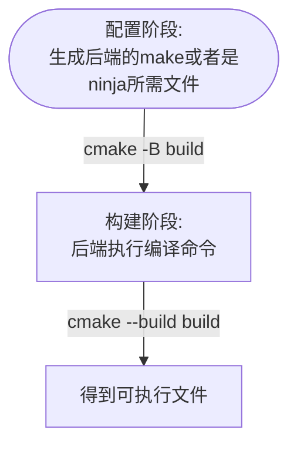

## 一、前言

生成器表达式是cmake提出支持一个多编译配置的功能。先看看cmake官方给它的定义：

> Generator expressions are evaluated during build system generation to produce information specific to each build configuration  
> 
> 翻译：生成器表达式在生成构建系统时进行求值，以生成与每个构建配置相关的信息

仅从这句话很难看出它解决了什么问题。首先看cmake一般编译工作流:



那么如何在构建阶段达到不同参数进行不同的编译呢？

最快想到的是通过设置变量来解决，即在 CMakeLists.txt 中将其定义为构建阶段的变量。矛盾点在于在配置阶段，变量已经完成了字符串替换，到构建阶段时它不再是变量了。例如set(var "rrr")，CMAKE_SOURCE_DIR等等。

因此需要提出一种新的方式，在cmakelists.txt中区别与常规的变量，来达到build阶段的多种编译。

那么为什么会存在build阶段的多种配置呢？当一个项目同时需要 Debug 和 Release 等多种模式时，只需进行一次配置，随后可根据需要执行不同类型的构建。此时某些平台（如 Visual Studio 或 Xcode）支持这种机制，它可以降低项目的配置阶段开销。

## 二、编写语法

### 2.1 基本格式

当cmake识别到如下形式时，它会认为是一个正则表达式。

```cmake
$<...>
```

### 2.2 空白符处理

先看cmake官方的解释：

> 生成器表达式通常在命令参数之后进行解析。
> 如果生成器表达式包含空格、换行符、分号或其他可能被解释为命令参数分隔符的字符，则在将该表达式传递给命令时，应将其整体用引号括起来。否则，该表达式可能会被拆分，从而导致无法再被识别为生成器表达式。

第一句话的意思如下：

+ 解析时机：生成器表达式（Generator Expressions）是在 CMake 生成构建系统（如 Makefile、Visual Studio 项目文件等）的阶段进行解析和求值的，也就是运行 cmake 或 cmake --configure 时，而不是在 cmake --build 阶段。

+ “命令参数之后”：指的是在 CMake 处理某个命令（如 add_executable、target_link_libraries）时，先解析该命令的普通参数，然后再对其中可能包含的生成器表达式进行识别和处理。

+ 举例说明：  
    ```cmake
    target_compile_definitions(myexe PRIVATE $<$<CONFIG:Debug>:DEBUG>)
    ```
    在处理 target_compile_definitions 命令时，CMake 首先识别命令的各个参数（myexe, PRIVATE, 以及后面的表达式），然后对 $<$<CONFIG:Debug>:DEBUG> 这个生成器表达式进行解析。如果这个表达式包含空格或分号，就必须用引号括起来，否则会被错误地拆分成多个参数。

+ 总结：  
    “生成器表达式通常在命令参数之后进行解析” 指的是在 CMake 配置阶段（运行 cmake 时），处理 CMakeLists.txt 中的命令时，先解析普通参数，再解析其中的生成器表达式。

那么怎样会被认为是正确的呢？从一个例子出发，看看有哪些错误

1. version1：生成器表达式中使用空格而没有加引号：

    ```cmake
    add_custom_target(run_some_tool
        COMMAND some_tool -I$<JOIN:$<TARGET_PROPERTY:tgt,INCLUDE_DIRECTORIES>, -I>
        VERBATIM
    )
    ```

    + 生成器表达式中包含空格：  
        表达式 `$<JOIN:$<TARGET_PROPERTY:tgt,INCLUDE_DIRECTORIES>, -I>` 中使用了 , -I> 作为分隔符，其中包含一个空格。  
        这个空格在 CMake 解析 COMMAND 参数时，会被当作命令行参数的分隔符，导致整个表达式被错误地拆分成多个部分。
    + 生成器表达式被破坏:  
        由于空格导致解析出错，CMake 无法将 `$<JOIN:...>` 完整识别为一个生成器表达式。
        结果是，该表达式不会被正确求值，可能导致构建失败或传给工具的参数不正确。
    + 即使使用了 VERBATIM，也无法修复此问题：  
        VERBATIM 选项可以改善构建系统对命令行参数的转义和引用处理（特别是在 Windows 上），但它不能解决 CMake 在配置阶段解析命令参数时的分割问题。  
        在 CMake 生成构建文件时，就已经因为空格把表达式拆开了，此时 VERBATIM 还没起作用。

2. version2：使用空格但是加了引号：
    
    ```cmake
    add_custom_target(run_some_tool
    COMMAND some_tool "-I$<JOIN:$<TARGET_PROPERTY:tgt,INCLUDE_DIRECTORIES>, -I>"
    VERBATIM
    )
    ```

    + 比之前好，但仍然不够健壮。引号防止了空格导致表达式被拆分，但工具最终会将展开后的整个值当作一个单一参数接收。
    + 虽然表达式能正确展开，比如展开成：
        
        ```
        -I/path/to/include -I/usr/local/include -I../src
        ```

    + 但由于整个表达式被用引号括起来了，CMake 会把这整个展开后的字符串视为一个命令行参数。结果是some_tool 接收到的是一个参数：
        
        ```
        "-I/path/to/include -I/usr/local/include -I../src"
        ```

        而不是期望的多个独立参数：

        "-I/path/to/include" "-I/usr/local/include" "-I../src"

    + 很多命令行工具（如编译器、代码生成工具等）无法正确解析这种合并的参数，特别是当它们期望每个 -I 是一个独立选项时。

3. version3：将空格变成分号

    ```cmake
    add_custom_target(run_some_tool
        COMMAND some_tool "-I$<JOIN:$<TARGET_PROPERTY:tgt,INCLUDE_DIRECTORIES>,;-I>"
        COMMAND_EXPAND_LISTS
        VERBATIM
    )
    ```

    + 几乎正确了。使用分号分隔参数并加上 COMMAND_EXPAND_LISTS 选项，意味着包含空格的路径也能被正确处理；给整个表达式加引号确保了它能被识别为生成器表达式。
    + 但如果目标属性为空，我们会得到一个孤零零的 -I，后面没有任何内容。

4. version4:使用条件正则表达式

    ```
    add_custom_target(run_some_tool
        COMMAND some_tool $<$<BOOL:$<TARGET_PROPERTY:tgt,INCLUDE_DIRECTORIES>>:-I$<JOIN:$<TARGET_PROPERTY:tgt,INCLUDE_DIRECTORIES>,;-I>>
        COMMAND_EXPAND_LISTS
        VERBATIM
    )
    ```

那么能否直接使用变量来表示一整个生成器表达式呢？cmake官方给了一个示例

```cmake
set(prop "$<TARGET_PROPERTY:tgt,INCLUDE_DIRECTORIES>")
add_custom_target(run_some_tool
  COMMAND some_tool "$<$<BOOL:${prop}>:-I$<JOIN:${prop},;-I>>"
  COMMAND_EXPAND_LISTS
  VERBATIM
)
```

最后它会变成

```cmake
add_custom_target(run_some_tool
  COMMAND some_tool "$<LIST:TRANSFORM,$<TARGET_PROPERTY:tgt,INCLUDE_DIRECTORIES>,PREPEND,-I>"
  COMMAND_EXPAND_LISTS
  VERBATIM
)
```

另外一个常见的错误是嫌参数太长就换行处理

```cmake
target_compile_definitions(tgt PRIVATE
  $<$<AND:
      $<CXX_COMPILER_ID:GNU>,
      $<VERSION_GREATER_EQUAL:$<CXX_COMPILER_VERSION>,5>
    >:HAVE_5_OR_LATER>
)
```

最好如下书写

```cmake
set(is_gnu "$<CXX_COMPILER_ID:GNU>")
set(v5_or_later "$<VERSION_GREATER_EQUAL:$<CXX_COMPILER_VERSION>,5>")
set(meet_requirements "$<AND:${is_gnu},${v5_or_later}>")
target_compile_definitions(tgt PRIVATE
  "$<${meet_requirements}:HAVE_5_OR_LATER>"
)
```

## 三、debug方式

使用常规的message方式实在configure阶段，这种方式失效。cmake提供了两种方式

1. 使用add_custom_target

    ```cmake
    add_custom_target(genexdebug COMMAND ${CMAKE_COMMAND} -E echo "$<...>")
    ```

2. 使用file

    ```
    file(GENERATE OUTPUT filename CONTENT "$<...>")
    ```

## 四、基本语法

基本语法讲述生成器表达式的基本工具，有了这些才方便对具体场景进行解析。

### 4.1 生成器表达式的if

逻辑运算在编程中至关重要，cmake的底层变量值是字符串，因此cmake提供了如下两种形式

```cmake
$<condition:true_string> # 1

$<IF:condition,true_string,false_string> # 2

```

第一种是简单的if跳转，第二种是带else的跳转。其他多条件的可以由这两种形式组成出来。这个condition是一个布尔值，非字符串，因此依赖于其他生成器表达式将其他形式的判断转化为简单的布尔值，而不能像c语言那么具有隐式转换的方式。

看一个例子：

```cmake
$<$<CONFIG:Debug>:DEBUG_MODE>
```

当处于`$<CONFIG:Debug>`会返回一个布尔值，随后返回`DEBUG_MODE`这个字符串。

### 4.2 字符串转化bool值

如何将一个字符串转化为布尔值呢？cmake提供如下方式

```cmake
$<BOOL:string>
```

它会将紧接着的`string`转化为bool值。仅当如下情况发生时转为为0：

1. string 为空
2. string 等于 0、FALSE、OFF、N、NO、IGNORE 或 NOTFOUND（不区分大小写）
3. string 后缀为被 `-NOTFOUND` 修饰（不区分大小写）

否则都转为1.

### 4.3 生成器多条件判断

如何像c语言那样多个条件同时判断呢？cmake提供了如下条件

```
$<AND:conditions> # 视同 &&

$<OR:conditions> # 视同 ||

$<NOT:condition> # 视同 ！

```

1. 条件之间使用逗号分隔，不要有空格。
2. 每一个条件的最终返回值都是1或者0.
3. 3.28之后新增逻辑短路效应。

## 五、字符串处理

第四章讲到了逻辑跳转，本章主要讲cmake提供了可以对字符串进行哪些处理。

### 5.1 字符串比较

cmake提供了区分大小写的字符串比较。

```
$<STREQUAL:string1,string2>
```

如果`string1`和`string2`相同，返回1，否则返回零。也提供了大小写不敏感的写法：

```
$<STREQUAL:$<UPPER_CASE:${string1}>,BAR>
```

例如，如果 `${string1}` 的值是 BAR、Bar 或 bar 中的任意一个，以下表达式将求值为1。

### 5.2 数值比较

```
$<EQUAL:value1,value2>
```

如果 value1 和 value2 在数值上相等，则为 1，否则为 0。

### 5.3 版本比较

```
$<VERSION_LESS:v1,v2>  
```

如果 v1 版本小于 v2，则为 1，否则为 0。

```
$<VERSION_GREATER:v1,v2>  
```

如果 v1 版本大于 v2，则为 1，否则为 0。

```
$<VERSION_EQUAL:v1,v2>  
```
如果 v1 版本与 v2 相同，则为 1，否则为 0。

```
$<VERSION_LESS_EQUAL:v1,v2>  
```

版本 3.7 新增。  
如果 v1 版本小于或等于 v2，则为 1，否则为 0。

```
$<VERSION_GREATER_EQUAL:v1,v2>  
```

版本 3.7 新增。  
如果 v1 版本大于或等于 v2，则为 1，否则为 0。

### 5.4 字符串变换

```
$<LOWER_CASE:string>  
```
将字符串 `string` 的内容转换为小写。

```
$<UPPER_CASE:string>  
```

将字符串 `string` 的内容转换为大写。

```
$<MAKE_C_IDENTIFIER:...>  
```

将 `...` 的内容转换为一个合法的 C 标识符。转换规则与 `string(MAKE_C_IDENTIFIER)` 命令的行为相同。


----------------

未完待续...