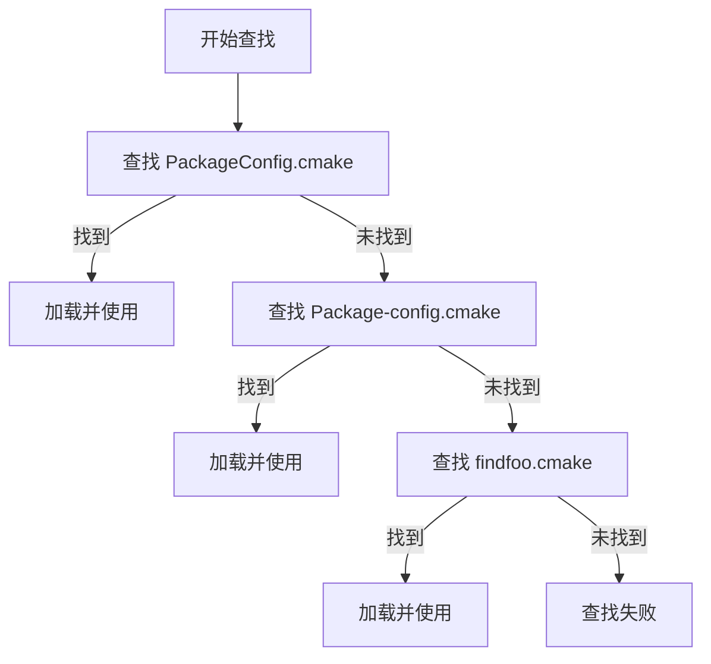

## 一、包管理的核心需求与早期方案的不足

在C/C++项目开发中，库的作者需要向使用者提供编译好的静态库、动态库、头文件等资源，而使用者则需要便捷地集成这些资源到自己的项目中。早期常见的做法是：作者提供源码或预编译库，使用者手动编译并设置绝对路径进行链接。这种做法虽然直接，但存在几个明显问题：

+ 缺乏包的整体描述：如版本信息、库之间的依赖关系等元数据缺失；
+ 使用繁琐：每次集成都需手动指定路径，不利于跨项目或自动化构建；
+ 结构复杂时难以管理：随着库规模增大，使用者需深入了解内部结构，增加了使用负担；
+ 命名冲突风险：多个库可能提供同名文件，造成链接混乱。

这些问题催生了对专业化包管理工具的需求，CMake 正是为此而生。它通过标准化的配置与安装流程，将包的构建、描述和使用分离，使作者能完整定义包内容，使用者只需熟悉 CMake 的查找机制即可快速集成。

## 二、CMake 的解决方案

为了系统化地解决传统包管理的痛点，CMake 为库作者和使用者分别提供了一套明确的能力和工具，通过标准化流程实现了职责分离，使双方都能专注于自己的核心任务。

### 2.1 为库作者提供的能力：完整定义与分发包

CMake 赋予库作者强大的能力，使其能够精确地描述和分发自己的软件包：

+ __目标的精细化管理__：通过 `add_library、target_include_directories` 等命令，作者可以定义库的编译属性、头文件路径、编译定义等，并利用生成器表达式（如 `$<BUILD_INTERFACE:...>`）区分构建时和安装时的行为。

+ __依赖与兼容性声明__：作者可以声明本包所依赖的其他库（通过 `find_dependency`），并生成版本配置文件（`ConfigVersion.cmake`），强制要求版本兼容性（如仅兼容相同主版本）。

+ __灵活的安装控制__：通过 `install` 命令，作者可以精确控制哪些目标（`TARGETS`）、文件（`FILES`）、目录（`DIRECTORIES`）被安装，以及安装到何种目录结构下。

+ __配置文件的自动生成__：借助 `CMakePackageConfigHelpers` 模块，作者可以从模板文件自动生成供 `find_package` 使用的、健壮的配置文件（`Config.cmake`），大大降低了手动编写的复杂度和出错概率。

+ __命名空间隔离__：通过 `EXPORT` 和 `NAMESPACE` 参数，作者可以为导出的目标设置命名空间，从根本上避免与其他包发生目标名称冲突。

__总结__：库作者利用 CMake 可以生成一个“自描述”的包，其中不仅包含编译好的二进制文件，还包含了所有必要的元数据（依赖、版本、使用方式），使其可以被 CMake 生态无缝识别和集成。

### 2.2 为使用者提供的能力：便捷查找与无缝集成

对于库的使用者，CMake 则极大地简化了查找、验证和集成第三方库的过程：

+ __统一的查找接口__：只需使用 `find_package(PackageName)` 命令，CMake 便会自动处理复杂的路径搜索、版本校验和配置加载过程。
+ __透明的依赖解析__：如果目标包声明了依赖，CMake 会在加载该包时自动递归地查找并加载其依赖项，使用者无需手动管理依赖链。
+ __目标导向的链接__：查找到包后，使用者可以直接通过清晰的命名空间目标（如 `Package::Library`）进行链接。CMake 会自动关联所有必要的包含目录、编译选项和链接库，无需手动指定路径。
+ __灵活的路径配置__：使用者可以通过多种方式（如设置 `CMAKE_PREFIX_PATH`）指导 CMake 去特定位置查找包，轻松管理不同版本或自定义编译的库。
+ __组件化支持__：对于支持组件的包，使用者可以按需请求特定组件（`COMPONENTS`），CMake 会检查这些组件是否存在，实现更精细的依赖控制。

__总结__：使用者无需理解库的内部构建细节，只需掌握简单的 `find_package` 和 `target_link_libraries` 命令，即可将复杂的第三方库可靠地集成到自己的项目中，实现了“开箱即用”的体验。

### 2.3 包管理机制与分工

CMake 通过 find_package() 命令实现包的查找与加载，其背后是一套明确的责任分工机制：

- 使用者责任：  
  + 设置 CMAKE_PREFIX_PATH 等搜索路径；
  + 调用 find_package() 查找包并验证版本；
  + 使用 target_link_libraries() 等命令链接目标。

- 作者责任：  
    + 提供包的配置文件（如 PackageConfig.cmake），供 find_package 读取；
    + 通过 CMake 脚本生成并安装这些配置文件，确保包的信息可被正确识别。

配置文件有三种命名格式，CMake 按以下顺序查找：



## 三、使用者的责任与关键使用要点

虽然 CMake 的 `find_package` 机制大大简化了库的集成过程，但使用者仍需对包的组成和 CMake 的查找逻辑有基本了解，才能正确、高效地使用第三方库。以下几点是使用者应特别注意的：

1. 理解包的内部结构：多目标（`Multi-Target`）支持  
    + 一个库项目（Package）可能包含多个目标（Target），例如：  
        - 核心静态库（libCore.a）
        - 动态链接库（libHelper.so）
        - 工具可执行文件（cli_tool）
    + 使用者可通过 `find_package(PackageName)` 加载整个包，然后按需链接具体目标：  
        ```cmake
        find_package(MyLibrary REQUIRED)
        target_link_libraries(my_app PRIVATE 
            MyLibrary::Core 
            MyLibrary::Helper)
        ```
    + 若只需使用其中部分目标，也可直接指定组件（若包支持组件查找）：  
        ```cmake
        find_package(MyLibrary COMPONENTS Core Helper)
        ```

2. 命名空间`（Namespace）`的作用与使用  
    + 为避免不同库之间的目标重名冲突，CMake 引入了命名空间机制。例如：  
        - 库 `ProjectA` 提供目标 `Algorithm`，使用时写作 `ProjectA::Algorithm`
        - 库 `ProjectB` 也提供 `Algorithm`，使用时写作 `ProjectB::Algorithm`
    + 使用者应查阅库文档，确认其提供的目标是否带有命名空间，并在链接时使用完整名称。

3. 搜索路径的多种设置方式  
    CMake 查找包配置文件的路径可通过多种方式指定，使用者应根据项目结构灵活选择：  
    + 使用 `list(APPEND) `设置 `CMAKE_PREFIX_PATH`：  
        这是<b>推荐做法</b>，可以确保自定义路径优先被搜索：  
        ```cmake
        # 将自定义路径添加到搜索路径列表的开头
        list(APPEND CMAKE_PREFIX_PATH "/usr/local/MyLib" "/opt/custom/lib")
        ```
    + 直接设置 `CMAKE_PREFIX_PATH`：  
        指定一个或多个根目录，CMake 会在其下的 `lib/cmake/、share/` 等子目录中查找包：  
        ```cmake
        set(CMAKE_PREFIX_PATH "/usr/local/MyLib;/opt/custom/lib")
        ```
    + 设置 `<PackageName>_DIR`：  
        直接指定某个包配置文件所在目录：  
        ```cmake
        set(MyLibrary_DIR "/path/to/MyLibraryConfig.cmake所在目录")
        ```
    + 使用 `PATHS` 参数在 `find_package` 中指定：
        ```cmake
        find_package(MyLibrary REQUIRED PATHS "/custom/install/dir")
        ```
    + 系统默认路径：  
        如 `/usr/local/、/usr/` 等标准安装路径，CMake 会自动搜索。

4. 版本与组件兼容性检查  
    + 使用者可通过 `find_package` 的版本参数确保兼容性：  
        ```cmake
        find_package(MyLibrary 2.0.0 REQUIRED)  # 要求至少版本 2.0.0
        ```
    + 若包支持组件机制，可指定需要加载的组件，未找到时 CMake 将报错：  
        ```cmake
        find_package(MyLibrary REQUIRED COMPONENTS Core Tools)
        ```

在使用不熟悉的库时，应先查阅其提供的 `Config.cmake` 文件或文档，了解其提供的目标名称、命名空间、版本要求及可选组件，避免因配置不当导致链接错误或运行时缺失依赖。

## 四、库作者工作流

库作者需要利用 `CMake` 提供的一系列命令和模块，精确地定义包的组成、生成供查找的配置文件，并完成安装。以下是这一流程的详细分解：

### 4.1 目标的定义与属性设置

库的构建以“目标”（Target）为中心。作者首先使用 `add_library` 或 `add_executable` 创建目标，并通过 `target_include_directories`、`target_compile_definitions` 等命令设置其属性。关键之处在于使用**生成器表达式**来区分“构建时”和“安装后”的接口：

```cmake
add_library(mylib mylib.c)
target_include_directories(mylib PUBLIC
    $<BUILD_INTERFACE:${CMAKE_CURRENT_SOURCE_DIR}/include>   # 构建时头文件路径
    $<INSTALL_INTERFACE:include>                            # 安装后头文件路径
)
```

这确保了使用者在构建自己的项目（依赖于 `mylib`）时，无论是在构建树内直接使用还是链接已安装的包，都能找到正确的头文件路径。

### 4.2 使用 `install` 命令安装目标与文件

`install` 命令是包分发的核心，它定义了哪些内容将被安装到最终的用户系统中。

- **安装目标**：通过 `TARGETS` 关键字安装库或可执行文件，并可指定导出符号集（`EXPORT`）。
    ```cmake
    install(TARGETS mylib
        EXPORT mylib-targets           # 将此安装目标归类到名为 "mylib-targets" 的导出集中
        ARCHIVE  DESTINATION lib       # 静态库安装到 <prefix>/lib
        LIBRARY  DESTINATION lib       # 动态库安装到 <prefix>/lib
        RUNTIME  DESTINATION bin       # 可执行文件安装到 <prefix>/bin
        PUBLIC_HEADER DESTINATION include  # 公共头文件安装到 <prefix>/include
    )
    ```
    `EXPORT` 参数至关重要，它将本次安装的目标信息收集到一个逻辑集合中，为后续生成目标配置文件做准备。

- **安装普通文件与目录**：使用 `FILES` 和 `DIRECTORIES` 关键字安装文档、许可证等非目标文件。

### 4.3 生成并安装包的配置文件

这是使包能被 `find_package` 发现的关键步骤。通常借助 `CMakePackageConfigHelpers` 模块（需通过 `include(CMakePackageConfigHelpers)` 引入）来简化流程。

1.  **生成包版本文件**：  
    使用 `write_basic_package_version_file` 函数生成 `<PackageName>ConfigVersion.cmake` 文件。该文件包含版本兼容性检查逻辑。
    ```cmake
    write_basic_package_version_file(
        "${CMAKE_CURRENT_BINARY_DIR}/MyProjectConfigVersion.cmake"
        VERSION ${PROJECT_VERSION}
        COMPATIBILITY SameMajorVersion  # 版本兼容性策略：相同主版本号兼容
    )
    ```

2.  **配置包主文件**：  
    使用 `configure_package_config_file` 函数，基于一个模板文件（通常为 `<PackageName>Config.cmake.in`）生成最终的 `<PackageName>Config.cmake` 文件。
    ```cmake
    configure_package_config_file(
        "${PROJECT_SOURCE_DIR}/cmake/MyProjectConfig.cmake.in"
        "${CMAKE_CURRENT_BINARY_DIR}/MyProjectConfig.cmake"
        INSTALL_DESTINATION ${CMAKE_INSTALL_DATAROOTDIR}/cmake/MyProject
    )
    ```
    - **模板文件的作用**：模板文件（`.in`）中包含占位符（如 `@PACKAGE_INIT@`, `@PROJECT_NAME@`），`configure_package_config_file` 函数会将其替换为实际的值。一个典型的模板内容如下：
        ```cmake
        @PACKAGE_INIT@  <!-- 被替换为CMake包初始化代码 -->

        include("${CMAKE_CURRENT_LIST_DIR}/MyProjectTargets.cmake")  <!-- 包含导出的目标 -->

        check_required_components("@PROJECT_NAME@")  <!-- 检查必需的组件 -->
        ```

3.  **安装配置文件**：  
    将生成的两个配置文件安装到指定目录，通常与库文件在同一相对路径下，形成标准的包布局。
    ```cmake
    install(FILES
        "${CMAKE_CURRENT_BINARY_DIR}/MyProjectConfig.cmake"
        "${CMAKE_CURRENT_BINARY_DIR}/MyProjectConfigVersion.cmake"
        DESTINATION lib/cmake/MyProject
    )
    ```

### 4.4 导出目标信息并应用命名空间

最后，需要将步骤 4.2 中通过 `EXPORT` 收集的目标信息导出为一个具体的 `.cmake` 文件，并为其加上命名空间以防冲突。

```cmake
install(EXPORT mylib-targets          # "mylib-targets" 与 install(TARGETS) 中的 EXPORT 名对应
    FILE MyProjectTargets.cmake       # 生成的目标配置文件名
    NAMESPACE MyProject::             # 为所有导出的目标添加命名空间 "MyProject::"
    DESTINATION lib/cmake/MyProject   # 安装位置，与配置文件相同
)
```

此命令会生成 `MyProjectTargets.cmake` 文件，其中定义了所有已安装目标（如 `mylib`），但这些目标在导入后会被命名为 `MyProject::mylib`。

#### 4.5 工作流总结

库作者的工作流是一个环环相扣的过程：

1.  **定义目标**并设置其接口。
2.  **安装目标**及其相关文件，同时标记导出集。
3.  **生成包的版本和主配置文件**。
4.  **导出目标信息**并应用命名空间。
5.  **安装所有配置文件**，形成完整的可分发包。

最终，在安装目录下会形成类似如下的结构，使 CMake 能够完整地识别和使用这个包：

```
<install-prefix>/
├── include/
│   └── mylib.h
├── lib/
│   ├── libmylib.a
│   └── cmake/
│       └── MyProject/
│           ├── MyProjectConfig.cmake
│           ├── MyProjectConfigVersion.cmake
│           └── MyProjectTargets.cmake
└── bin/
    └── my_tool
```

### 五、完整示例：从构建到集成的实战流程

以一个简单库项目为例，展示从代码编译到提供可查找包的完整过程：

1. **项目结构**：
   ```
   .
   ├── CMakeLists.txt
   ├── include/mylib.h
   └── mylib.c
   ```

2. **构建目标**：
   ```cmake
   add_library(mylib mylib.c include/mylib.h)
   target_include_directories(mylib PUBLIC
       $<BUILD_INTERFACE:${CMAKE_CURRENT_SOURCE_DIR}/include>
       $<INSTALL_INTERFACE:include>)
   ```

3. **安装目标与头文件**：
   ```cmake
   install(TARGETS mylib
       EXPORT mylib-targets
       PUBLIC_HEADER DESTINATION include
       ARCHIVE DESTINATION lib)
   ```

4. **生成并安装配置文件**：
   ```cmake
   install(EXPORT mylib-targets
       NAMESPACE mylib::
       FILE mylib-config.cmake
       DESTINATION lib/cmake/mylib)
   ```

5. **使用者集成**：
   ```cmake
   find_package(mylib REQUIRED)
   target_link_libraries(my_app PRIVATE mylib::mylib)
   ```

### 六、总结：CMake Install 命令的价值

CMake 的 `install` 命令与配套工具链（如 `CMakePackageConfigHelpers`）共同构成了一套完整的包制作与分发方案。它通过标准化流程：

- **降低了使用门槛**：使用者无需关心内部结构，直接通过 `find_package` 集成；
- **提升了包的可管理性**：支持版本控制、依赖声明、命名空间隔离；
- **实现了构建与使用的解耦**：作者负责包的完整定义，使用者专注业务集成。

这套机制不仅适用于单一项目，更是大型项目或第三方库分发的基石，体现了现代 C/C++ 工程管理的最佳实践。


-----------------------------

## 附录A：CMakePackageConfigHelpers 详解

本附录详细说明 `CMakePackageConfigHelpers` 模块中两个核心函数的使用机制和细节。

### A.1 `configure_package_config_file` 函数

此函数充当一个“配置器”，它将一个模板文件（输入）转换为最终的包配置文件（输出）。

1. **函数语法**：  
    ```cmake
    configure_package_config_file(<input> <output> [OPTIONS])
    ```
    - `<input>`：模板文件路径（如 `MyProjectConfig.cmake.in`）。
    - `<output>`：生成的配置文件路径（如 `MyProjectConfig.cmake`）。
    - `INSTALL_DESTINATION`：指定配置文件的最终安装路径，用于生成正确的相对路径。

2. **模板文件（.in）**：  
    模板文件使用特殊的 `@VARIABLE@` 占位符语法。函数执行时，会将这些占位符替换为CMakeLists.txt中定义的当前变量值。  
    一个典型的模板文件内容如下：  
        ```cmake
        @PACKAGE_INIT@  # 关键：被替换为CMake包初始化代码块

        include("${CMAKE_CURRENT_LIST_DIR}/MyProjectTargets.cmake") # 引入导出的目标 

        check_required_components("@PROJECT_NAME@") # 检查组件是否全部找到
        ```
      - `@PACKAGE_INIT@`：替换后会产生一系列CMake代码，用于初始化包查找环境，并定义如 `check_required_components` 和 `set_and_check` 等辅助宏。
      - `check_required_components(@PROJECT_NAME@)`：此宏用于验证 `find_package` 调用时请求的组件是否都被成功找到。即使包不明确支持组件，也建议调用此宏以保证健壮性。

3. **变量替换机制**：  
  函数会将模板中所有 `@VAR_NAME@` 形式的标记替换为当前CMake变量 `VAR_NAME` 的值。这包括CMake内置变量（如 `CMAKE_INSTALL_PREFIX`）和在CMakeLists.txt中自定义的变量。  
  **示例**：  
  假设在CMakeLists.txt中：
  ```cmake
  set(MY_LIBRARY_DIR "lib")
  ```
  在模板中：
  ```cmake
  set(MY_PROJECT_LIB_DIR "@MY_LIBRARY_DIR@")
  ```
  生成后：
  ```cmake
  set(MY_PROJECT_LIB_DIR "lib")
  ```

-----------------------------

### A.2 `write_basic_package_version_file` 函数

此函数用于生成一个独立的版本配置文件，它不依赖模板，直接根据参数生成。

**函数语法**：

```cmake
write_basic_package_version_file(<filename> VERSION <version> COMPATIBILITY <compatibility>)
```

- `<filename>`：生成的版本文件名。
- `VERSION`：包的版本号，通常取 `PROJECT_VERSION`。
- `COMPATIBILITY`：版本兼容性策略，决定 `find_package` 时如何匹配版本。常用策略有：  
    - `AnyNewerVersion`：任何等于或高于给定版本的包都兼容。
    - `SameMajorVersion`：要求主版本号必须相同（推荐，保证API兼容）。
    - `ExactVersion`：版本必须完全匹配。

-----------------------------

### A.3 配置文件的作用与执行流程

- **`ProjectConfig.cmake`（主配置文件）**：是包的“大脑”。当 `find_package` 找到包时，首先加载并执行此文件。它的核心任务是使用 `include()` 引入由 `install(EXPORT ...)` 生成的目标文件（如 `MyProjectTargets.cmake`），从而将包中的目标（如 `MyProject::mylib`）导入到当前项目中。
- **`ProjectConfigVersion.cmake`（版本配置文件）**：是包的“守门员”。它被主配置文件内部调用，用于验证用户通过 `find_package(MyProject 1.2.3 REQUIRED)` 请求的版本是否满足兼容性策略。如果验证失败，整个 `find_package` 过程将失败。

通过这种分工，两个配置文件共同确保了包能被正确、安全地查找和导入。
