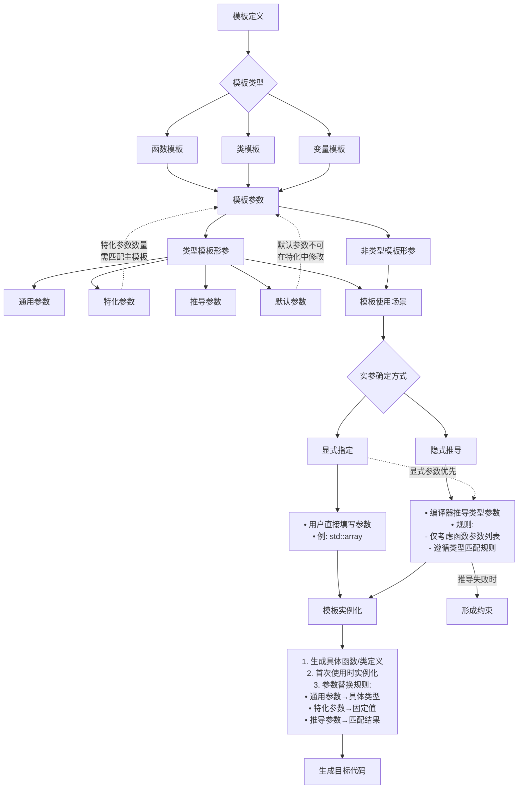

## 一、前言

模板是C++语言中为实现通用化编程而提供的一项重要特性。然而在实际应用中，由于模板的灵活性过高，往往需要对其施加适当的约束条件。这些约束能够有效减少因模板过度泛化而导致的编程错误。

### 1.1 模板种类 

c++中按模板种类有三种：

+ __函数模板__
    ```c++
    template <typename T>
    void swap(T& a, T& b) {
        T tmp = a;
        a = b;
        b = tmp;
    }
    ```
+ __类模板__
    ```c++
    template <typename T, size_t Size>
    class Array {
        T data[Size];
        // ...通用实现
    };
    ```
+ __变量模板__
    ```c++
    template <typename T>
    constexpr T e = T(2.718281828459045);
    ```

### 1.2 主模板和特化模板

在1.1节的例子中，这些模板对任何类型实参都可以使用，但是实际上会存在有些类型不能使用这个模板，用了就会出问题。这个时候，我们希望对有一些类型单独处理，要么是针对这些类型重新定义实现，要么是只要求满足条件的类型才可以使用这个模板，或者是两者都使用。本文对这些类型的要求统称为约束。

如果单独处理某些类型，c++提供了特化模板（包含偏特化和全特化模板），而这两者都是在一个主模板上定义的。如前面定义的模板

```c++
template <typename T>
void swap(T& a, T& b) {
    T tmp = a;
    a = b;
    b = tmp;
}
```

此时它是主模板。如何对其特化，就是对其模板形参在参数列表中加上限定，然后它就可以称为特化版本。分为两种，全特化和偏特化

+ 全特化模板，指为模板的所有参数提供具体类型或值，生成一个完全定制的版本。全特化会覆盖主模板的通用实现，针对特定参数组合提供专属行为
    
    ```c++
    template <>
    void swap<int> (int & a, int & b) {
        T tmp = a;
        a = b;
        b = tmp;
    }
    ```
+ 偏特例化模板，将模板的部分参数提供具体类型或约束条件，生成一个针对特定类型组合的定制版本。偏特化保留了部分泛化能力，同时针对特定模式（如指针、引用、固定值等）优化实现。值得注意的是，函数模板不支持偏特化模板。感性的来说，就是对主模板有进一步的约束条件，它就可以被称为偏特化模板。
    ```c++
    template <typename T, int N>  
    class Array { T data[N]; };  

    // 偏特化1：固定N=10，保留T泛型  
    template <typename T>  
    class Array<T, 10> {  
        T data[10];  
        void init() { /* 针对size=10的优化 */ }  
    };  

    // 偏特化2：针对指针类型  
    template <typename T, int N>  
    class Array<T*, N> {  
        T* data[N];  
        void clear() { /* 指针专用清理逻辑 */ }  
    };  
    ```

### 1.3 模板形参

模板与非模板的区别就是增加了一个类型变量，被称为模型形参，主要分为两类：

+ 非类型模板形参
    + 它主要是像int、std::size_t这种整形参数介绍，具体可参考[c++常量注入技术](./2025-05-26-一种c++常量注入技术.md)的内容
> C++标准规定非类型模板参数可以是以下类型：
> 
> 1. 整型常量（包括枚举值）
> ```cpp
> template <int Size> class Buffer {};
> ```
> 
> 2. 指针/引用（指向具有静态存储期的对象）
> ```cpp
> template <const char* Str> class Logger {};
> ```
> 
> 3. C++20起支持的类类型（必须是字面类型）
> ```cpp
> struct Config { int size; bool debug; };
> template <Config C> class Widget {};
> ```
> 
> 4. `std::nullptr_t`类型
> ```cpp
> template <std::nullptr_t P> class Nullable {};
> ```

+ 类型模板形参
    - 通用参数：T（可匹配任意类型），可用于主模板、偏特化模板中
    - 特化参数：在偏特化中被固定为具体类型或值的参数，仅用于特化模板中
    - 推导参数：通过模式匹配推导出的参数。
    - 默认参数：使用=获取的到的参数，默认参数只能出现在主模板中，偏特化版本不能重新定义或修改默认参数，偏特化版本必须保持与主模板相同的参数数量。

模板被使用时，既需要填入不是其实参不是类型的实参，也需要模板实参，即参数为类型。比如模板函数，它只是想要对类型没有关系，实际工作时还是需要入参。因为有的时候，在使用模板的地方如果可以通过上下文推断模板实参，那么编译器就可以自动为用户填入模板实参，有的地方推导不出来，那么就需要用户手动指定。综上，c++提供了两种方式来确定被使用的地方，其模板实参。

+ __用户直接指定模板实参__
    - 例如：std::vector<int> vec;
+ __编译器通过非类型实参进行推导__
    - 例如：std::vector vec{1, 2}; //因为传入的初始化列表中，单个元素的类型为int，其类型参数被推导为int。

前面说到，类型模板形参中的推导参数，它可直接或者是间接由通用模板参数推导得到，因此，为了实现前面说到的模板约束，也可以通过它来约束模板的使用条件。当类型实参不满足条件时，就可以让它推导失败，从而约束了模板。

### 1.4 编译器对模板的处理流程

使用模板后，编译器主要的处理流程如下：



分为两个阶段一个是定义模板阶段，一个是使用模板阶段。
使用模板时，编译器对这个模板的处理也分为两个阶段，第一个阶段是通过各种方式来获取模板所需要的实际模板实参和类型实参，第二阶段是根据实际参数来实例化模板。

根据它的工作特性，似乎设计模板时，可以在两者间任选一个阶段实现错误，但是实际上却不是。由于c++标准中有替换失败不是错误这一条准则，即sfinae准则，此时推导失败的话，编译器会忽略这个模板，而是选择其他模板或者是可选实现来让整个编译通过。但是一般选择实例化阶段，就直接报错了。试想一下，仅仅只是一个模板不匹配，然后就没办法继续编译了，明明可能用户还有其他的可选实现，但是这个时候编译器报错拒绝工作流额，想一下也没有人愿意用这个模板吧。

怎么使用推导参数来达到约束，举一个例子

```c++
template<class T, typename = std::enable_if_t<std::is_integral_v<T>>>
int func(T x) {
    return 0;
}

int main() {
    std::cout << Foo(0) << std::endl;  // 输出 "0"
}
```

这个模板参数中，无名模板形参是通过形参T的具体参数推导出其模板实参。这个过程中可以不用先了解`std::enable_if_t<std::is_integral_v<T>>`这一坨集体的工作原理是什么，只需要知道它对这个类型进行了一定的约束。我们想要达到的效果是，当这个类型对模板参数推导失败之后，它就不会选择这个模板函数作为main函数中foo函数的备选定义。假设，其他地方还实现了类似的函数如：
```c++
int func(float x) {
    return 1;
}
```
此时c++编译器就会选择到这个函数的定义，而不会是之前的模板函数的定义。

## 二、模板参数确定

前面说到了，一般的套路是，先在调用的地方利用一些手段，获取到通用模板实参$T_{enviroment}$，然后我们想要对$T_{enviroment}$进行约束，那么就通过模板参数推导的手段推导出推导实参$T_{decltype}$，在推导$T_{decltype}$过程中加上约束。看起来，这很像函数啊。输入一个模板参数，再输出一个模板参数。那么是否可以按照下面的等式理解

$$
T_{decltype} = f(T_{enviroment})
$$

那么前面的约束又如何按照函数的方式来理解呢？先来想想函数是怎么加约束的，一般最常见的就是定义域吧，如何log函数要求定义域要大于零，因此我们也可以按照这种方式理解。回到模板参数推导中，当$T_{enviroment}$满足这个函数的定义域时，那么就可以推导成功了。那么怎么构造这个函数呢？这个就是所谓的模板元编程了。

不过再搞懂函数具体定义之前，即如何构造出对这个输入值的要求之前，我们需要了解c++中是如何获取到$T_{enviroment}$的。

### 2.1 如何获取模板函数的自变量？

前面提到过，有两种方式，但是可以一起公用。
第一种：用户手动指定
```c++
template<typename T>
int func(T v) {
    return 0;
}

int main ()
{
    return func<float>(0); // 调用处指明类型，就是用户指定
}
```

第二种：编译器根据实参类型自动推导模板实参。首先要确定的是，编译器是根据哪些实参进行推导的。

### 2.2 自变量模板实参的自动推导规则

#### 2.2.1 函数模板

__规则：从函数参数列表中推导，编译器通过实参类型与模板参数声明形式的模式匹配来确定具体类型，其中根据函数参数列表中的顺序反推处模板参数类型。__

- 首先将上面这段话的第二部分，参数循序和模板形参之间的关系。
    ```c++
    template<typename T1, typename T2, typename T3>
    int func(T3 v1, T1 v2, T2 v3) {
        return 0;
    }

    func(1, "dsad", 3.2);
    // 在这里，1的类型为int,那么根据参数顺序，T3被推导为int，
    // "dsad"为const char *, 那么 T1就是const char *, 同理T2就是double。
    ```
- `“实参类型与模板参数声明形式的模式匹配”`，这段话是啥意思呢？它主要强调了如下规则

| 模板参数声明形式         | 实参类型示例       | 推导结果            | 关键规则说明                     |
|--------------------------|--------------------|---------------------|----------------------------------|
| `T`                      | `int`              | `T=int`             | 直接按值匹配                     |
| `T*`                     | `int*`             | `T=int`             | 解构指针类型                     |
| `const T`                | `const int`        | `T=int`             | 忽略顶层const                    |
| `T&`                     | `int`              | `T=int`             | 引用传递保留底层const            |
| `T&&` (非万能引用)       | `int&&`            | `T=int`             | 匹配右值引用                     |
| `T&&` (万能引用)         | 左值`int`          | `T=int&`            | 引用折叠产生左值引用             |
| `T&&` (万能引用)         | 右值`42`           | `T=int`             | 正常推导为值类型                 |
| `template<typename T>`   | `std::vector<int>` | `T=int`             | 需要C++17 CTAD支持               |
| `T (&arr)[N]`            | `int[5]`           | `T=int, N=5`        | 数组引用保留维度信息             |
| `T::type` (嵌套类型)     | -                  | **无法推导**        | 需要显式指定                     |
| `typename C<T>::iterator`| `vector<int>::iter`| **无法推导**        | 容器类型无法从迭代器反向推导     |
| `template<typename T, size_t N>` | `array<int,5>` | `T=int, N=5` | C++17起支持类模板参数推导        |

总结：
1. 引用声明形式（`T&`/`T&&`）会保留cv限定符
2. 数组和函数在非引用传递时会退化为指针
3. 万能引用需用`std::forward`实现完美转发
4. 类模板推导(C++17+)依赖构造函数或推导指引

#### 2.2.2 变量模板

C++14起支持，推导规则与函数模板类似：

+ 根据初始化表达式推导模板参数
    ```c++
    template<typename T>
    constexpr T pi = T(3.1415926);

    auto x = pi<float>;  // 显式指定
    auto y = pi<decltype(4.5)>;  // 通过decltype间接推导

    ```
+ CTAD 编译器根据构造函数的实参推导模板参数

#### 2.2.3 类模板参数推导

(1) 传统方式（C++17前）
类模板参数必须显式指定，除非：

+ 通过构造函数参数推导（C++17起支持CTAD）
+ 使用make_xxx辅助函数（如std::make_pair）

(2) CTAD（Class Template Argument Deduction，C++17起）

#### 2.2.4 自动推导总结

从三种模板可以看出，自动感知到的模板实参都是需要在出现在参数列表中，我们把这部分模板参数定义为自变量模板参数集$T_{enviroment}$。想象一下自己实现一个编译器，要么是用户指引推导，否则的话，似乎只能从实际参数中获取类型，然后反推出模板形参的类型。

### 2.3 因变量模板实参的推导

根据前面的步骤，我们已经获取到了自变量模板实参集合$T_{enviroment}$，那么就需要如何构造函数了。首先感受一下问题背景，在初等函数中，各个不同的函数都会有不同的定义域和值域，那么我们可以通过根据不同的基本函数来组合出我们想要的函数，这些组合方式有加减乘除四则运算，以及复合和求导等等方式。那么c++编译器给我们提供了哪些基本的方法，比如前文所提到的std::enable_if_t，这就是相当于一个基础工具，类似的还有其他的工具，具体可参考cppreference。那么组合方式有哪些呢？

1. 函数模板
    + 函数模板的签名中哪些地方可以包含类型呢？模板形参，函数参数，以及函数返回值
2. 变量模板和类模板
    + 由于这两个都可以认为是构造函数，一般而言，构造函数并没有返回值，因此它少了一个函数返回值的地方进行构造。

### 2.4 自变量可行性检验

__问题背景以及问题定义__：

c++模板是支持偏特例化和全特例化的，全特例化还好说，还有一个偏特例化呢。因为它的存在，就出现多个模板，而可能存在这个偏特例化对模板形参的要求和主模板的要求不一致，或者是，不同偏特例化的模板之间的要求是不一样的，那到底是按照哪一个模板构造的检验函数来推导呢？即到底是用主模板的，还是使用偏特化模板的呢？还是所有都用呢？如果所有都用，那么到底是先用偏特例化的模板还是主模板的呢？

__答案：依赖主模板声明确定类型实参。__

模板形参推导首先基于主模板的声明进行，按照主模板生成的函数约束推导出类型，然后在调用位置处，生成实际的各个模板实参，而不会使用这个模板下的特化版本来生成模板参数。也就是说，模板形参推导阶段仅依赖主模板的声明，偏特化仅在推导完成后参与重载决议。根据这个规则，如果主模板的一些检验不通过，所有基于这个主模板特化的模板都会被抛弃。

> 个人猜测这样设计的原因，这是有逻辑要求在，主模板一般是最低要求了，而特化版本是针对某一类型的更高要求，如果连最低要求都无法通过，那么特化版本就可以直接抛弃了。

以下是测试代码来验证说法

```c++
// 主模板（仅对浮点数启用）
template<typename T, typename = std::enable_if_t<std::is_floating_point_v<T>>>
struct Widget {
    static constexpr char* value = "Primary";
};

// 偏特化（针对T=int）
template<typename T>
struct Widget<T, std::enable_if_t<std::is_same_v<T, int>>> {
    static constexpr char* value = "int specialization";
};

int main() {
    auto v = Widget<int>::value; // 编译失败：主模板的enable_if未通过
    return 0;
}
```

这段代码就编译不通过，因为基于Widget的特化模板版本都被弃用了，从而编译失败。

一种较为常见的模板元处理技术就是标签派发，它的方案就是利用主模板萃取出模板参数，然后偏特例化来实现精准匹配


## 三、模板实例化

模板不是具体的代码，它需要借助于编译器自动生成定义之后，然后才能进行编译。那么编译器如何进行实例化呢？

前面我们知道，编译器先在调用模板的地方先确定出了模板参数，那么处理这个函数之后，如果这个函数被调用了，那么后续它会递归的生成所有依赖的模板函数，这个叫做模板的延迟实例化。模板的实例化过程是"最特化匹配"规则决定的。

它的具体实例化过程如下：

1. 编译器会收集当前调用中的所有特化版本，并对所有收集到的特化版本进行排序。
    - 一个模板A比模板B"更特化"当且仅当：A能接受的所有参数集合是B能接受的参数集合的子集，但B能接受某些A不能接受的参数。
    - 简单理解就说如果特化的模板参数个数更少，那么就等级越过，相同特化模板参数置于同一等级中。

2. 根据主模板收集到的模板参数，来选择最特化的匹配版本。
    + 从全特化到偏特化依次检查参数是否完全匹配，如果不匹配的话，继续选择下一优先级别的偏特化版本。
    + 依次将同一级别的特化版本带入和前面推导出的模板参数进行匹配。
        - 如果是全特例化，编译器直接依次将前面得到的模板实参和全特例化的类型参数比较，判断是否匹配。
        - 如果是偏特例化，编译器依次将主模板萃取到的模板实参和偏特例化的模板参数进行比较，如果是特化过了的，判断是否匹配，如果不是特化了的，就将其带入替换为实际的模板参数，如果是推导参数，通过模式匹配从而推导出具体的参数。
            ```c++
            template<typename T, typename U, typename V>
            struct Foo {};  // 主模板

            // 偏特化2（修改版）
            template<typename T, typename U>
            struct Foo<T, U*, std::enable_if_t<std::is_floating_point_v<U>>> {};
            Foo<int, float*, void> f;
            ```
        如上所示，第一个参数是通用参数，偏特例化版本的模板函数直接将形参替换推导出的模板参数int；然后判断实际传入参数是否为指针，这个是特化参数，然后第三个参数是特化后的，它是推导的模板参数，将第二个参数带入到`std::enable_if_t<std::is_floating_point_v<U>>`中判断，结果是满足要求。
    + 只有完全匹配且条件满足的偏特化版本才会被考虑，当匹配完成后推出匹配阶段，将同一级别中的偏特化版本进行同样的处理。

3. 匹配到特化版本，判断同一级别匹配是否为仅有一个匹配，如果是，使用该版本进行实例化；否则报错。

4. 未匹配到特化版本，使用主模板进行特化。

## 四、构建模板参数约束

根据前面的内容，我们可以从三个方向进行模板约束。

1. 主模板中进行模板参数约束。
    + 这个使用的是默认模板参数，主要通过sfinae技巧。它的主要方式就是使用std::enable_if_t的模板函数，它的第一个参数是bool值，这个位置通过其他的模板元接口函数获取编译期bool值，然后控制默认值推导是否成功，从而控制主模板参数是否成功。但是它也有一个缺点，因为它是默认值，也就是说只有使用者不指定模板参数时才会推导，假设用户指定了这个位置的模板参数，也就没办法检查了。
        ```c++
        template<typename T, 
                typename = std::enable_if_t<std::is_integral_v<T>>>
        void process(T value) {
            std::cout << "Processing integral: " << value << std::endl;
        }

        // 另一个重载版本（处理浮点类型）
        template<typename T,
                typename = std::enable_if_t<std::is_floating_point_v<T>>,
                typename = void>  // 需要额外的默认参数来避免重定义
        void process(T value) {
            std::cout << "Processing float: " << value << std::endl;
        }

        int main() {
            // 情况1：用户不指定模板参数（SFINAE生效）
            process(42);      // 调用整数版本
            process(3.14);    // 调用浮点版本

            // 情况2：用户显式指定模板参数（SFINAE被绕过）
            process<double, void>(10);  // 强制调用浮点版本，即使传入整数
                                        // 此时std::is_floating_point_v<T>的检查被跳过
        }
        ```
    + 在主模板的函数签名中增加约束。第一个中是在形参列表中增加约束，常见的是增加一个没有变量实参的类型形参，这个形参来进行约束。值得注意的是，推导的参数需要支持{}这样的默认构造
        ```c++
        template<typename T>
        process3(T value, std::enable_if_t<std::is_integral_v<T>, int> = {}) {
            // 函数实现
        }
        int main() {
            process3(66);
            return 0;
        }
        ```
    第二种是函数返回值中进行约束。
        ```c++
        template<typename T>
        std::enable_if_t<std::is_integral_v<T>, void>
        process3(T value) {
            // 函数实现
        }
        ```

2. 偏特化模板中进行模板参数约束。值得注意的是，函数模板不支持偏特例化！
    ```c++
    template<typename T = int, typename U = double, typename V = void>
    struct Example {};
    ```
    + 第一种是直接指定一个具体类型实参，也叫做特化参数，要求这个位置的模板实参确实是该类型之后，才进行实例化，从而提供了约束。
        ```c++
        template<typename U, typename V>
        struct Example<float, U, V> {};
        ```
    这里偏特化了Example模板参数的第一个类模板参数。
    + 第二种是推导参数。
        ```c++
        template<typename A, typename B>
        struct Bar<A, B*, std::enable_if_t<std::is_integral_v<B>>::type> {};
        ```
    这里使用了推导的模板参数。常用技巧是，主模板中使用默认模板参数，但是实际并不使用这个模板参数，在偏特化模板中，使用模板参数推导，然后将对模板参数的要求一股脑的全部放到这个位置。

3. 全特例化
    + 模板参数全部是用特化参数，也就是全部指定模板参数。
    + 如果没有指定主模板中带有默认参数的模板形参时，编译器认为全特例化使用了主模板的默认参数进行特化参数。
        ```c++
        template<typename T = int, typename U = double>
        struct Bar {
            static constexpr char* value = "Primary";
        };

        template<>
        struct Bar<char> {
            static constexpr char* value = "dd";
        };

        Bar<char, char> fff;
        std::cout <<  decltype(fff)::value;
        ```
    输出结果`Primary`。

