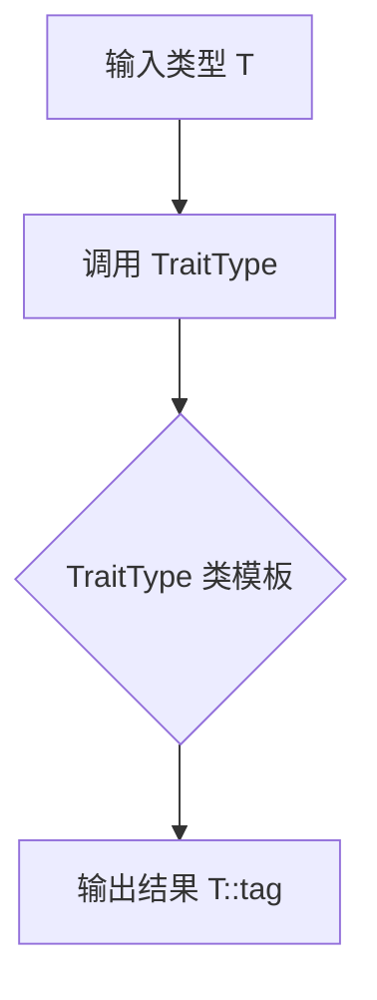
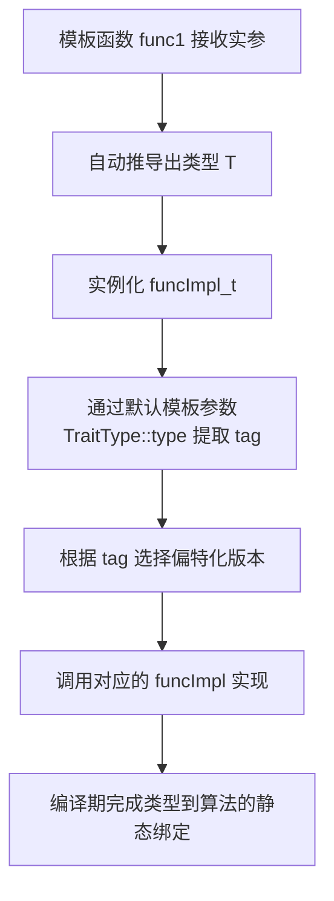
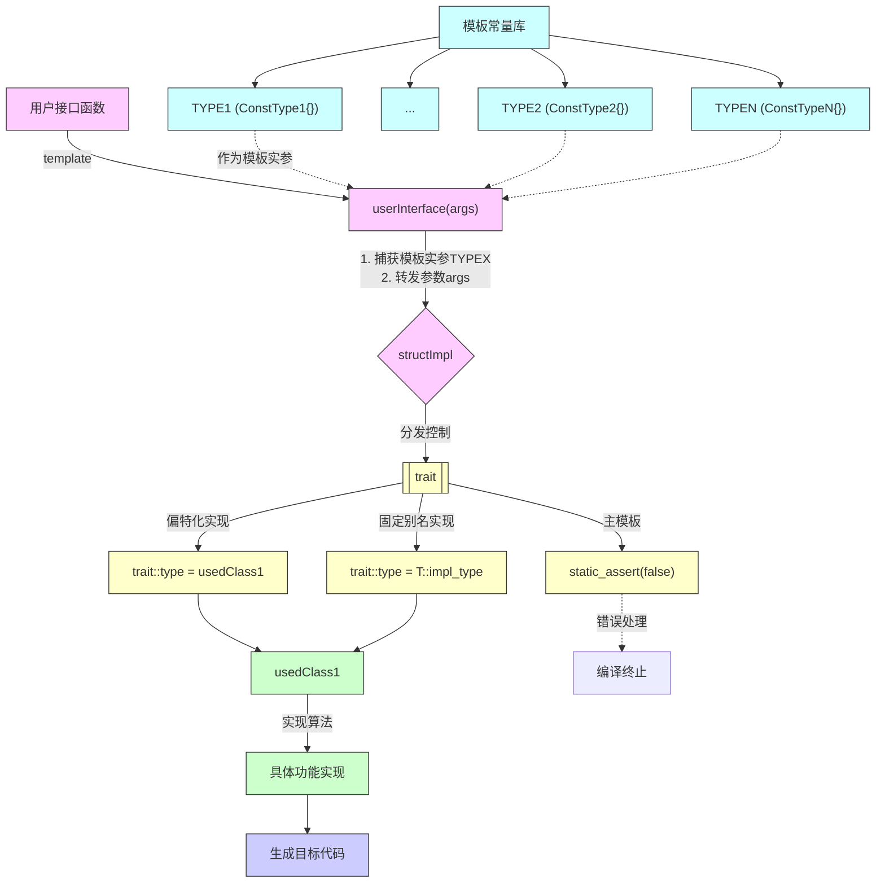

## 一、前言

当我们想要对多种类型实现同样的接口，那么最先想到的是重载这个函数，根据接口来让编译器自动选择。今天将一个比较常见的技巧，就是标签派发，它也能实现类似重载的效果。

## 二、主要结构设想 

在C++泛型编程中，常需为不同类型的对象提供统一的接口。然而，这些类型之间往往不存在继承关系，无法通过虚函数实现多态。此时，如何根据参数类型选择对应的实现逻辑，成为一个普遍需求。标签派发（Tag Dispatching）正是解决这一问题的典型技术。

标签派发旨在解决无继承关系的类在统一接口下实现不同行为的问题。

首先，通过函数模板可获取参数的实际类型。但模板在编译期处理，无法直接用 if-else 判断类型。

为此，引入两个机制：

1. 用标签类型标识不同情况，如 `struct tag_a {}; struct tag_b {};`
2. 用函数重载模拟分支选择，根据标签调用对应实现。

最终，主函数根据参数类型选择标签，并转发到正确的重载版本，实现编译期分发。

## 三、具体实现方案 

在无继承关系的类型间实现统一接口时，需在编译期根据类型选择不同实现。核心问题有两个：

1. 如何表示类型的“常量值”？  
    可定义空的标签类型作为类型常量：
    ```c++
    struct ConstType1 {};
    struct ConstType2 {};
    struct ConstType3 {};
    struct ConstType4 {};
    ```

2. 如何实现类型的“swich-case”分支？  
    利用类模板的偏特化机制，实现基于类型匹配的编译期分支，等效于 switch 语句。在[c++参数推导](./2025-06-25-c++模板参数推导和模板实例化.md)中，可以使用偏特例化，既保持泛型的效果，又可以达到约束的效果。接下来谈谈如何实现“swich-case”的类型匹配。

### 3.1 实现类型 `swich (value)`

在普通的 switch(value) 中，输入的是一个表达式的值；而在类型系统中，我们通过类型“求值”实现类似机制。

switch 是对表达式求值后匹配分支，类型匹配则是：输入一个类型，得到另一个类型。

假设有一个类型参数 `T`，通过元函数 `TraitType` 对其“求值”，输出结果为 `TraitType<T>::type`（即 T::tag）。



具体实现如下，通过特征类（trait）提取类型的标签：

```c++
template <typename T>
struct TraitType {
    using type = typename T::tag;  // 要求T定义嵌套类型tag
};

class usedClass1 {
public:
    using tag = ConstType1;
};
```

在这里就实现了输入一个类型实参，得到另外一个类型实参的目的。

### 3.2 实现类型的 case

在普通的 switch-case 中，case 分支匹配的是常量值，随后执行对应的动作。例如：

```c++
case value: func(); break;
```

__核心类比：__

| 运行时 `switch-case`       | 编译期类型匹配                     |
|--------------------------|----------------------------------|
| `case val:`               | 模板偏特化 `funcImpl_t<T, val>`   |
| `default:`                | 主模板默认特化                    |
| 执行对应语句块            | 调用特化版本的 `funcImpl` 函数     |


具体实现如下，使用类模板偏特化实现类型级的 case 分支：

```c++
// 主模板：默认实现（相当于 default 分支）
template <typename RealType, typename = GetTypeOfTag<RealType>>
struct funcImpl_t{
    static void funcImpl(RealType&& Val) {
        std::cout << "default impl\r\n";
    }
}

// 偏特化版本1：处理标签 ConstType1（相当于 case ConstType1:）
template <typename RealType>
struct funcImpl_t <RealType, ConstType1> {
    static void funcImpl(RealType&& Val) {
        std::cout << "ConstType1\r\n";
    }
}

// 偏特化版本2：处理标签 ConstType2（相当于 case ConstType2:）
template <typename RealType>
struct funcImpl_t <RealType, ConstType2> {
    static void funcImpl(RealType&& Val) {
        std::cout << "ConstType2\r\n";
    }
}

// 偏特化版本3：处理标签 ConstType3（相当于 case ConstType3:）
template <typename RealType>
struct funcImpl_t <RealType, ConstType3> {
    static void funcImpl(RealType&& Val) {
        std::cout << "ConstType3\r\n";
    }
}

```

__说明__:

+ 每个偏特化版本对应一个具体的标签类型（如 ConstType1），相当于 case 中的常量值。
+ 编译器根据 TraitType<RealType>::type 的结果，选择匹配的特化版本，实现编译期分支。
+ 主模板作为默认情况，未匹配时启用，相当于 default 分支。

这样，就实现了类型系统中的 case 机制：
输入一个类型标签，匹配对应的实现分支，执行特定逻辑，完成从“类型到行为”的静态分发。

### 3.3 两者进行关联

我们的最终目标是：让函数能够根据传入参数的类型，自动选择对应的算法实现，从而达成 静态多态（Static Polymorphism）。

与运行时通过虚函数和继承实现的动态多态不同，静态多态在编译期完成类型判断与函数绑定，不产生任何运行时开销。C++ 中实现这一机制的核心工具是 模板（templates） 和 类型萃取（type traits）。

为了实现这一目标，我们已经实现了类似 switch (value) 的结构化类型分派机制，并为不同类型设计了对应的 case 分支处理逻辑。接下来的关键问题是如何将“类型”与“对应实现”有效地关联起来。

解决这一问题的思路如下：

C++ 的模板函数具备自动类型推导能力 —— 当调用模板函数时，编译器会根据实参的类型自动推断出模板参数。同时，结合 函数重载 和 重载解析（overload resolution） 规则，编译器会选择最匹配的函数版本。这意味着，我们可以为不同类型的参数提供不同的重载版本，从而实现基于类型的“分发”。

更进一步，借助 std::enable_if、constexpr if（C++17）或 SFINAE 技术，可以在编译期根据类型特征（如是否为整型、是否支持某种操作等）启用或禁用特定的模板重载，实现精确的算法选择。

因此，我们将 类型萃取 与 模板重载 相结合：

+ 利用模板获取实参的类型；
+ 利用类模板的默认模板参数提取类型标签（tag）；
+ 通过条件编译选择或者是模板偏特化基于标签进行分支匹配；
+ 最终在编译期完成“类型 → 算法”的静态绑定。

即“类型 → 实现”的自动选择机制。

如下面的代码：

```c++
class usedClass1 {
public:
    using tag = ConstType1;
};

template <typename T>
void func1(T val) {
    funcImpl_t<T>::funcImpl(val);
};

int main() {
    usedClass1 ff;
    func1(ff);
    return 0;
}

```

其工作流程为：



### 3.4 实际设计方案

根据上一节的内容，主要的实现流程可总结如上。

1. 设计模板常量TYPE1、TYPE2...TYPEN
    + 如上面例子中的 `struct ConstType1 {};struct ConstType2 {};struct ConstType3 {};struct ConstType4 {};`。
2. 设计用户接口函数，userInterface
    + 需要使用模板函数，从而获取传入变量的模板实参。
    + 将变量实参和模板实参同时传递给具体实现的类模型structImpl。
3. 设计具体实现类usedClass1与模板常量的绑定方式，以及具体实现类usedClass1与萃取接口函数绑定的方式。
    + 实现一：设计一个模板类trait，然后读取类中固定类型别名，然后把这个类型赋值给名为type的类型别名。
    + 实现二：设计一个主模板类trait，其内部没有type的类型别名，然后偏特化实现，type值定为想要绑定的类型别名。
4. 根据第三步设计的绑定方式，将具体实现类的模板参数同步转发，并使用萃取接口萃取实际传入的类型绑定的模板常量。
    + 实现方式一般为默认值。
    + 内部需要有一个静态接口函数接口，一般实现为使用静态断言false，表示没有特化成功。或者是该模板没有实现响应的接口。
5. 根据structImpl依次特化模板常量TYPE1、TYPE2...TYPEN，然后重新实现主模板中的接口函数。

主要实现的伪码如下

```c++

template<typename T>
void interfaceUser(T val)
{
    switch (GetTypeOfTag<T>)
    {
    case ConstType1:
        funcImpl_t<T, ConstType1>::funcImpl(val);
    break;
    case ConstType2:
        funcImpl_t<T, ConstType1>::funcImpl(val);
    break;
    case ConstType3:
        funcImpl_t<T, ConstType1>::funcImpl(val);
    
    break;
    case ConstType4:
        funcImpl_t<T, ConstType1>::funcImpl(val);
    break;
    case ConstType5:
        funcImpl_t<T, ConstType1>::funcImpl(val);
    break;
    default:
        static_assert(0, "error message!");
    break;
    }
}

```

关系图如下：



## 四、impl获取信息的泛型实现

前面提到通过自定义 tag 匹配算法实现，但引入了一个问题：编写算法时只知道 tag，对传入对象的内部信息一无所知，难以操作。要访问对象的信息，通常有三种方式：

+ 通过 obj.data 访问数据成员：  
    需要算法方指定类中必须存在的数据成员名。但由于算法和类由不同人员开发，算法要求类暴露特定成员，会增加类设计的约束，影响封装性，不够灵活。

+ 通过 obj.memberFunc() 调用成员函数：  
    比直接访问成员稍好，但仍要求类提供特定公有接口。若类开发者不愿暴露这些接口，则无法使用。

+ 通过友元获取类内部信息：  
    虽可访问私有成员，但仍需类主动声明友元，本质上仍依赖类的配合。

三种方式都要求类按照算法预期提供特定访问方式。算法方只能提出要求：<b>若想使用本算法，必须实现指定的数据或接口</b>，否则无法工作。这在一定程度上解决了前述困境——明确使用条件，但依然对类的设计提出了约束。

### 4.1 友元优缺点分析

c++中可以使用友元函数和友元类，这两者可以各自选择是否需要模板化来实现泛型的目的。

### 4.2 友元函数

算法端通常采用模板函数作为统一接口，用于获取或设置对象数据。基本做法是：

+ 定义一个泛型函数模板，对未特化的类型触发 static_assert 报错，提示用户必须提供特化实现。
+ 用户在自定义类中将该函数模板的特化版本声明为 friend，从而允许其访问私有成员。
+ 提供对应的函数模板特化实现，直接访问对象的私有数据。

```c++
template<typename T>
auto getInfoUsedForAlgo(const T& val) -> decltype(auto) {
    static_assert(false, "should specialize getInfoUsedForAlgo for your class");
}

class concreteType {
    int name = 42;
    friend auto getInfoUsedForAlgo<concreteType>(const concreteType& val) -> decltype(auto);
};

template<>
auto getInfoUsedForAlgo<concreteType>(const concreteType& val) -> decltype(auto) {
    return val.name;
}
```

特点与优势：

+ 实现简单直接，无需额外类或复杂结构。
+ 通过友元机制访问私有成员，不破坏类的封装性。
+ 对于 struct，可直接特化函数模板，无需显式声明友元。
+ 算法方定义接口契约，用户按需实现，降低了算法与具体类型的耦合度。

本质：<b>算法定义访问契约，用户通过友元函数特化满足契约，实现安全、解耦的数据提取</b>。

### 4.3 友元类

使用友元类的主要目的是利用类模板的偏特化能力，因为函数模板不支持偏特化。通过偏特化可针对不同类型施加条件判断，适配具体类的实现，同时保留泛型接口的通用性。

常见方案有两种：

**********

#### 4.3.1 Boost.Serialization 方案（友元普通类 + 成员函数模板）

+ 定义一个普通类（如 detail::access），作为通用访问器。
+ 该类的静态成员函数为函数模板，负责调用被访问类的私有接口（如 serialize）。
+ 用户类将 access 声明为友元，并实现相应的私有访问接口。

```c++
namespace detail {
struct access {
    template<typename Archive, typename UserType>
    static void save(Archive& ar, const UserType& obj) {
        obj.serialize(ar); // 调用私有成员函数
    }
};
}

class concreteType {
    int name = 42;
    friend class detail::access;

    template<typename Archive>
    void serialize(Archive& ar) {
        ar & name;
    }
};
```

特点：

+ 访问逻辑由被访问类主动实现（如 serialize 方法），控制权在用户端。
+ 适用于需要深度定制序列化行为的场景，灵活性高。

---------------------------------------------

#### 4.3.2 Boost.Geometry 方案（友元类模板 + 静态成员函数）

+ 定义一个类模板 detail::access<T>，用于提取类型 T 的数据。
+ 提供默认模板版本并用 static_assert 限制未特化情况。
+ 用户通过特化 access<T> 模板，并将其声明为友元，实现对私有成员的访问。

```c++
namespace detail {
template<typename T>
struct access {
    static auto getData(const T& obj) -> decltype(auto) {
        static_assert(false, "must specialize access<T>");
    }
};
}

class concreteType {
    int name = 42;
    friend struct detail::access<concreteType>;
};

template<>
struct detail::access<concreteType> {
    static const int& getData(const concreteType& obj) {
        return obj.name;
    }
};

// 支持模板类特化
template<typename T>
class concreteTypeT {
    int name = 42;
    template<typename U>
    friend struct detail::access;
};

template<typename T>
struct detail::access<concreteTypeT<T>> {
    static const int& getData(const concreteTypeT<T>& obj) {
        return obj.name;
    }
};

```

特点：

+ 通过模板特化统一提供外部访问接口，适合泛型库设计。
+ 支持对模板类的整体特化，提升代码复用性

### 4.4 总结 

| 方案             | 机制                         | 适用场景                     | 特点                         |
|------------------|------------------------------|------------------------------|------------------------------|
| Serialization 风格 | 友元普通类 + 成员函数模板     | 每个类需定制交互逻辑           | 用户实现私有接口，灵活但重复   |
| Geometry 风格     | 友元类模板 + 偏特化           | 泛型库、模板类通用处理         | 接口集中管理，复用性强         |


## 五、geometry标签分发的一个实现

既然是针对进行处理的，那么变量肯定需要是类型中的常量，假设我预先设计一个类型，比如

```c++
#include <iostream>
#include <type_traits>
#include <vector>
#include <list>

// 1. 定义标签类型
namespace geometry {
    namespace traits {
        // 主标签
        struct geometry_tag {};
        
        // 具体几何类型标签
        struct point_tag : geometry_tag {};
        struct line_tag : geometry_tag {};
        struct polygon_tag : geometry_tag {};
        struct multi_point_tag : geometry_tag {};
        struct multi_line_tag : geometry_tag {};
        struct multi_polygon_tag : geometry_tag {};
    }

    // 2. 定义特征类模板（主模板）
    template <typename Geometry>
    struct tag {
        // 默认情况下没有标签
        // 用户需要为他们的几何类型特化这个特征类
    };

    // 3. 定义一些几何类型
    template <typename T>
    struct Point {
        T x, y;
    };

    template <typename T>
    struct Line {
        Point<T> start, end;
    };

    template <typename T>
    struct Polygon {
        std::vector<Point<T>> outer;
        std::vector<std::vector<Point<T>>> inners;
    };

    // 4. 为几何类型特化标签特征
    template <typename T>
    struct tag<Point<T>> {
        using type = traits::point_tag;
    };

    template <typename T>
    struct tag<Line<T>> {
        using type = traits::line_tag;
    };

    template <typename T>
    struct tag<Polygon<T>> {
        using type = traits::polygon_tag;
    };

    // 5. 辅助类型提取
    template <typename Geometry>
    using tag_t = typename tag<Geometry>::type;

    // 6. 实现算法（使用标签派发）
    namespace dispatch {
        // 默认实现（主模板）
        template <typename Geometry, typename Tag = tag_t<Geometry>>
        struct area {
            static double apply(Geometry const&) {
                // 默认实现（可能抛出异常或静态断言）
                static_assert(sizeof(Geometry) == 0, 
                    "Not implemented for this geometry type");
                return 0;
            }
        };

        // 点特化
        template <typename Geometry>
        struct area<Geometry, traits::point_tag> {
            static double apply(Geometry const&) {
                return 0.0; // 点的面积为0
            }
        };

        // 线特化
        template <typename Geometry>
        struct area<Geometry, traits::line_tag> {
            static double apply(Geometry const&) {
                return 0.0; // 线的面积为0
            }
        };

        // 多边形特化
        template <typename Geometry>
        struct area<Geometry, traits::polygon_tag> {
            static double apply(Geometry const& geom) {
                // 简化版多边形面积计算（实际Boost.Geometry有更复杂的实现）
                double sum = 0.0;
                for (size_t i = 0; i < geom.outer.size(); ++i) {
                    size_t j = (i + 1) % geom.outer.size();
                    sum += (geom.outer[i].x * geom.outer[j].y - 
                            geom.outer[j].x * geom.outer[i].y);
                }
                return std::abs(sum) / 2.0;
            }
        };
    }

    // 7. 用户接口函数
    template <typename Geometry>
    double area(Geometry const& geom) {
        return dispatch::area<Geometry>::apply(geom);
    }
}

int main() {
    using namespace geometry;
    
    Point<double> p{1.0, 2.0};
    Line<double> l{{0.0, 0.0}, {1.0, 1.0}};
    Polygon<double> poly{
        {{0.0, 0.0}, {1.0, 0.0}, {1.0, 1.0}, {0.0, 1.0}}, // 外环
        {} // 内环
    };

    std::cout << "Point area: " << area(p) << "\n";
    std::cout << "Line area: " << area(l) << "\n";
    std::cout << "Polygon area: " << area(poly) << "\n";

    return 0;
}
```