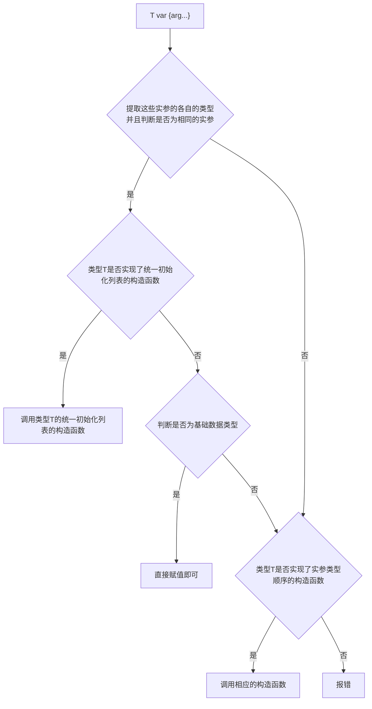

## 一、前言

c++的初始化方式较为多样，既有c语言继承而来的，也有自己演变的，因而有必要对初始化进行一定的总结。

一般而言，c++的数据可分为三类，一类是基础数据类型，如整形(int,char等)和浮点数类型,第二类是数组,即相同的数据类型排列成共同组合成为一种新的数据类型,第三种是用户自定义类型，struct和class等声明的数据类型。

### 1.1 基础数据类型初始化

对基础数据类型变量的初始化一般就是等式左边是变量，右边是另外一个变量或者是字面量(即已经知道是多少的值，如1、3.0这类在写代码的时候就知道的值)。而变量在定义的同时又完成初始化，即

```
TypeName var = var1; or TypeName var = var1;
```

这种格式就可以实现变量定义和初始化。而c++当时的定位是c的拓展，也就继承了这一部分。

### 1.2 数组初始化

设想一下，数组是不是表示一堆数据，那么这个时候只要能把这一堆数据告诉给编译器就行。c语言就提出使用花括号{}，将这一堆数据告诉编译器即可，然后编译器再生成相应的汇编指令。

```c++
int c[3] = {1, 2, 3};
int d[] = {1, 2, 3, 5};
```

### 1.3 结构体初始化

有些时候,想要把不同数据类型的组合在一起，这样使用的时候就可以表示这是一个整体。为了解决这种需求，c语言由提出了struct的概念，为了仿照基础数据类型，就提出使用一对花括号`{}`带入初始化的值来进行初始化。同时也能像数组一样，形式上都是一堆数据，只不过是不同类型的数据而已，如下形式：

```
TypeName var = {0, 2};or TypeName var = {var1, var2};
```

当自定义结构中嵌套了其他的自定义嵌套结构，这个时候就可以通过多个嵌套的格式进行初始化，如

```c++

struct A {
    int a;
};

struct B {
    struct A a;
    int b;
};

int main() {
    struct B varB = {{1}, 2};
    return 0;
}

```

以这种递归嵌套花括号的方式实现了对各种类型都实现了初始化。并且c语言还能保证，当花括号内的数据不足以将所有的数据初始化时，其默认值为零，毕竟所有自定义数据结构都是由基础数据结构组合出来的，而所有的基础数据都可以初始化为零。

> gcc的编译器能够支持<strong>指定变量名初始化</strong>，主要作用是一定要某一个数据成员达到初始化，提高代码的可维护性，这样改动自定义数据结构时，就不用一个一个数顺序。

因此，c语言的基础数据结构和用户自定义数据结构都能以各自的方式完成初始化，c语言达到了其完备性。

### 1.4 c语言初始化总结

c语言由于表现数据的格式较少，由上面的形式可以知道为三种类型：
1. 基础类型直接使用`T var = var1`;
2. 数组和结构体使用列表的格式，将实际初始化的数据通过{}表示出来即可。嵌套结构可用嵌套{}表示。

_______________

### 1.5 c++的初始化需要与演变

随着时代变化，一堆人为了在计算机中更好的模拟真实的世界，就提出了类这种概念，并且它还满足封装、继承和多态。为了实现这个概念，c++提出了class这个概念，其中封装性就是指类的设计者不应该过于了解类的内部实现机制，将一些数据对用户隐蔽，这个特性的目的是用户不需要过于了解其实现，知道怎么用就行。

一般而言，使用类的话，首先初始化对象，然后再使用，这个时候如果直接仿照c的花括号初始化，需要你了解各个数据成员，那么也就意味着用户需要对类本身很了解，这也就意味着照搬c的初始化方式有种脱裤子放屁的感觉，即类的特性要求封装性，即不需要了解其内部实现，而初始化又需要了解，前后矛盾。

因此，c++就提出使用构造函数，通过在类内部定义和类型名称同样的函数，只不过这个函数没有返回值的方式提供了初始化的方式。这就从语言层面保证了如何既保证封装性又提供类初始化的方式。

这个被认为是一个函数调用，而又需要变量初始化的时候调用，同时这个的变量前面还要保留类型名称，表明其具体类型。因此就成了如下形式

```c++
className var1(arg...);
```

因此各自都有了初始化的方式，达到了一定的完整性。而这个时候出现了一个新问题，叫做Most Vexing Parse这种问题：

> Most Vexing Parse 是 C++ 中的一种语法解析问题，它描述了一种在声明变量时因为语法的二义性导致的意外行为。具体来说，这种问题发生在编译器将声明解析为函数声明而不是变量声明。
> 
> ```
> #include <iostream>
> 
> class Example {
> public:
>     Example() {
>         std::cout << "Example constructor" << std::endl;
>     }
>     void exampleFunction() {}
> };
> 
> int main() {
>     Example e(Example());
>     e.exampleFunction(); // This may lead to a compilation error
>     return 0;
> }
> ```
> 
> 看起来 Example e(Example()); 是在声明一个名为 e 的 Example 对象，并用一个临时的 Example 对象进行初始化。然而，编译器却解析为声明一个函数 e，其返回类型是 Example，并且接受一个单独的参数，这个参> 数是一个指向函数的指针，该函数不接受参数并且返回一个 Example 对象。

另外,c++还支持实现了拷贝构造函数类使用像基础数据类型一样形式的初始化方式,即'classname var1 = classname(arg ...)'.以前老的标准中,它使用的是先使用构造函数,构造出一个匿名变量,然后这个var1再使用拷贝构造函数进行初始化.

综上,c++的初始化方式较为多种多样,这使得使用者比较混乱,因为c++既支持c的初始化方式,又支持自身特性带来的初始化方式,种类较为多样.在这种的情况下提出了统一初始化这个概念.

## 二、初始化方式

根据前面的介绍,c++有多种初始化方式,而往往我们使用者是与编译器沟通，既编译器认为怎么写是哪种初始化。

### 2.1 按照语法形式分类的初始化方式

1. 等号初始化(拷贝初始化)
    ```c++
    int x = 42;
    std::string s = "hello";
    ```
    + 特点：可能触发隐式转换（C++11前不允许窄化转换）
    + 限制：不能用于显式构造函数
2.  圆括号初始化（直接初始化）
    ```c++
    int x(42);
    std::vector<int> v(10, 5);  // 10个元素，每个都是5
    ```
    + 特点：直接调用构造函数
    + 陷阱：Most Vexing Parse问题
3. 花括号初始化（统一初始化语法，C++11引入）
    ```c++
    int x{42};
    std::vector<int> v{10, 5}; 
    ```
    + 包含两种语义：
        - 列表初始化（当调用std::initializer_list时）
        - 普通构造初始化（当没有initializer_list时）
4. 等号+花括号（混合初始化）
    ```c++
    int x = {42};  // 等价于int x{42};
    auto lst = {1,2,3}
    ```

总结：

| 初始化方式       | 语法示例                     | 是否允许窄化转换 | 优先匹配initializer_list | 适用场景                     |
|-----------------|------------------------------|------------------|--------------------------|--------------------------|
| 等号初始化       | `int x = 3.14;`              | 是（有警告）     | 不涉及                   | 简单类型初始化               |
| 圆括号初始化     | `std::vector<int>(5,10)`     | 是               | 否                       | 显式调用构造函数             |
| 花括号初始化     | `int x{3.14}`                | 否               | 是                       | 通用场景（推荐）             |
| 等号+花括号      | `auto lst = {1,2,3};`        | 否               | 必须                     | 推导initializer_list        |
| 聚合初始化       | `Point p{1,2};`              | 否               | 不涉及                   | 简单结构体/POD类型           |
| 值初始化         | `int x{};`                   | 否               | 不涉及                   | 零初始化/默认构造            |


### 2.2 统一初始化

前面提到了c++既有的问题之后,迫切需要一个方式来解决这种既有c语言的初始化方式,又有自身个性化的初始化方式,并且新增加对构造函数的新的需求,比如对数组的拓展,c++个性化了各种不同的stl组件.

__统一初始化:C++11引入的标准化语法形式，用{}替代多种初始化写法.__

那用户怎么写,编译器认为是使用的是统一初始化呢?

```c++
int a {};
int b {1};
std::string ff {"dsadsad"};
```

+ 形式上的特点:即通过一对花括号,并且不再有=等号.
+ 作用:
    - 消除()初始化与函数声明的歧义（Most Vexing Parse）
    - 禁止窄化转换（如int x{1.5};报错）
    - 统一所有初始化场景的写法

既c++想要实现基础数据类型和用户自定义数据类型具有一样的初始化方式,并且解决前面提到的直接初始化所带来的问题.

### 2.3 统一初始化具体细节

前面提到了统一初始化都具有一样的表现形式。即都是变量后面接一个{}，{}像是初始化数据的收集器。但是这个列表怎么个性化呢？前面说到，大致三类数据，即基础类型，相同类型的数据的集合体，不同数据的集合体（这里的集合体并没有c++语言层面上的具体概念，就只是把开发需要概括出来）。如何对{}里面的数据检验呢？即到底是多少数据，以及数据到底是不是同一类型呢（仿数组的功能）？数据类型是不是满足类构造函数的参数要求呢？

先看看三类数据结构各自的需求。

1. 基础数据类型，这比较简单。
    + 编译器就看看数据类型是否能够互相转化就可以了，因为它就一个数。

2. 结构体
    + 根据参数个数和类型来调用不同的构造函数。
3. 仿数组（容器）。
    + 它需要在编译阶段就要知道编写代码的数据是否是一样的。
    + 仿数组需要如何知道数组个数，以及如何获取这些具体的数据。
    + 拥有其他个性化的初始化方式。

c++提出的方案是统一初始化列表来判定是否达到c的数组同质数据初始化，从而将仿数组的需求一起解决了。统一初始化列表是一个类，编译器会把实际参数打包起来并且其必要信息传递给这个类。

那么编译器是怎么处理的呢？看看下面的简略处理图：



特点：
+ 当实际参数是可以被构造为初始化列表之后，就直接调用类型T的初始化列表的构造函数。
+ 当T是基础类型，就可以直接初始化。
+ 当T没有初始化列表构造函数时，就直接调用T的符合实际参数类型及其顺序的构造函数。

因此，回答上面的问题，编译器编译的时候对这些参数进行数量和类型的推断，然后根据类T的实际类型和构造函数，通过初始化列表的方式来实现了仿数组、基础类型、结构体三大类的统一初始化。

## 三、初始化列表

首先，初始化列表是一个模板类。其函数声明为
```c++
template< class T >
class initializer_list;
```

c++标准规定了一些通常的模板类的成员类型，这个主要是可以用模板元编程。然后就是提供了三个成员函数，size(),begin(),end()，这三个成员函数足够将实际的参数读取出来。

而msvc实现如下：

```c++
template <class _Elem>
class initializer_list {
public:
    using value_type      = _Elem;
    using reference       = const _Elem&;
    using const_reference = const _Elem&;
    using size_type       = size_t;

    using iterator       = const _Elem*;
    using const_iterator = const _Elem*;

    constexpr initializer_list() noexcept : _First(nullptr), _Last(nullptr) {}

    constexpr initializer_list(const _Elem* _First_arg, const _Elem* _Last_arg) noexcept
        : _First(_First_arg), _Last(_Last_arg) {}

    _NODISCARD constexpr const _Elem* begin() const noexcept {
        return _First;
    }

    _NODISCARD constexpr const _Elem* end() const noexcept {
        return _Last;
    }

    _NODISCARD constexpr size_t size() const noexcept {
        return static_cast<size_t>(_Last - _First);
    }

private:
    const _Elem* _First;
    const _Elem* _Last;
};
```

可以看出它只是接受头尾两个指针。

那么c++标准没有明确实现方式，只是定义其语义学：

std::initializer_list<T> 的实例化对象是一个轻量型代理对象，它提供了一个访问`const T`类型数组类型接口。一个初始化列表对象会在以下时机自动生成：

1. 被用于列表初始化一个对象，当这个对象拥有一个接受初始化列表的类构造函数。
    ```c++
    struct A {
        A(std::initializer_list<int> arg) {
            for (auto i : arg) {
                std::cout << i;
            }
        }
    }

    int main() {
        A a {1, 2, 3}; return 0;
    }
    ```
    如上所示，需要实现一个带有初始化列表的类构造函数。

2. 当作赋值运算符的右操作数或者是当作函数实参，并且相应的赋值运算符或者是函数参数中接受std::initializer_list。
    
    ```c++
    struct A {
        A() = default;
        template<typename T>
        A & operator = (std::initializer_list<T> arg) {
            for (auto i : arg) {
                std::cout << i << " ";;
            }
            return *this;
        }
    };
    /*
    根据C++规则，赋值运算符不能定义成静态成员函数，也不能定义为普通的非成员函数。它必须是类的成员函数。所以下面的方式错误。
    struct C {};

    void operator = (C&, std::initializer_list<int> a) {
        for (auto i : arg) {
            std::cout << i;
        }
    }
    */

    void func1(std::initializer_list<int> y) {
        for (auto i : arg) {
            std::cout << i << " ";;
        }
    }

    int main() {
        A a; a = {1, 2, 3}; 
        func1({1, 2, 888});
        return 0;
    }
    ```

3. 当花括号括起来的列表绑定于auto 类型，这个既可以当作变量声明，也可直接在范围循环处使用{}定义初始化列表。
    ```c++
    auto i = {1, 2, 3};

    int main() {
        for (auto c : i) {
            std::cout << c << " ";
        }
        
        for (double c : {5.5, 6.0}) {
            std::cout << c << " ";
        }
         return 0;
    }
    ```

__值得注意：__
1. std::initializer_list要求所有元素必须是相同的数据类型（或可隐式转换为该类型）。这是其设计的一个核心约束，与C++的类型安全机制紧密相关。
2. 当使用auto推导时，编译器会尝试寻找所有元素的共同类型。
    ```c++
    auto lst3 = {1, 2, 3.0f};      // std::initializer_list<float>（int可转float）
    auto x2{1, 2};       // C++17起错误（必须用=初始化）
    auto x3{42};         // C++17起是int，不是initializer_list（C++11/14中是initializer_list）
    ```
3. 初始化列表概念是为了解决当仿数组使用统一初始化时都具有统一的调用格式无法区分到底是实现数组初始化的效果还是类构造函数的初始化效果，此时编译器根据调用处上下文环境推导出初始化列表，然后实现c语言中实现数组初始化效果，不满足的情况下再进行其他的构造函数，从而解决了仿容器既想要同质化数据初始化，也想要根据不同类型初始化的要求。

--------------------------------------------------------------------

常见书写形式总结:

|场景	        |调用目标                                               |	示例        |
| :-----        | :------:                                              | :-----: |
|T{...}         |且有匹配的initializer_list	initializer_list构造函数	|  std::vector{1,2,3}|
|T{...} 且无initializer_list|	其他匹配的构造函数	                     | std::vector(5,10)|
|T{单一元素}	|C++17起优先匹配非列表构造	|int{42} → int|
|T{}（空列表）	|优先匹配默认构造函数	|std::string{} → 默认构造|


### 3.1 初始化列表数据源

那么用户定义的数据存储在哪里呢？也就是说：

```c++
// 用户代码
std::vector<int> v = {1, 2, 3};

// 编译器实际生成的类似代码：
const int __temp[3] = {1, 2, 3};//这个数据放置在栈还是全局区呢？
std::vector<int> v(std::initializer_list<int>(__temp, __temp + 3));
```

c++标准并没有对此进行规定，它的标准规定为：
> An object of type std::initializer_list\<E\> is constructed from an initializer list as if the implementation allocated a temporary array of N elements of type const E.

那么，
+ 实现（编译器）需要负责分配临时数组
+ 该数组元素类型为const E
+ 数组生命周期与initializer_list对象相同

因此它是有可能放在静态存储区，或者是栈上。然后初始化完成之后再将具体的数组起始和末尾的指针在调用处自动生成调用。

## 四、后记

从c++11到c++17的变化，统一初始化已经达到了完全的c++中推荐的变量初始化方式，它根据类型和构造函数共同决定变量实际调用方式，算是达到了形式上的统一。
