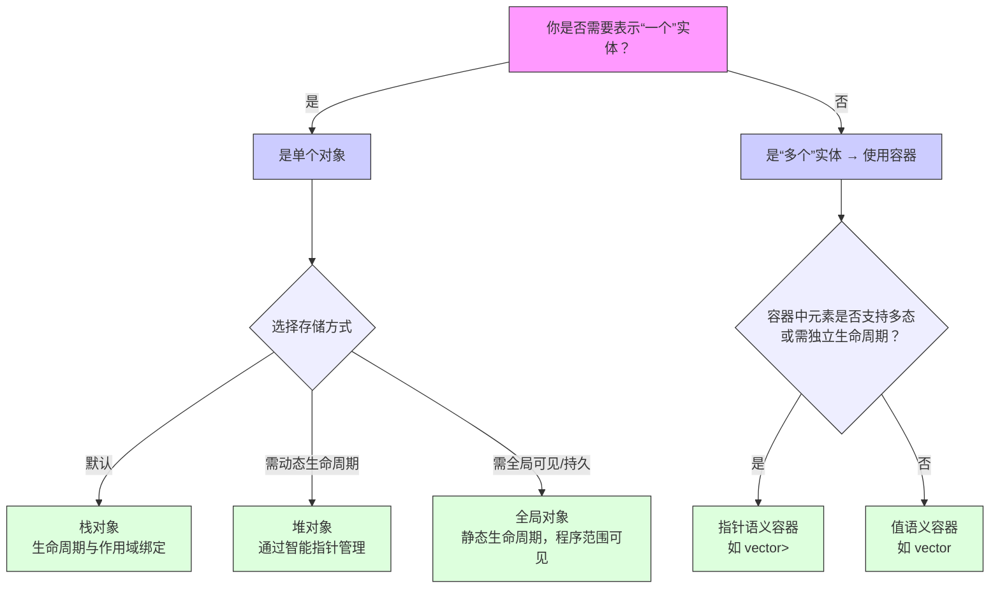

## 一、前言

编程，本质上是用代码模拟现实。我们从真实世界中抽象出“类”，再创建“对象”去代表具体事物，最终通过控制这些对象的行为，实现我们想要的效果。这正是面向对象的核心——封装、继承、多态与抽象，让程序更贴近生活、更易维护、更可扩展。

## 二、对象数量维度考量


### 2.1 类的一般设计准则

对象应具备面向对象编程的三大特性：

1. __继承__:子类复用父类属性与方法，实现代码复用与层级扩展。
2. __多态__:同一接口不同实现，运行时动态绑定，提升灵活性。
3. __封装__:隐藏内部细节，对外提供统一接口，保障数据安全与模块独立。

此外，常通过组合多个对象构建更复杂的对象，以实现更强功能。实际设计中，类通常同时结合继承、多态与组合，构建结构更完善、可维护性更高的代码。

### 2.2 数量的考量

多个对象通常通过容器管理，容器是若干对象的集合。其主要考量包括：

1. __抽象集合__：将多个同质对象组织为统一接口，屏蔽底层存储细节。
2. __统一管理__：提供标准操作（增删改查、迭代），简化多对象处理。
3. __表达设计意图__：通过容器类型选择表达“对象是否独立”、“是否支持多态”等设计决策。
4. __性能与灵活性权衡__：值语义容器内存连续、缓存友好；指针语义容器支持动态大小和多态。

## 三、对象存储方式考量

对象实体在内存模型中主要分为栈对象、堆对象与全局对象（含局部静态对象）。

### 3.1 设计哲学

| 方式       | 核心哲学             | 关键词               | 适用对象                     |
|------------|----------------------|----------------------|------------------------------|
| **栈对象** | 自动化、确定性、零开销 | RAII、作用域、局部性 | 单个对象、容器元素（值语义） |
| **堆对象** | 动态性、控制力、所有权语义 | 智能指针、多态、生命周期控制 | 单个对象、容器元素（指针语义） |
| **全局对象** | 静态生命周期、全局可见 | 静态初始化、单例、全局状态 | 全局配置、单例服务、共享资源 |

> **关键认知**：三者非对象类型之别，而是**存储位置与生命周期管理方式**的差异。同一对象（如 `User`）可依需置于栈、堆或全局区。

### 3.2 现实考虑

| 考量维度     | 栈对象       | 堆对象           | 全局对象             |
|--------------|--------------|------------------|----------------------|
| **生命周期** | 作用域绑定   | 手动/智能指针管理 | 程序启动至结束       |
| **内存位置** | 栈           | 堆               | 数据段/静态区        |
| **性能**     | 极快         | 较慢             | 初始化开销，访问快   |
| **安全**     | 高           | 中               | 依赖初始化顺序，易出错 |
| **适用规模** | 小型、固定   | 大型、动态       | 单一实例、共享状态   |
| **多态支持** | 否（需指针） | 是               | 是（通过指针/引用）  |
| **容器中使用** | 值语义容器   | 指针语义容器     | 一般不直接用于容器   |

### 3.3 典型用例

```cpp
// 栈对象
User user("Alice");                  // 栈上分配

// 堆对象
auto user_ptr = std::make_unique<User>("Bob"); // 堆上分配

// 全局对象
User g_user("Admin");                // 全局静态对象

// 局部静态对象（函数内全局语义）
void init() {
    static User local_static_user("Singleton"); // 首次调用初始化，生命周期全局
}

// 容器：值语义
std::vector<User> users;
users.emplace_back("Charlie");

// 容器：指针语义
std::vector<std::unique_ptr<User>> user_ptrs;
user_ptrs.push_back(std::make_unique<User>("David"));
```

### 3.4 三者关系图



> **简洁说明**：全局对象适用于程序全程共享的资源，但应谨慎使用，避免初始化依赖混乱和测试耦合。

## 四、堆对象的管理方式

### 4.1 原始指针与引用：裸指针的角色、风险与引用的替代价值

> **设计定位**：
> 
> 1. 原始指针不是资源管理工具，而是**访问工具**。它不拥有资源，仅用于**观察、传递或临时访问**已由智能指针或容器管理的对象。
> 2. 引用是对象的“别名”，它绑定到一个已存在的对象，且不能为 null，不能重新绑定。它比原始指针更安全、更直观，是“传递对象”的首选方式

- **适用场景**：  
    - 作为函数参数接收对象（不获取所有权）。
    - 在性能敏感代码中作为“观察者”访问对象（如遍历容器、调用接口）。
    - 与 C 接口或遗留代码交互时的“桥梁”。

- **关键准则**：  
    + **“谁申请，谁释放” —— 原始指针绝不负责释放资源！**
    + 如果你通过 `new` 或 `malloc` 分配了内存，必须由**同一个作用域或明确的所有者**负责释放（通常通过智能指针封装）。原始指针只是“借用”访问权，不能承担所有权责任。

- **风险警示**：  
    - 原始指针极易导致**悬空指针**、**内存泄漏**、**重复释放**。
    - 现代 C++ 中，应**尽量避免在新代码中使用原始指针管理资源**，除非有明确理由且安全边界清晰。

### 4.2 **独占指针（std::unique_ptr）**

- **设计目的**：体现 **独占所有权语义** 和 **资源唯一性**。它确保一个资源在同一时间只有一个所有者，禁止拷贝，只允许移动，从而避免所有权混淆和资源重复释放。
- **可完成的目的**：  
    - **自动内存管理**：当 `unique_ptr` 离开作用域时，自动释放资源，防止内存泄漏。
    - **明确所有权转移**：通过 `std::move` 转移所有权，代码清晰表达资源传递意图。
    - **轻量级和零开销**：相比 `shared_ptr`，`unique_ptr` 几乎无额外开销（无引用计数），适合性能敏感场景。
    - **自定义删除器**：支持定制资源释放逻辑（如文件句柄、网络连接）。

> **“谁申请，谁释放”准则在此完美落地**：  
> `unique_ptr` 是资源的**唯一拥有者**，它在构造时（如 `make_unique`）申请资源，在销毁时自动释放，完全封装了“申请-释放”生命周期，是“谁申请谁释放”的最佳实践体现。

**示例**：
```cpp
// 独占所有权：资源只能由一个 unique_ptr 持有
auto ptr1 = std::make_unique<MyClass>();
// auto ptr2 = ptr1; // 错误！不能拷贝
auto ptr2 = std::move(ptr1); // 正确：所有权转移，ptr1 变为空

// 用于工厂模式返回对象 —— 工厂“申请”，调用者“持有并释放”
std::unique_ptr<MyClass> createObject() {
    return std::make_unique<MyClass>();  // 工厂申请资源，返回所有权
}
```

### 4.3 **共享指针（std::shared_ptr）**

- **设计目的**：体现**共享所有权语义**和**资源协同管理**  
    它允许多个指针共享同一资源，通过引用计数自动管理生命周期，当最后一个 `shared_ptr` 被销毁时释放资源。

- **可完成的目的**：
    - **多实体共享资源**：适合多个对象需要访问同一资源的场景（如缓存、观察者模式）。
    - **循环引用处理**：虽然 `shared_ptr` 可能导致循环引用（需配合 `std::weak_ptr` 解决），但它提供了灵活的共享机制。
    - **线程安全**：引用计数操作是原子的，但对象访问需额外同步。
    - **动态生命周期**：资源生命周期由所有共享者共同决定，无需明确指定所有者。

> **“谁申请，谁释放”准则的扩展形式**：  
> 在 `shared_ptr` 场景中，“申请者”可以是第一个创建 `shared_ptr` 的对象，但“释放者”是**最后一个销毁 `shared_ptr` 的所有者**。这本质上仍遵循“谁持有所有权，谁负责释放”，只是所有权被多个实体共享。

**示例**：
```cpp
// 共享所有权：多个 shared_ptr 指向同一对象
auto ptr1 = std::make_shared<MyClass>();
auto ptr2 = ptr1; // 引用计数增加
// 当 ptr1 和 ptr2 都销毁时，资源才释放 —— 多个“持有者”共同决定释放时机

// 用于共享资源场景
class Cache {
    std::shared_ptr<Data> data;
public:
    void setData(std::shared_ptr<Data> d) { data = d; } // 多个 Cache 实例可共享 Data
    // 此处不负责释放，由原始创建者或最后一个持有者释放
};
```

### 4.4 总结：现代 C++ 资源管理三原则

1. **优先使用智能指针管理资源**：`unique_ptr`（独占）或 `shared_ptr`（共享），它们自动遵守“谁申请谁释放”。
2. **原始指针仅作访问工具**：绝不负责释放资源，避免所有权混淆。
3. **所有权清晰化**：通过移动语义（`std::move`）或引用传递，明确表达资源归属，减少 bug。

> **永远不要在新代码中用原始指针管理资源生命周期**  
> **让智能指针做“守门人”，原始指针只做“访客”**

