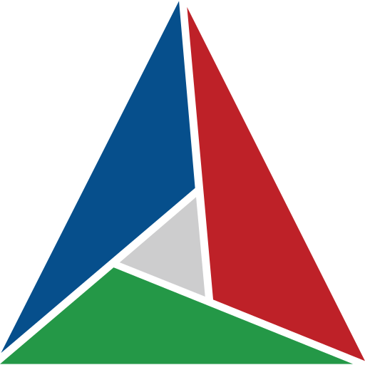

---
hide:
  - toc
  - navigation
---

  <h1 style="text-align: center;">个人主页</h1>
  ⚡ ikun fan

  

  <h3 style="text-align: center; color: #4CAF50; margin-top: 0; 
             border-bottom: 2px dashed #4CAF50; padding-bottom: 10px;">
    坤式精神档案
  </h3>
  
  

    

      
🎤 音乐信仰

      

        单曲循环《Hug me》的朝圣者 
        坤式旋律人体节拍器 
        "只因你太美"十级学者
      

    

    
    

      
💃 灵魂共鸣

      

        舞台艺术的显微镜 
        每个wave都值得反复品味 
        应援打榜专业八级选手
      

    

  

  
  

    

      "练习生没有捷径" 终身实践者 
      在唱跳rap篮球的宇宙中 
      追寻完美平衡的IKUN信徒
    

  

  
  
  

## 🛠️ 技术栈

  

    <!-- 使用Base64编码的芯片图标 -->
    
    <strong style="font-size: 1.1em; color: #2c3e50;">嵌入式开发</strong>
  

  <ul style="margin: 0; padding-left: 1.2rem; line-height: 1.6;">
    <li><code>STM32/Cortex-M</code> 开发</li>
    <li><code>FreeRTOS</code> 实时系统</li>
    <li>硬件加速算法优化</li>
  </ul>

  

    
    <strong style="font-size: 1.1em; color: #004482;">C++开发</strong>
  

  <ul style="margin-top: 0; margin-bottom: 0; padding-left: 1.2rem;">
    <li>C++11/17</li>
    <li>CMake</li>
    <li>模板元编程</li>
  </ul>

  

    <!-- 使用Base64编码的工具箱图标 -->
    
    <strong style="font-size: 1.1em; color: #2c3e50;">工具链</strong>
  

  <ul style="margin: 0; padding-left: 1.2rem; line-height: 1.6;">
    <li><code>Git</code> 版本控制</li>
    <li><code>VSCode</code> 开发环境</li>
    <li><code>Docker</code> 容器化</li>
  </ul>

## 🔥 热门项目

### 1. [CMake实战教程](cmake/2025-01-16-cmake的总体语言概念.md)

- 现代CMake最佳实践
- 多平台构建方案
- 依赖管理技巧

### 2. [C++11特性解析](cplusplus/2025-05-26-一种c++常量注入技术.md)

- 移动语义详解
- lambda表达式
- 类型推导

## 📺 技术视频
<iframe ... sandbox="allow-same-origin allow-scripts"></iframe>
