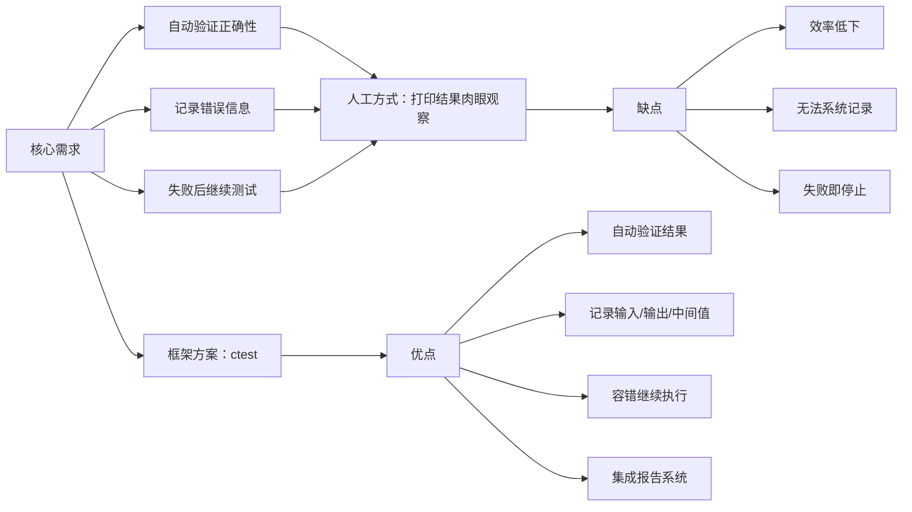

# 前言

当我们写出代码之后，一般需要对它的正确性进行检验。


现代c++事实上基本采用cmake进行构建系统，因此有必要了解cmake出品的ctest框架。  

# 整体流程

ctest框架整体分为两个部分，告诉cmake如何生成单元测试的可执行文件；第二部分，使用ctest命令来执行单元测试的可执行文件，其测试的总体情况会在终端上显示出来，而其他详细的测试结果会自动在执行目录下生成测试结果的详情。

## 如何告诉cmake生成单元测试的可执行文件

整体上，ctest仍然通过cmakelists.txt文件进行构建，与常规的构建可执行文件并没有太多的区别。常规的cmakelists.txt如下：
```cmake
cmake_minimum_required(VERSION xxx)

project(project)

set(Src ${CMAKE_SOURCE_DIR}/main.cc)

add_executable(${PROJECT_NAME} ${Src})
```
如上，便可以生成一个可执行文件的cmakelist.txt文件写法。为了使用ctest，仅仅需要  
1. enable_testing()
2. add_test(NAME TARGETNAME COMMAND EXCUTEABLE ARG1 ARG2 ...)

将这两个添加到CMakeLists.txt中后
```cmake
cmake_minimum_required(VERSION xxx)

project(project1)

set(Src ${CMAKE_SOURCE_DIR}/main.cc)

add_executable(${PROJECT_NAME} ${Src})

enable_testing()
add_test(NAME project1 
    COMMAND ${PROJECT_NAME} "1" "2" "3" 
    WORKING_DIRECTORY ${CMAKE_BINARY_DIR}
)
```
上面需要注意的是，使用引号将命令之后的内容包起来当作一整个命令。
那么后两句cmake命令主要是生成一个CTestTestfile.cmake的配置文件，用于指导ctest如何进行单元测试。  

## 如何运行单元测试呢

核心便是如何让ctest找到这个CTestTestfile.cmake，ctest命令根据这个配置文件执行响应的单元测试。那么就有两种方式：
1. cd到配置文件所在的目录，然后执行ctest命令。  
2. 使用选项--test-dir 编译选项指定目录，然后ctest命令便会将详细的测试内容写入到CTestTestfile.cmake所在目录下会生成相应的结果。  

# 附录

## 常用的ctest选项