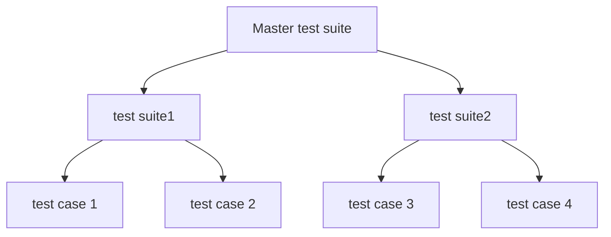
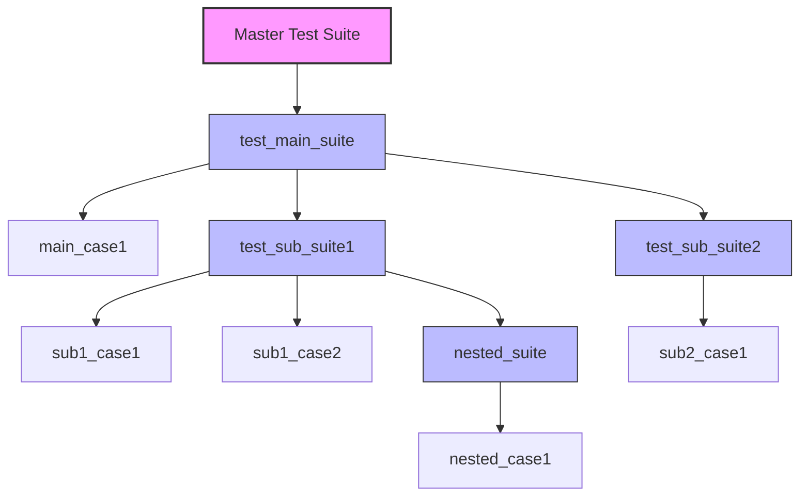
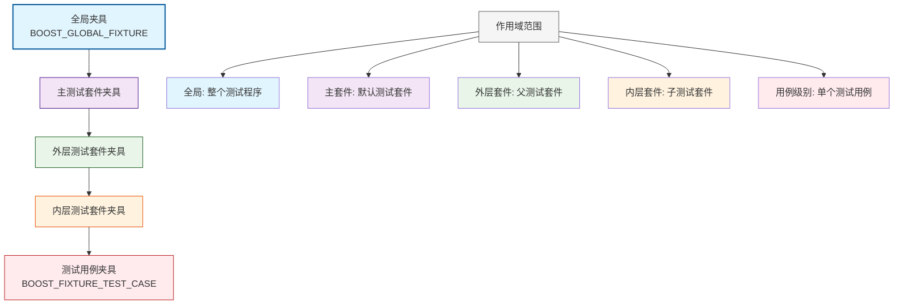

## 第一章 前言

当写出来一个代码之后，使用一定的测试来判断代码是否正常运行，因此我们可以考虑使用一定的测试框架来检测自己的代码是否正确。

接下来介绍一下boost.test框架所带来的测试框架流程。

## 第二章 总体预览

boost.test框架将测试代码以树的方式进行构建。boost.test称之为test tree。  
整棵树主要分为四类：

1. 测试用例 test case
    - 测试树中的叶子节点，包含具体的测试代码逻辑。一般而言，一个功能就对应一个测试用例。  
2. 测试套件 test suite
    - 测试树种的内部节点，本身不包含可执行代码，但是可以绑定夹具和字测试用例或者套件。它的作用就是将各个测试用例或者是子套件注册到测试树上。
3. 主测试套件 Master Test Suite
    - 测试树的根节点，本质是一个测试套件。绑定到主测试套件的夹具称为全局夹具。
4. 夹具（Fixtures）
    - 在测试单元（如测试用例或套件）执行前后运行的代码单元，用于环境初始化或清理。

具体树状结构如下所示：


## 第三章 测试用例

### 3.1 前言

测试用例用于验证功能是否按预期实现。一个复杂功能通常可拆分为多个测试用例，每个测试用例通过若干个断言来检查预期结果。测试完成后，框架会生成日志或报告来展示测试结果。

在了解测试用例之前，需要明白两个问题。

<b>问题一</b>：Boost.Test 通过测试树组织测试用例，整个框架提供了哪些方式来让测试人员将自己的测试用例放到测试树上。  

<b>答</b>：boost支持两种注册方式：

+ <b>自动注册</b>： 优点是使用简单。
+ <b>手动注册</b>： 优点是更高的定制化控制能力，允许精确管理测试执行流程，缺点较为复杂。

<b>问题二</b>：

由于测试用例的编写实现方式测试的需求有关，比如说，有的测试人员想看看这种情况下是否代码是否按照自己的需求运行，有的测试需要看看这段代码是否能够在大量普遍测试情况下完成，有的想要看看某些模板是否按照预期运行，
在这些需求下，boost.test提炼出如下三种常见的测试场景：

1. 无参测试用例：基础功能验证

2. 有参测试用例：多组输入数据的批量测试

3. 带有模板的测试用例：泛型代码测试

本文仅仅涉及前两个场景，第三个请参考boost官方文档。

由于无论是测试场景的范式还是手动或者是自动注册，都需要介绍两个概念：

1. 测试断言：组成测试用例。
2. 编程范式：如何引入boost.test库到自己的测试代码中。

### 3.2 预备知识

#### 3.2.1 断言  
一般来说，测试断言应该接收一个bool类型的运行期变量，然后boost.test框架根据true或者是false来判断断言是否成功。该节主要讲述测试用例的前备知识。

测试用例通过断言来验证功能是否满足预期。Boost.Test 提供了多种断言工具来控制测试流程:

1. <b>基础值比较</b>  
    ```c++
    BOOST_TEST(1 + 1 == 2);              // 布尔表达式检查
    BOOST_TEST_EQ(result, expected);     // 严格相等比较
    BOOST_TEST_NE(status, ERROR);        // 不等比较
    ```
2. <b>条件检测断言</b>: 断言失败是否终止当前测试用例  
    ```c++
    BOOST_TEST(condition);        // 非致命检查，失败后继续执行
    BOOST_REQUIRE(condition);     // 致命检查，失败则终止当前用例
    ```
3. <b>异常断言</b>: 判断是否抛出预期异常  
    ```c++
        BOOST_REQUIRE_THROW(func(), std::runtime_error); // 必须抛出指定异常
        BOOST_CHECK_NO_THROW(safe_func());               // 不应抛出任何异常
        BOOST_CHECK_THROW(func(), std::logic_error, "Why?"); // 检查异常类型+消息
    ```
4. <b>浮点数容差比较</b>
    ```c++
      BOOST_TEST(1.0 == 1.001, tt::tolerance(0.01));  // 允许1%误差
      BOOST_CHECK_CLOSE(result, 3.14, 0.1);           // 允许0.1%误差
    ```
5. <b>上下文信息增强</b>： 主要是附加调试信息  
    ```c++
      BOOST_TEST_CONTEXT("Testing scenario X") {
          BOOST_TEST(data.parse() == OK); // 失败时会显示上下文标签
      }
    ```
6. <b>自定义谓词</b>
    ```c++
      BOOST_TEST_PREDICATE([](int x) { return x % 2 == 0; }, (value));  // 使用自定义判断逻辑
    ```

通过这些断言，可以精确控制测试的检查点和执行流程，测试框架会自动记录结果并生成详细报告。

#### 3.2.2 编程范式

boost支持三种编程范式。

1. 头文件格式
     - 注意点在于，需要定义BOOST_TEST_MODULE这个宏定义，然后再包含测试框架的相关设施
       ```c++
       #define BOOST_TEST_MODULE test module name
       #include <boost/test/included/unit_test.hpp>
       ```
2. 静态库链接
     - 第一步，所有的翻译单元都需要包含下面的头文件
       ```c++
         #include <boost/test/unit_test.hpp>
       ```
     - 第二步，有且仅有一个翻译单元是如下格式
       ```c++
       #define BOOST_TEST_MODULE test module name
       #include <boost/test/unit_test.hpp>
       ```
     - 第三步，链接boost的静态库
     此方法的缺点：会增大二进制文件的大小。
3. 动态库链接
     - 第一步，所有翻译单元均需要包含如下两行
       ```c++
       #define BOOST_TEST_DYN_LINK
       #include <boost/test/unit_test.hpp>
       ```
     有且仅有一个翻译单元满足如下三行
       ```c++
       #define BOOST_TEST_MODULE test module name
       #define BOOST_TEST_DYN_LINK
       #include <boost/test/unit_test.hpp>
       ```
     - 第二步，链接boost的动态库

### 3.3 无参测试用例

无参测试用例主要有以下形式：

+ 使用 `BOOST_AUTO_TEST_CASE` 宏自动将测试用例注册到测试树中
+ 测试树的构建、维护和执行调度完全由 `Boost.Test` 框架自动处理
+ 宏语法借鉴不带返回值的函数定义形式，将测试用例封装为完整单元

其设计优点：

+ 关注点分离：开发者无需关心底层注册机制和测试组织细节
+ 专注测试逻辑：只需专注于测试用例本身的业务逻辑实现
+ 降低使用门槛：直观的语法设计让编写测试用例更加简洁明了
+ 易于理解：测试单元化的设计方式降低了框架的理解难度

这种设计使得测试用例的编写既简单又高效，让开发者能够快速上手并专注于测试业务逻辑。

下面写一个常见的无参测试用例示例

```c++
// 定义测试模块名称为 example，这会显示在测试报告中
#define BOOST_TEST_MODULE example
// 包含 Boost.Test 框架的头文件，使用单头文件包含方式
#include <boost/test/included/unit_test.hpp>

// 使用 BOOST_AUTO_TEST_CASE 宏定义一个测试用例
// free_test_function 是这个测试用例的名称，会在测试日志和报告中显示
BOOST_AUTO_TEST_CASE( free_test_function )
/* 注释说明：这种写法类似于定义了一个 void free_test_function() 函数 */
{
    // 在测试用例中编写具体的测试断言
    // BOOST_TEST 是 Boost.Test 提供的断言宏，这里验证 true 为真
    BOOST_TEST( true /* 测试断言 */ );
}
```

__代码结构说明：__

1. 测试模块定义：BOOST_TEST_MODULE example 定义了测试模块的名称，用于组织相关的测试用例

2. 测试用例定义：BOOST_AUTO_TEST_CASE(free_test_function) 创建了一个名为 "free_test_function" 的测试用例
    + 测试用例名称会在运行测试时显示在输出日志中
    + 每个测试用例都是独立的测试单元

3. 测试断言：BOOST_TEST(true) 是测试的核心部分，用于验证代码行为是否符合预期
    + 断言是测试用例中的检查点
    + 如果断言失败，测试框架会标记该测试用例为失败

4. 自动注册机制：通过宏定义，测试用例会自动注册到 Boost.Test 的测试树中，无需手动注册

这种结构让测试代码保持简洁，同时提供了清晰的测试组织和报告功能。

### 3.4 有参数测试用例

在实际测试过程中，经常需要验证同一个函数在不同输入参数下的行为是否正确。传统的做法是手动编写多组测试数据，然后依次调用函数并进行断言验证。但这种方法存在明显不足：

+ <b>工作量大</b>：需要重复编写相似的测试代码
+ <b>覆盖不全</b>：难以穷举所有边界情况和正常情况
+ <b>维护困难</b>：当测试数据变化时需要大量修改

`Boost.Test` 提供了参数化测试功能，通过自动生成和管理测试数据集来解决上述问题：

1. <b>自动数据驱动</b>：框架能够自动生成测试数据集，并将每组数据依次传入测试函数
2. <b>全面覆盖</b>：支持定义各种边界值、正常值和异常值组合
3. <b>灵活扩展</b>：既可以使用内置的数据生成器，也支持自定义数据集
4. <b>简洁高效</b>：用声明式的方式定义测试数据，减少重复代码

接下来我们将详细介绍 Boost.Test 中数据集的定义和使用方式。

#### 3.4.1 数据集基础概念

数据集中“样本(Sample)”的定义与特性

1. 核心概念
     - 样本(Sample) 是一种多态元组(polymorphic tuple)，即可以容纳不同类型的元素组合。
     - 元组的长度直接定义为样本的元数(arity)，即样本中包含的元素数量。
2. 作用
     - 通过多态元组的结构，单个样本可以灵活地封装测试所需的多维输入数据（例如：(int, string, float) 三者组合）。
     - 元数(arity) 明确了每次测试时需要的参数个数，例如：
         + 元数为2的样本：(input_value, expected_result)
         + 元数为3的样本：(x, y, expected_sum)
3. 与数据集(Data Dataset)的关系
     - 数据集是由多个样本构成的集合，用于参数化测试（如迭代测试同一逻辑的不同输入组合）。  

举例说明：

在汽车运动数据采集中，需要同时记录多个相关参数来全面描述车辆状态，以采样汽车运动数据为例来说明数据集，样本，以及元数的概念。

假设我们需要测试一辆汽车在一段时间内的位置，速度，加速度，假设这三个都是我们可以直接使用传感器测量到的，那么每一次测量都有位置、速度、加速度，这一次就叫做采样；而一次采样包含了位置、速度、加速度这三种类型的信息，这叫做元数，这个例子中元数为3，假设我们不测量加速度了，那么元数是2；而这一段时间内所有的采样就是数据集。

__总结__:

+ 单次测量 = 一个样本（包含位置、速度、加速度）
+ 参数数量 = 元数（此例中为3）
+ 所有测量 = 数据集（多个时间点的样本集合）

#### 3.4.2 boost.test中表达数据集的方式

在boost中，数据集需要满足三个功能：  

+ 可向前迭代的，即这个类型支持operator++运算符。
+ 需要实现size函数，返回这个数据的所包含的元素个数。  
+ 可以访问到类内定义的一个枚举，arity，表示多少个元数。  

而为了实现数据集的功能，数据集需要定义如下接口函数：  

1. <b>`iterator begin()`</b>  
   返回指向数据集中第一个样本的向前迭代器。至于向前迭代器的功能可参考`cppreference`中的定义。

2. <b>`boost::unit_test::data::size_t size() const`</b>
     - 返回数据集的大小，其返回值类型为 `boost::unit_test::data::size_t`（专有类型）。
     - 返回值可能是有限值（如 10）或表示无限数据集（如 `boost::unit_test::data::infinite`）。

3. <b>`enum arity`</b>
     - 表示数据集中每个样本的元数(`arity`)，即样本包含的元素个数
     - 需要通过模板特化使数据集能被Boost.Test识别:  
        ```c++
        boost::unit_test::data::monomorphic::is_dataset
        ```  
        其条件是`boost::unit_test::data::monomorphic::is_dataset<D>::value`为 `true`

boost官方例程来说明如何构造一个数据集：

```c++
#define BOOST_TEST_MODULE dataset_example68
#include <boost/test/included/unit_test.hpp>
#include <boost/test/data/test_case.hpp>
#include <boost/test/data/monomorphic.hpp>
#include <sstream>

namespace bdata = boost::unit_test::data;

// Dataset generating a Fibonacci sequence
class fibonacci_dataset {
public:
    // the type of the samples is deduced
    enum { arity = 1 };

    struct iterator {

        iterator() : a(1), b(1) {}

        int operator*() const   { return b; }
        void operator++()
        {
            a = a + b;
            std::swap(a, b);
        }
    private:
        int a;
        int b; // b is the output
    };

    fibonacci_dataset()             {}

    // size is infinite
    bdata::size_t   size() const    { return bdata::BOOST_TEST_DS_INFINITE_SIZE; }

    // iterator
    iterator        begin() const   { return iterator(); }
};

namespace boost { namespace unit_test { namespace data { namespace monomorphic {
  // registering fibonacci_dataset as a proper dataset
  template <>
  struct is_dataset<fibonacci_dataset> : boost::mpl::true_ {};
}}}}

// Creating a test-driven dataset, the zip is for checking
BOOST_DATA_TEST_CASE(
    test1,
    fibonacci_dataset() ^ bdata::make( { 1, 2, 3, 5, 8, 13, 21, 35, 56 } ),
    fib_sample, exp)
{
      BOOST_TEST(fib_sample == exp);
}
```

#### 3.4.3 数据集的一些操作

见附录A

#### 3.4.3 声明和注册带参数的测试用例

Boost.Test 提供了两个主要的参数化测试宏：

+ BOOST_DATA_TEST_CASE：基础参数化测试用例
+ BOOST_DATA_TEST_CASE_F：带测试夹具的参数化测试用例

__测试夹具概念：__  
测试夹具（Fixture）为测试用例提供所需的环境配置，例如某些代码需要在特定条件下才能正常工作，夹具负责创建和维护这些条件。

__设计特点：__  
为了降低使用和理解难度，参数化测试用例在形式上与 BOOST_AUTO_TEST_CASE 保持一致：

+ 采用无返回值的函数定义形式
+ 通过不定参数宏定义实现参数化功能
+ 保持语法简洁直观，便于开发者快速上手

<b>带参数测试用例的设计目标</b>：通过一段代码自动生成多个独立测试用例，这些用例仅样本数据不同。为便于使用样本数据，Boost.Test 引入类似结构化绑定的机制。

<b>数据访问方式：</b>

1. <b>默认方式</b>：使用 sample 变量访问当前样本的完整数据
2. <b>显式绑定</b>：在宏定义中声明变量名（如 `var1~varN`），框架会自动将样本的各维度值绑定到对应变量
3. <b>使用便捷</b>：测试代码直接通过绑定变量读取具体数值，实现多参数组合测试

这种设计让参数化测试既保持了代码简洁性，又提供了灵活的数据访问方式。

```c++
// 默认方式：使用 sample 访问单维度数据
BOOST_DATA_TEST_CASE(test_case_name, dataset) { /* dataset of arity 1 */ }
/* 等价于：
for(const auto & sample : dataset) {
    // 通过 sample 访问数据
}
*/

// 结构化绑定：显式声明变量名绑定样本各维度
BOOST_DATA_TEST_CASE(test_case_name, dataset, var1) { /* dataset of arity 1 */ }
/* 等价于：
for(const auto & var1 : dataset) {
    // 通过 var1 访问数据
}
*/

BOOST_DATA_TEST_CASE(test_case_name, dataset, var1, ..., varN) { /* dataset of arity N */ }
/* 等价于：
for(const auto & [var1, ..., varN] : dataset) {
    // 通过 var1...varN 分别访问样本的各维度数据
}
*/

// 带夹具的默认方式
BOOST_DATA_TEST_CASE_F(fixture, test_case_name, dataset) { /* dataset of arity 1 with fixture */ }
/* 等价于：
for(const auto & sample : dataset) {
    // 在夹具环境下通过 sample 访问数据
}
*/

// 带夹具的结构化绑定
BOOST_DATA_TEST_CASE_F(fixture, test_case_name, dataset, var1) { /* dataset of arity 1 with fixture */ }
/* 等价于：
for(const auto & var1 : dataset) {
    // 在夹具环境下通过 var1 访问数据
}
*/

BOOST_DATA_TEST_CASE_F(fixture, test_case_name, dataset, var1, ..., varN) { /* dataset of arity N with fixture */ }
/* 等价于：
for(const auto & [var1, ..., varN] : dataset) {
    // 在夹具环境下通过 var1...varN 分别访问样本的各维度数据
}
*/
```

第二种只是添加了夹具，与前面的并无区别。

#### 3.4.4 带参数测试用例特点

1. 批量生成测试用例  
     - 与BOOST_AUTO_TEST_CASE（声明单个测试用例）不同，BOOST_DATA_TEST_CASE 会根据数据集中的样本数量动态注册多个测试用例，每个用例对应一个样本。
     - 若数据集有 5 个样本，则注册 5 个独立测试用例  
2. 命名规则
     - 生成一个名为 `test_case_name` 的测试套件（`Test Suite`）。
     - 套件内的每个测试用例按样本索引命名，格式为 _0, _1, ..., _N-1（N 为数据集大小）
     ```shell
       test_case_name/_0  → 样本0的测试
       test_case_name/_1  → 样本1的测试
     ```
3. 关键优势  
     1. 精准定位失败样本，日志中会明确标识失败的样本索引（如 test_case_name/_3 failed），并输出该样本的具体值，加速调试。
     2. 灵活的测试控制  
          - 命令行筛选：支持单独运行特定样本或子集
          ```shell 
            ./test_program --run_test=test_case_name/_2
          ```
     3. 装饰器应用: 
          - 可为每个样本的测试用例单独附加标签（如 @timeout）。  
     4. 执行隔离性:
          - 样本间的测试相互独立：某个样本失败不会影响其他样本的执行。

## 第四章 测试套件管理

测试套件在测试树结构中相当于树干，而测试用例则是叶子节点。虽然Boost.Test可以仅使用测试用例而不使用测试套件，但引入测试套件能够更好地组织和管理测试用例的执行。

测试套件分为两种注册方式：

+ 自动注册：通过宏自动完成测试套件的注册
+ 手动注册：需要手动编写注册代码

其中最重要的是主测试套件（Master Test Suite），它是整个测试树的根节点。

### 4.1 自动注册测试套件设计理念

测试套件的设计借鉴了C++命名空间的嵌套机制。与简单的测试用例宏不同，测试套件需要管理层次化的测试结构。

测试套件以BOOST_AUTO_TEST_SUITE宏作为开始声明，以BOOST_AUTO_TEST_SUITE_END宏作为结束声明：

__核心语法：__

```c++
BOOST_AUTO_TEST_SUITE(test_main_suite);    // 主测试套件开始

BOOST_AUTO_TEST_CASE(main_case1)
{
    BOOST_TEST(true);
}

BOOST_AUTO_TEST_SUITE(test_sub_suite1);    // 子测试套件1开始

BOOST_AUTO_TEST_CASE(sub1_case1)
{
    BOOST_TEST(true);
}

BOOST_AUTO_TEST_CASE(sub1_case2)
{
    BOOST_TEST(true);
}

BOOST_AUTO_TEST_SUITE(nested_suite);       // 嵌套测试套件开始

BOOST_AUTO_TEST_CASE(nested_case1)
{
    BOOST_TEST(true);
}

BOOST_AUTO_TEST_SUITE_END();               // 嵌套测试套件结束

BOOST_AUTO_TEST_SUITE_END();               // 子测试套件1结束

BOOST_AUTO_TEST_SUITE(test_sub_suite2);    // 子测试套件2开始

BOOST_AUTO_TEST_CASE(sub2_case1)
{
    BOOST_TEST(true);
}

BOOST_AUTO_TEST_SUITE_END();               // 子测试套件2结束

BOOST_AUTO_TEST_SUITE_END();               // 主测试套件结束

```



__关键特性：__

+ 测试用例归属于最近的外层测试套件
+ 所有套件最终都是主测试套件的成员
+ 支持嵌套定义，形成自然的树形结构

这种命名空间式的设计使测试代码层次清晰，便于组织复杂的测试关系。

### 4.2 主测试套件  

主测试套件是测试树结构的根节点，每个测试模块内部维护着唯一的主测试套件实例。框架自动管理该实例，所有其他测试单元都作为其直接或间接子节点注册。

#### 4.2.1 内部结构

```c++
namespace boost {
namespace unit_test {
class master_test_suite_t : public test_suite
{
  /// implementation details
public:
  int argc;
  char** argv;
};

} // namespace unit_test
} // namespace boost
``` 

#### 4.2.3 访问主测试套件

要访问主测试套件的实例，使用以下接口：

```c++
namespace boost {
namespace unit_test {
namespace framework {

master_test_suite_t& master_test_suite();

} // namespace framework
} // namespace unit_test
} // namespace boost
```

__命令行参数访问示例：__

```c++
boost::unit_test::framework::master_test_suite().argc;
boost::unit_test::framework::master_test_suite().argv;
```  

#### 4.2.4 修改主测试套件名称

主测试套件默认名称为"Master Test Suite"，可以通过以下两种方式修改：

1. __使用`BOOST_TEST_MODULE`宏__
    ```c++
    #define BOOST_TEST_MODULE "自定义测试套件名称"
    #include <boost/test/included/unit_test.hpp>
    ```  
    定义BOOST_TEST_MODULE宏后，框架会自动生成初始化函数。

2. __自定义初始化函数__  
    当没有定义BOOST_TEST_MAIN和BOOST_TEST_MODULE标志时，需要手动实现测试模块初始化函数：  
    ```c++
      #include <boost/test/included/unit_test.hpp>
      using namespace boost::unit_test;

      BOOST_AUTO_TEST_CASE( free_test_function )
      {
        BOOST_TEST( true /* test assertion */ );
      }

      test_suite* init_unit_test_suite( int /*argc*/, char* /*argv*/[] )
      {
        framework::master_test_suite().p_name.value = "my master test suite name";
        return 0;
      }
    ```  

__注意事项：__

+ 如果没有使用自动初始化宏，必须手动实现init_unit_test_suite函数
+ 主测试套件名称可以在初始化函数中的任意位置重置
+ 返回0表示成功，框架会继续自动注册过程

## 第五章 测试夹具

### 5.1 基础概念

夹具是测试用例执行前后的资源管理工具，用于：

1. 测试环境的搭建和清理
2. 共享测试数据和资源
3. 避免测试用例间的相互影响

测试树中各个基本都是如何引入测试夹具的，如下章节所示。

### 5.2 测试用例引入夹具

#### 5.2.1 不带参数的测试用例夹具

```c++
struct SimpleFixture {
    SimpleFixture() { /* 初始化 */ }
    ~SimpleFixture() { /* 清理 */ }
    int data = 42;
};

// 方式1：BOOST_FIXTURE_TEST_CASE
BOOST_FIXTURE_TEST_CASE(TestCase1, SimpleFixture) {
    BOOST_TEST(data == 42);
}

// 方式2：BOOST_AUTO_TEST_CASE + 夹具类
BOOST_AUTO_TEST_CASE(TestCase2) {
    SimpleFixture fixture;  // 手动实例化
    BOOST_TEST(fixture.data == 42);
}
```

#### 5.2.2  带参数的测试用例夹具（数据驱动测试）

```c++
struct ParamFixture {
    int param;
    ParamFixture(int p) : param(p) {}
};

// 数据驱动测试结合夹具
BOOST_DATA_TEST_CASE_F(ParamFixture, TestWithParams, 
    boost::unit_test::data::make({1, 2, 3}), value) {
    BOOST_TEST(param == value);
}
```

### 5.3 测试套件级别夹具引入

#### 5.3.1 一般测试套件夹具引入

```c++
struct SuiteFixture {
    SuiteFixture() { /* 套件级别初始化 */ }
    ~SuiteFixture() { /* 套件级别清理 */ }
    std::string shared_resource;
};

// 使用 * boost::unit_test::fixture<FixtureType>() 语法
BOOST_AUTO_TEST_SUITE(MyTestSuite, 
    * boost::unit_test::fixture<SuiteFixture>())

BOOST_AUTO_TEST_CASE(Test1) {
    // 可以访问 SuiteFixture 的成员
}

BOOST_AUTO_TEST_CASE(Test2) {
    // 共享同一个 SuiteFixture 实例
}

BOOST_AUTO_TEST_SUITE_END()
```
#### 5.3.2 主测试套件（Master Test Suite）夹具引入

1. 全局夹具（作用于整个测试程序）
   ```c++
   struct GlobalFixture {
        GlobalFixture() { 
            std::cout << "全局测试开始" << std::endl; 
        }
        ~GlobalFixture() { 
            std::cout << "全局测试结束" << std::endl; 
        }
    };

    BOOST_GLOBAL_FIXTURE(GlobalFixture);
   ```
2. 多个全局夹具
    ```c++
    struct LoggingFixture {
        LoggingFixture() { /* 日志初始化 */ }
    };

    struct ConfigFixture {
        ConfigFixture() { /* 配置加载 */ }
    };

    // 注册多个全局夹具
    BOOST_GLOBAL_FIXTURE(LoggingFixture);
    BOOST_GLOBAL_FIXTURE(ConfigFixture);
    ```

### 5.4 夹具引入的优先级和作用域

#### 5.4.1 作用域范围



#### 5.4.2 实际执行顺序示例

```
struct GlobalF { GlobalF() { std::cout << "Global setup\n"; } };
struct SuiteF { SuiteF() { std::cout << "Suite setup\n"; } };
struct CaseF { CaseF() { std::cout << "Case setup\n"; } };

BOOST_GLOBAL_FIXTURE(GlobalF);

BOOST_AUTO_TEST_SUITE(MySuite, * boost::unit_test::fixture<SuiteF>())

BOOST_FIXTURE_TEST_CASE(MyTest, CaseF) {
    // 执行顺序：
    // 1. GlobalF 构造函数
    // 2. SuiteF 构造函数  
    // 3. CaseF 构造函数
    // 4. 测试用例代码
    // 5. CaseF 析构函数
    // 6. SuiteF 析构函数
    // 7. GlobalF 析构函数
}

BOOST_AUTO_TEST_SUITE_END()
```

### 5.5 特殊夹具引入方式

#### 5.5.1 模板夹具

```c++
template<typename T>
struct TypedFixture {
    T value;
    TypedFixture() : value(T()) {}
};

BOOST_FIXTURE_TEST_CASE_TEMPLATE(
    TemplateTest, T, 
    boost::mpl::list<int, double>, 
    TypedFixture<T>) {
    BOOST_TEST(value == T());
}

```

#### 5.5.2 装饰器式夹具（新版本）

__优势__:可以写一类夹具，通过参数化构造函数来实现不同测试场景的定制化配置，提高夹具的复用性和灵活性

```c++
struct DecoratorFixture {
    void setup() { /* 设置 */ }
    void teardown() { /* 清理 */ }
};

BOOST_AUTO_TEST_CASE(DecoratorTest, 
    * boost::unit_test::fixture<DecoratorFixture>()) {
    // 使用装饰器模式
}
```

### 5.6 最佳实践建议

1. __用例级别__：使用`BOOST_FIXTURE_TEST_CASE`保证测试隔离性
2. __套件级别__：相关测试组使用套件夹具提高效率
3. __全局级别__：用于程序级别的初始化和清理
4. __避免过度共享__：只在必要的时候使用高级别夹具
5. __明确作用域__：选择合适级别的夹具避免意外的状态共享

这种分层设计使得 `Boost.Test` 的夹具系统既灵活又强大，能够满足不同复杂度的测试需求。


--------------------

## __附录A 数据集操作与生成器__

-----

### A.1 数据集基本操作

----

数据集支持三种基本组合操作，用于构建复杂的测试数据组合。

#### A.1.1 顺序结合（operator+）

__作用__：将多个数据集按顺序串联，形成更长的新数据集。

__行为__：新数据集包含所有输入数据集的样本，依次排列。

__示例__：

```c++
 auto ds1 = data::make({1, 2});          // 数据集1: [1, 2]
 auto ds2 = data::make({"a", "b", "c"}); // 数据集2: ["a", "b", "c"]
 auto combined = ds1 + ds2;              // 结果: [1, 2, "a", "b", "c"]
```

__适用场景__：需要合并多个独立数据集的样本（如测试不同数据类型的组合）。

----

#### A.1.2 压缩结合（operator^）

__作用__：将多个数据集的样本按索引逐对拼接（拉链效果）。

__行为__：新数据集的每个样本是各输入数据集对应索引位置的组合，以最短输入数据集为准截断。

__示例__：

```c++
auto ds1 = data::make({1, 2});          // 数据集1: [1, 2]
auto ds2 = data::make({"a", "b"});      // 数据集2: ["a", "b"]
auto product = ds1 * ds2;               // 结果: [(1,"a"), (1,"b"), (2,"a"), (2,"b")]
```

__适用场景__：需要一对一关联不同数据集的样本（如输入与期望输出的配对测试）。

----

#### A.1.3 笛卡尔积（operator*）

__作用__：生成所有可能的样本组合（笛卡尔积）。

__行为__：新数据集的每个样本是各输入数据集样本的全排列组合。

__示例__：

```c++
auto ds1 = data::make({1, 2});          // 数据集1: [1, 2]
auto ds2 = data::make({"a", "b"});      // 数据集2: ["a", "b"]
auto product = ds1 * ds2;               // 结果: [(1,"a"), (1,"b"), (2,"a"), (2,"b")]
```

__适用场景__：需要覆盖所有参数组合的测试（如边界值交叉验证）。

### A.2 数据集生成器

-----

#### A.2.1 单例生成器（Singletons）

__功能__：生成仅包含单个值或固定值组合的小型数据集。

__使用方法__：

```c++
#include <boost/test/data/test_case.hpp>
namespace bdata = boost::unit_test::data;

// 生成单值数据集
auto single_val = bdata::make(42);          // 数据集: [42]
auto tuple_val  = bdata::make(1, "test");   // 数据集: [(1, "test")]
```

__特点__：

+ 元数（arity）由参数数量决定
+ 适用于测试特定边界值或常量输入

--------

#### A.2.2 容器/C数组生成器

功能：从STL容器或C风格数组生成数据集。

使用方法：

```cpp
std::vector<int> vec = {10, 20, 30};
int c_array[] = {100, 200};

auto ds_vec = bdata::make(vec);      // 数据集: [10, 20, 30]
auto ds_arr = bdata::make(c_array);  // 数据集: [100, 200]
```

特点：

+ 自动推导元数
+ 支持双向迭代器
+ 适用于复用现有数据容器

--------

#### A.2.3 范围序列生成器（Ranges/Sequences）

功能：生成线性序列。

使用方法：

 ```cpp
 auto ds_range = bdata::xrange(1, 5);        // 数据集: [1, 2, 3, 4]
 auto ds_step  = bdata::xrange(0, 10, 2);    // 数据集: [0, 2, 4, 6, 8]
 auto ds_float = bdata::xrange(0.5, 2.0, 0.5);// 数据集: [0.5, 1.0, 1.5]
 ```

参数说明：

 - `start`：起始值（包含）。
 - `stop`：结束值（不包含）。
 - `step`：步长（可选，默认为 1）。

适用场景：生成连续整数或浮点数序列。

----------

#### A.2.3 随机数生成器（Random Numbers）

功能：生成服从特定分布的随机数序列。s

使用方法：

```cpp
// 生成均匀分布的随机整数 [0, 100)
auto rand_int = bdata::random(0, 100) ^ bdata::xrange(5); // 5个随机数

// 生成正态分布的随机浮点数 (均值=0.0, 标准差=1.0)
auto rand_normal = bdata::random(
    bdata::distribution=std::normal_distribution<>(0.0, 1.0)
) ^ bdata::xrange(3); // 3个样本
```

支持的分布：

- `uniform_int_distribution`
- `normal_distribution`
- 其他 C++ `<random>` 库中的分布类型。

----------

#### A.2.5 无限数据集生成器

（待补充内容）
