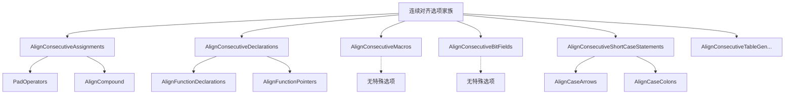

## 一、访问修改器偏移（AccessModifierOffset）

访问修饰符（例如 `public`:）的额外缩进或反向缩进量。示例如下：

```c++
// AccessModifierOffset: 0（默认）
class MyClass {
public:
    void function();
private:
    int member;
};

// AccessModifierOffset: -4（反向缩进4个空格）
class MyClass {
public:
    void function();
private:
    int member;
};

// AccessModifierOffset: 4（额外缩进4个空格）
class MyClass {
    public:
        void function();
    private:
        int member;
};
```

## 二、AlignAfterOpenBracket（布尔类型）

如果为 true，则在开括号后水平对齐参数。

示例：

```
true:                         vs.   false
someLongFunction(argument1,         someLongFunction(argument1,
                 argument2);            argument2);
```

从 clang-format 22 版本开始，此选项变为布尔类型，之前的 Align 选项被替换为 true，DontAlign 被替换为 false，而 AlwaysBreak 和 BlockIndent 选项被替换为 true，并通过设置新的样式选项来使用，这些新选项包括：`BreakAfterOpenBracketBracedList、BreakAfterOpenBracketFunction、BreakAfterOpenBracketIf、BreakBeforeCloseBracketBracedList、BreakBeforeCloseBracketFunction` 和 `BreakBeforeCloseBracketIf`。

此选项适用于圆括号、尖括号和方括号。

## 三、数组初始化对齐样式（AlignArrayOfStructures）

**可能的取值：**

- **AIAS_Left**（在配置文件中写作：`Left`）
  对齐数组列并使列**左对齐**，例如：
  ```cpp
  struct test demo[] =
  {
      {56, 23,    "hello"},
      {-1, 93463, "world"},
      {7,  5,     "!!"   }
  };
  ```

- **AIAS_Right**（在配置文件中写作：`Right`）
  对齐数组列并使列**右对齐**，例如：
  ```cpp
  struct test demo[] =
  {
      {56,    23, "hello"},
      {-1, 93463, "world"},
      { 7,     5,    "!!"}
  };
  ```

- **AIAS_None**（在配置文件中写作：`None`）
  **不**对齐数组初始化器的列。

## 四、连续对齐类

连续对齐是表示了对一组语句是否有一样的格式，哪种格式以及怎么描述哪些算是一组语句。

### 4.1 连续对齐选项总览



主要有以下几种:

+ `AlignConsecutiveAssignments`
+ `AlignConsecutiveDeclarations`
+ `AlignConsecutiveMacros`
+ `AlignConsecutiveBitFields`
+ `AlignConsecutiveShortCaseStatements`
+ `AlignConsecutiveTableGen`...

---

### 4.2 详细分类说明

#### 4.2.1 通用对齐选项（所有连续对齐类型共享）

- **`Enabled`**: 是否启用对齐
- **`AcrossEmptyLines`**: 是否跨越空行对齐
- **`AcrossComments`**: 是否跨越注释对齐
- **`AcrossEmptyLinesAndComments`**: 同时跨越空行和注释

#### 4.2.2 各对齐类型的特殊选项

1. **AlignConsecutiveAssignments（赋值对齐）**  
    + **对齐目标**: 赋值操作符 `=`, `+=`, `-=` 等  
    ```cpp
    // 对齐效果
    int a            = 1;
    int somelongname = 2;
    double c         = 3;
    ```  
    + **特殊选项**:  
        - **`PadOperators`**: 短操作符左填充，使所有操作符右侧对齐
        - **`AlignCompound`**: 复合赋值操作符（如 `+=`）与简单赋值 `=` 一起对齐

2. **🔹 AlignConsecutiveDeclarations（声明对齐）**  
    + **对齐目标**: 变量声明
        ```cpp
        // 对齐效果
        int         aaaa = 12;
        float       b = 23;
        std::string ccc;
        ```
    + **特殊选项**:  
        - **`AlignFunctionDeclarations`**: 函数声明对齐
        - **`AlignFunctionPointers`**: 函数指针对齐

3. **AlignConsecutiveMacros（宏定义对齐）**  
    **对齐目标**: `#define` 宏定义  
    ```cpp
    // 对齐效果
    #define SHORT_NAME       42
    #define LONGER_NAME      0x007f
    #define EVEN_LONGER_NAME (2)
    ```

4. **AlignConsecutiveBitFields（位域对齐）**  
    **对齐目标**: 结构体位域的冒号对齐  
    ```cpp
    // 对齐效果
    int aaaa : 1;
    int b    : 12;
    int ccc  : 8;
    ```

5. **AlignConsecutiveShortCaseStatements（case语句对齐）**  
    + **对齐目标**: switch-case 语句中的 case 标签  
        ```cpp
        // 对齐效果
        switch (level) {
        case log::info:    return "info:";
        case log::warning: return "warning:";
        default:           return "";
        }
        ```
    + **特殊选项**:  
        - **`AlignCaseArrows`**: 对齐 case 箭头（Java风格switch）
        - **`AlignCaseColons`**: 对齐冒号位置或冒号后的内容

6. **TableGen相关对齐（3种）**  
    主要用于 TableGen DSL 的特殊语法对齐：
    - `AlignConsecutiveTableGenBreakingDAGArgColons`: DAG参数冒号对齐
    - `AlignConsecutiveTableGenCondOperatorColons`: 条件操作符冒号对齐  
    - `AlignConsecutiveTableGenDefinitionColons`: 定义继承冒号对齐

### 4.3 配置示例

```yaml
# .clang-format 配置示例
AlignConsecutiveAssignments:
  Enabled: true
  AcrossEmptyLines: true
  AcrossComments: false
  PadOperators: true      # 赋值对齐特有
  AlignCompound: true     # 赋值对齐特有

AlignConsecutiveDeclarations:
  Enabled: true
  AcrossEmptyLines: false
  AlignFunctionDeclarations: true  # 声明对齐特有

AlignConsecutiveMacros: AcrossEmptyLinesAndComments  # 宏对齐无特殊选项
```

### 4.4 总结

- **通用选项**控制对齐的基本行为（范围、连续性）
- **特殊选项**针对特定语法结构提供精细控制
- 大部分对齐类型只有通用选项，少数复杂类型才有特殊选项
- 配置时要根据具体需求选择合适的对齐类型和选项组合


## 五、`AlignEscapedNewlines`（转义换行对齐样式）

用于对齐转义换行中反斜杠的选项。

**可能的取值：**

- **ENAS_DontAlign**（在配置文件中写作：`DontAlign`）  
  **不**对齐转义换行。
  ```cpp
  #define A \
    int aaaa; \
    int b; \
    int dddddddddd;
  ```

- **ENAS_Left**（在配置文件中写作：`Left`）  
  将转义换行**尽可能向左**对齐。
  ```cpp
  #define A   \
    int aaaa; \
    int b;    \
    int dddddddddd;
  ```

- **ENAS_LeftWithLastLine**（在配置文件中写作：`LeftWithLastLine`）  
  将转义换行**尽可能向左**对齐，如果预处理指令的最后一行最长，则以其为参考。
  ```cpp
  #define A         \
    int aaaa;       \
    int b;          \
    int dddddddddd;
  ```

- **ENAS_Right**（在配置文件中写作：`Right`）  
  在**最右侧列**对齐转义换行。
  ```cpp
  #define A                                                            \
    int aaaa;                                                          \
    int b;                                                             \
    int dddddddddd;
  ```

## 六、`AlignOperands`（操作数对齐样式）

如果为 true，则水平对齐二元和三元表达式的操作数。

**可能的取值：**

- **OAS_DontAlign**（在配置文件中写作：`DontAlign`）  
  **不**对齐二元和三元表达式的操作数。换行的行从行首缩进 `ContinuationIndentWidth` 个空格。

- **OAS_Align**（在配置文件中写作：`Align`）  
  **水平对齐**二元和三元表达式的操作数。  
  具体来说，这会对需要跨越多行的单个表达式的操作数进行对齐，例如：
  ```cpp
  int aaa = bbbbbbbbbbbbbbb +
            ccccccccccccccc;
  ```
  当设置了 `BreakBeforeBinaryOperators` 时，换行的操作符会与第一行的操作数对齐。
  ```cpp
  int aaa = bbbbbbbbbbbbbbb
            + ccccccccccccccc;
  ```

- **OAS_AlignAfterOperator**（在配置文件中写作：`AlignAfterOperator`）  
  **水平对齐**二元和三元表达式的操作数。  
  这与 `OAS_Align` 类似，不同之处在于：当设置了 `BreakBeforeBinaryOperators` 时，操作符会**取消缩进**，使得换行的操作数与第一行的操作数对齐。
  ```cpp
  int aaa = bbbbbbbbbbbbbbb
          + ccccccccccccccc;
  ```

## 七、`AlignTrailingComments`（尾随注释对齐样式）

控制尾随注释的对齐方式。对齐在换行后的右大括号处停止，并且仅当后面跟着其他右大括号、do-while 循环、lambda 调用或分号时才生效。从 clang-format 16 版本开始，此选项不再是布尔类型，而是可以设置为多个选项。传统的布尔选项仍然可以像以前一样解析。

### 7.1 使用示例

```yaml
AlignTrailingComments:
  Kind: Always
  OverEmptyLines: 2
```

### 7.2 嵌套配置标志

**对齐选项**：

1. **TrailingCommentsAlignmentKinds Kind**  
    指定尾随注释的对齐方式。  
    **可能的取值：**  
      - **TCAS_Leave**（在配置文件中写作：`Leave`）  
        保持尾随注释原样。
        ```cpp
        int a;    // comment
        int ab;       // comment
        
        int abc;  // comment
        int abcd;     // comment
        ```
      - **TCAS_Always**（在配置文件中写作：`Always`）  
        对齐尾随注释。
        ```cpp
        int a;  // comment
        int ab; // comment
        
        int abc;  // comment
        int abcd; // comment
        ```
      - **TCAS_Never**（在配置文件中写作：`Never`）  
        不对齐尾随注释，但应用其他格式化规则。
        ```cpp
        int a; // comment
        int ab; // comment
        
        int abc; // comment
        int abcd; // comment
        ```

2. **unsigned OverEmptyLines**  
    在多少空行上应用对齐。当 `MaxEmptyLinesToKeep` 和 `OverEmptyLines` 都设置为 2 时，格式化效果如下：  
    ```cpp
    int a;      // all these
    
    int ab;     // comments are
    
    
    int abcdef; // aligned
    ```
    当 `MaxEmptyLinesToKeep` 设置为 2 而 `OverEmptyLines` 设置为 1 时，格式化效果如下：  
    ```cpp
    int a;  // these are
    
    int ab; // aligned
    
    
    int abcdef; // but this isn't
    ```

3. **bool AlignPPAndNotPP**  
  是否将预处理指令后的注释与普通注释对齐。  
  ```cpp
    //true:    
    #define A  // Comment    
    #define AB // Aligned               
    int i;     // Aligned               

    // false
    #define A  // Comment
    #define AB // Aligned
    int i; // Not aligned
  ```

## 八、Allow类配置选项

clang-format提供了多种Allow开头的配置选项，用于控制不同代码结构是否允许在单行显示或特定的换行行为。

### 8.1 Allow类配置选项列表

1. AllowAllArgumentsOnNextLine - 允许所有参数在一行
2. AllowAllParametersOfDeclarationOnNextLine - 允许声明参数全放下一行
3. AllowBreakBeforeNoexceptSpecifier - 允许在noexcept说明符前换行
4. AllowBreakBeforeQtProperty - 允许在Qt属性前换行
5. AllowShortBlocksOnASingleLine - 允许短代码块放在单行
6. AllowShortCaseExpressionOnASingleLine - 允许短case表达式放在单行
7. AllowShortCaseLabelsOnASingleLine - 允许短case标签放在单行
8. AllowShortCompoundRequirementOnASingleLine - 允许短复合要求放在单行
9. AllowShortEnumsOnASingleLine - 允许短枚举放在单行
10. AllowShortFunctionsOnASingleLine - 允许短函数放在单行
11. AllowShortIfStatementsOnASingleLine - 允许短if语句放在单行
12. AllowShortLambdasOnASingleLine - 允许短lambda表达式放在单行
13. AllowShortLoopsOnASingleLine - 允许短循环放在单行
14. AllowShortNamespacesOnASingleLine - 允许短命名空间放在单行

### 8.2 AllowAllArgumentsOnNextLine

**类型**：布尔类型  
**作用**：如果函数调用或大括号初始化列表在一行中放不下，允许将所有参数放在下一行，即使 `BinPackArguments` 为 false。

**配置示例**：
```yaml
AllowAllArgumentsOnNextLine: true
```

**效果对比**：
```cpp
// true:
callFunction(
    a, b, c, d);

// false:
callFunction(a,
             b,
             c,
             d);
```

### 8.3 AllowAllParametersOfDeclarationOnNextLine

**类型**：布尔类型  
**作用**：如果函数声明在一行中放不下，允许将函数声明的所有参数放在下一行，即使 `BinPackParameters` 设置为 `OnePerLine`。

**配置示例**：
```yaml
AllowAllParametersOfDeclarationOnNextLine: true
```

**效果对比**：
```cpp
// true:
void myFunction(
    int a, int b, int c, int d, int e);

// false:
void myFunction(int a,
                int b,
                int c,
                int d,
                int e);
```

### 8.4 AllowBreakBeforeNoexceptSpecifier

**类型**：BreakBeforeNoexceptSpecifierStyle枚举  
**作用**：控制是否可以在noexcept说明符前换行。

**取值**：
- `Never` - 不允许换行
- `OnlyWithParen` - 仅在有括号时允许换行
- `Always` - 总是允许换行

**配置示例**：
```yaml
AllowBreakBeforeNoexceptSpecifier: OnlyWithParen
```

### 8.5 AllowBreakBeforeQtProperty

**类型**：布尔类型  
**作用**：允许在`Q_Property`关键字（如`READ`、`WRITE`等）前换行，就像它们前面有一个逗号（,）一样。

**配置示例**：
```yaml
AllowBreakBeforeQtProperty: true
```

### 8.6 AllowShortBlocksOnASingleLine

**类型**：ShortBlockStyle枚举  
**作用**：根据设置值，`while (true) { continue; }` 这样的代码块可以放在单行上。

**取值**：
- `Never` - 从不将代码块合并到单行
- `Empty` - 只合并空代码块
- `Always` - 总是将短代码块合并到单行

**配置示例**：
```yaml
AllowShortBlocksOnASingleLine: Empty
```

### 8.7 AllowShortCaseExpressionOnASingleLine

**类型**：布尔类型  
**作用**：是否将短的switch标签规则合并到单行。

**配置示例**：
```yaml
AllowShortCaseExpressionOnASingleLine: true
```

**效果对比**：
```cpp
// true:
switch (a) {
case 1 -> 1;
default -> 0;
};

// false:
switch (a) {
case 1 ->
    1;
default ->
    0;
};
```

### 8.8 AllowShortCaseLabelsOnASingleLine

**类型**：布尔类型  
**作用**：如果为true，短的case标签将收缩到单行显示。

**配置示例**：
```yaml
AllowShortCaseLabelsOnASingleLine: true
```

**效果对比**：
```cpp
// true:
switch (a) {
case 1: x = 1; break;
case 2: return;
}

// false:
switch (a) {
case 1:
  x = 1;
  break;
case 2:
  return;
}
```

### 8.9 AllowShortCompoundRequirementOnASingleLine

**类型**：布尔类型  
**作用**：允许将短的复合要求放在单行显示。

**配置示例**：
```yaml
AllowShortCompoundRequirementOnASingleLine: true
```

**效果对比**：
```cpp
// true:
template <typename T>
concept c = requires(T x) {
  { x + 1 } -> std::same_as<int>;
};

// false:
template <typename T>
concept c = requires(T x) {
  {
    x + 1
  } -> std::same_as<int>;
};
```

### 8.10 AllowShortEnumsOnASingleLine

**类型**：布尔类型  
**作用**：允许将短的枚举定义放在单行显示。

**配置示例**：
```yaml
AllowShortEnumsOnASingleLine: true
```

**效果对比**：
```cpp
// true:
enum { A, B } myEnum;

// false:
enum {
  A,
  B
} myEnum;
```

### 8.11 AllowShortFunctionsOnASingleLine

**类型**：ShortFunctionStyle枚举  
**作用**：根据设置值，`int f() { return 0; }` 这样的函数可以放在单行上。

**取值**：
- `None` - 从不将函数合并到单行
- `InlineOnly` - 只合并类内部定义的函数
- `Empty` - 只合并空函数
- `Inline` - 只合并类内部定义的函数（含空函数）
- `All` - 合并所有能放在单行的函数

**配置示例**：
```yaml
AllowShortFunctionsOnASingleLine: Inline
```

### 8.12 AllowShortIfStatementsOnASingleLine

**类型**：ShortIfStyle枚举  
**作用**：根据设置值，`if (a) return;` 这样的if语句可以放在单行上。

**取值**：

- `Never` - 从不在同一行放置短if语句
- `WithoutElse` - 只有在没有else语句时才在同一行放置短if语句
- `OnlyFirstIf` - 将短if语句放在同一行，但不包括else if和else语句
- `AllIfsAndElse` - 总是将短if语句、else if和else语句放在同一行

**配置示例**：
```yaml
AllowShortIfStatementsOnASingleLine: WithoutElse
```

### 8.13 AllowShortLambdasOnASingleLine

**类型**：ShortLambdaStyle枚举  
**作用**：根据设置值，`auto lambda []() { return 0; }` 这样的lambda表达式可以放在单行上。

**取值**：
- `None` - 从不在同一行放置短lambda表达式
- `Empty` - 只合并空的lambda表达式
- `Inline` - 如果lambda是函数的参数，则将其合并到单行
- `All` - 合并所有能放在单行的lambda表达式

**配置示例**：
```yaml
AllowShortLambdasOnASingleLine: Inline
```

### 8.14 AllowShortLoopsOnASingleLine

**类型**：布尔类型  
**作用**：如果为true，`while (true) continue;` 这样的循环语句可以放在单行显示。

**配置示例**：
```yaml
AllowShortLoopsOnASingleLine: true
```

### 8.15 AllowShortNamespacesOnASingleLine

**类型**：布尔类型  
**作用**：如果为true，`namespace a { class b; }` 这样的命名空间定义可以放在单行显示。

**配置示例**：
```yaml
AllowShortNamespacesOnASingleLine: true
```

## 九、Always类配置选项

clang-format提供了多种Always开头的配置选项，用于强制在某些代码结构前或后进行换行。

### 9.1 Always类配置选项列表

1. AlwaysBreakAfterDefinitionReturnType - 函数定义返回类型后换行风格
2. AlwaysBreakAfterReturnType - 返回类型后换行（已弃用）
3. AlwaysBreakBeforeMultilineStrings - 多行字符串前换行
4. AlwaysBreakTemplateDeclarations - 模板声明前换行（已弃用）

### 9.2 AlwaysBreakAfterDefinitionReturnType

**类型**：DefinitionReturnTypeBreakingStyle枚举  
**引入版本**：clang-format 3.7  
**状态**：已弃用，保留用于向后兼容  
**作用**：控制函数定义返回类型的换行风格。

**取值**：
- `None` - 自动在返回类型后换行，考虑PenaltyReturnTypeOnItsOwnLine惩罚因子
- `All` - 总是在返回类型后换行
- `TopLevel` - 总是在顶级函数的返回类型后换行

**配置示例**：
```yaml
AlwaysBreakAfterDefinitionReturnType: TopLevel
```

### 9.3 AlwaysBreakAfterReturnType

**类型**：已弃用选项  
**引入版本**：clang-format 3.8  
**状态**：已弃用，已重命名为BreakAfterReturnType  
**作用**：控制返回类型后的换行行为。

**配置示例**：
```yaml
# 已弃用，请使用BreakAfterReturnType
# AlwaysBreakAfterReturnType: true
BreakAfterReturnType: Always
```

### 9.4 AlwaysBreakBeforeMultilineStrings

**类型**：布尔类型  
**引入版本**：clang-format 3.4  
**作用**：如果为true，总是在多行字符串字面量前换行。

**配置示例**：
```yaml
AlwaysBreakBeforeMultilineStrings: true
```

**效果对比**：
```cpp
// true:
aaaa =
    "bbbb"
    "cccc";

// false:
aaaa = "bbbb"
       "cccc";
```

**说明**：此标志旨在使文件中存在多个多行字符串的情况看起来更加一致。因此，只有当在该点换行会导致字符串从行首缩进ContinuationIndentWidth个空格时，它才会生效。

### 9.5 AlwaysBreakTemplateDeclarations

**类型**：已弃用选项  
**引入版本**：clang-format 3.4  
**状态**：已弃用，已重命名为BreakTemplateDeclarations  
**作用**：控制模板声明前的换行行为。

**配置示例**：
```yaml
# 已弃用，请使用BreakTemplateDeclarations
# AlwaysBreakTemplateDeclarations: true
BreakTemplateDeclarations: MultiLine
```

## 十、BinPack类和BitField类配置选项

clang-format提供了BinPack相关的配置选项，用于控制参数和列表的打包方式，以及BitField相关的空格设置。

### 10.1 BinPack类和BitField类配置选项列表

1. BinPackArguments - 实参参数打包
2. BinPackLongBracedList - 长大括号列表打包
3. BinPackParameters - 形参参数打包风格
4. BitFieldColonSpacing - 位域冒号空格风格

### 10.2 BinPackArguments

**类型**：布尔类型  
**引入版本**：clang-format 3.7  
**作用**：如果为false，函数调用的参数将全部在同一行或每行一个参数。

**配置示例**：
```yaml
BinPackArguments: true
```

**效果对比**：
```cpp
// true:
void f() {
  f(aaaaaaaaaaaaaaaaaaaa, aaaaaaaaaaaaaaaaaaaa,
    aaaaaaaaaaaaaaaaaaaaaaaaaaaaaaaaaaaaaaaaaaa);
}

// false:
void f() {
  f(aaaaaaaaaaaaaaaaaaaa,
    aaaaaaaaaaaaaaaaaaaa,
    aaaaaaaaaaaaaaaaaaaaaaaaaaaaaaaaaaaaaaaaaaa);
}
```

### 10.3 BinPackLongBracedList

**类型**：布尔类型  
**引入版本**：clang-format 21  
**作用**：如果BinPackLongBracedList为true，当大括号初始化列表中有20个或更多项时，它会覆盖BinPackArguments的设置。

**配置示例**：
```yaml
BinPackLongBracedList: false
```

**效果对比**：
```cpp
// BinPackLongBracedList: false
vector<int> x{
            1,
            2,
            ...,
            20,
            21};

// BinPackLongBracedList: true
vector<int> x{1, 2, ...,
                   20, 21};
```

### 10.4 BinPackParameters

**类型**：BinPackParametersStyle枚举  
**引入版本**：clang-format 3.7  
**作用**：控制参数打包的风格。

**取值**：

- `BinPack` - 打包参数
- `OnePerLine` - 如果参数适合当前行，则全部放在当前行；否则每个参数单独一行
- `AlwaysOnePerLine` - 总是每个参数单独一行

**配置示例**：
```yaml
BinPackParameters: OnePerLine
```

**效果示例**：
```cpp
// BinPack: 打包参数
void f(int a, int bbbbbbbbbbbbbbbbbbbbbbbbbbbbbbbbbbbb,
       int ccccccccccccccccccccccccccccccccccccccccccc);

// OnePerLine: 适合时放一行，否则每行一个
void f(int a, int b, int c);

void f(int a,
       int b,
       int ccccccccccccccccccccccccccccccccccccc);

// AlwaysOnePerLine: 总是每行一个参数
void f(int a,
       int b,
       int c);
```

### 10.5 BitFieldColonSpacing

**类型**：BitFieldColonSpacingStyle枚举  
**引入版本**：clang-format 12  
**作用**：控制位域冒号周围空格的风格。

**取值**：

- `Both` - 在冒号两侧各添加一个空格
- `None` - 不在冒号周围添加空格（AlignConsecutiveBitFields需要时除外）
- `Before` - 只在冒号前添加空格
- `After` - 只在冒号后添加空格（AlignConsecutiveBitFields需要时可能在前面添加空格）

**配置示例**：
```yaml
BitFieldColonSpacing: Both
```

**效果示例**：
```cpp
// Both: 冒号两侧各一个空格
unsigned bf : 2;

// None: 冒号周围无空格
unsigned bf:2;

// Before: 只在冒号前添加空格
unsigned bf :2;

// After: 只在冒号后添加空格
unsigned bf: 2;
```

## 十一、BraceWrapping类配置选项

clang-format提供了BraceWrapping相关的配置选项，用于精确控制各种大括号的换行行为。

### 11.1 BraceWrapping类配置选项列表

1. BraceWrapping - 大括号换行控制
2. BracedInitializerIndentWidth - 大括号初始化列表缩进宽度

### 11.2 BraceWrapping

**类型**：BraceWrappingFlags结构体  
**引入版本**：clang-format 3.8  
**作用**：控制单个大括号换行情况。如果BreakBeforeBraces设置为Custom，则使用此选项指定每个单独的大括号情况应如何处理。

**配置前提**：
```yaml
BreakBeforeBraces: Custom
BraceWrapping:
  AfterEnum: true
  AfterStruct: false
  SplitEmptyFunction: false
```

__BraceWrapping嵌套配置选项：__

1. **AfterCaseLabel** (布尔类型)  
    **作用**：包装case标签。  
    **效果对比**：  
    ```cpp
    // false:
    switch (foo) {
    case 1: {
        bar();
        break;
    }
    default: {
        plop();
    }
    }
    // true:
    switch (foo) {
    case 1:
    {
        bar();
        break;
    }
    default:
    {
        plop();
    }
    }
    ```

2. **AfterClass** (布尔类型)  
    **作用**：包装类定义。  
    **效果对比**：
    ```cpp
    // true:
    class foo
    {};

    // false:
    class foo {};
    ```

3. **AfterControlStatement** (AfterControlStatementStyle枚举)  
    **作用**：包装控制语句（if/for/while/switch/..）。  
    **取值**：  
       - `Never` - 从不在控制语句后包装大括号
       - `MultiLine` - 仅在多行控制语句后包装大括号
       - `Always` - 总是在控制语句后包装大括号

    **效果示例**：  
        ```cpp
        // Never:
        if (foo()) {
        } else {
        }
        for (int i = 0; i < 10; ++i) {
        }

        // MultiLine:
        if (foo && bar &&
            baz)
        {
        quux();
        }
        while (foo || bar) {
        }

        // Always:
        if (foo())
        {
        } else
        {}
        for (int i = 0; i < 10; ++i)
        {}
        ```

4. **AfterEnum** (布尔类型)  
    **作用**：包装枚举定义。  
    **效果对比**：
    ```cpp
    // true:
    enum X : int
    {
    B
    };

    // false:
    enum X : int { B };
    ```

5. **AfterFunction** (布尔类型)  
    **作用**：包装函数定义。  
    **效果对比**：  
    ```cpp
    // true:
    void foo()
    {
    bar();
    bar2();
    }

    // false:
    void foo() {
    bar();
    bar2();
    }
    ```

6. **AfterNamespace** (布尔类型)  
    **作用**：包装命名空间定义。  
    **效果对比**：  
    ```cpp
    // true:
    namespace
    {
    int foo();
    int bar();
    }

    // false:
    namespace {
    int foo();
    int bar();
    }
    ```

7. **AfterObjCDeclaration** (布尔类型)  
    **作用**：包装ObjC定义（接口、实现等）。注意：`@autoreleasepool`和`@synchronized`块根据`AfterControlStatement`标志进行包装。  
    **AfterStruct** (布尔类型)    
    **作用**：包装结构体定义。  
    **效果对比**：  
    ```cpp
    // true:
    struct foo
    {
    int x;
    };

    // false:
    struct foo {
    int x;
    };
    ```

8. **AfterUnion** (布尔类型)   
    **作用**：包装联合体定义。  
    **效果对比**：
    ```cpp
    // true:
    union foo
    {
    int x;
    }

    // false:
    union foo {
    int x;
    }
    ```

9. **AfterExternBlock** (布尔类型)  
    **作用**：包装extern块。  
    **效果对比**：  
    ```cpp
    // true:
    extern "C"
    {
    int foo();
    }

    // false:
    extern "C" {
    int foo();
    }
    ```

10. **BeforeCatch** (布尔类型)   
    **作用**：在catch前换行。  
    **效果对比**：
    ```cpp
    // true:
    try {
    foo();
    }
    catch () {
    }

    // false:
    try {
    foo();
    } catch () {
    }
    ```

11. **BeforeElse** (布尔类型)   
    **作用**：在else前换行。  
    **效果对比**：
    ```cpp
    // true:
    if (foo()) {
    }
    else {
    }

    // false:
    if (foo()) {
    } else {
    }
    ```

12. **BeforeLambdaBody** (布尔类型)  
    **作用**：包装lambda块。  
    **效果对比**：
    ```cpp
    // true:
    connect(
    []()
    {
        foo();
        bar();
    });

    // false:
    connect([]() {
    foo();
    bar();
    });
    ```

13. **BeforeWhile** (布尔类型)  
    **作用**：在while前换行。  
    **效果对比**：
    ```cpp
    // true:
    do {
    foo();
    }
    while (1);

    // false:
    do {
    foo();
    } while (1);
    ```

14. **IndentBraces** (布尔类型)  
    **作用**：缩进已包装的大括号本身。  
    **SplitEmptyFunction** (布尔类型)  
    **作用**：如果为false，空函数体可以放在单行上。此选项仅在函数的大括号已被包装时使用。  
    **效果对比**：
    ```cpp
    // false:
    int f()
    {}

    // true:
    int f()
    {
    }
    ```

15. **SplitEmptyRecord** (布尔类型)   
    **作用**：如果为false，空记录（如类、结构体或联合体）体可以放在单行上。  
    **效果对比**：
    ```cpp
    // false:
    class Foo
    {}

    // true:
    class Foo
    {
    }
    ```

16. **SplitEmptyNamespace** (布尔类型)  
    **作用**：如果为false，空命名空间体可以放在单行上。  
    **效果对比**：
    ```cpp
    // false:
    namespace Foo
    {}

    // true:
    namespace Foo
    {
    }
    ```

### 11.3 BracedInitializerIndentWidth

**类型**：整数类型  
**引入版本**：clang-format 17  
**作用**：用于缩进大括号初始化列表内容的列数。如果未设置或为负数，则使用 `ContinuationIndentWidth`。

**配置示例**：
```yaml
AlignAfterOpenBracket: AlwaysBreak
BracedInitializerIndentWidth: 2
```

**效果示例**：
```cpp
void f() {
  SomeClass c{
    "foo",
    "bar",
    "baz",
  };
  auto s = SomeStruct{
    .foo = "foo",
    .bar = "bar",
    .baz = "baz",
  };
  SomeArrayT a[3] = {
    {
      foo,
      bar,
    },
    {
      foo,
      bar,
    },
    SomeArrayT{},
  };
}
```

## 十二、Break类配置选项

clang-format提供了多种Break开头的配置选项，用于控制各种代码结构的换行行为。

### 12.1 Break类配置选项列表

1. BreakAdjacentStringLiterals - 相邻字符串字面量间换行
2. BreakAfterAttributes - 属性后换行风格
3. BreakAfterJavaFieldAnnotations - Java字段注解后换行
4. BreakAfterOpenBracketBracedList - 大括号初始化列表左括号后换行
5. BreakAfterOpenBracketFunction - 函数左括号后换行
6. BreakAfterOpenBracketIf - if语句左括号后换行
7. BreakAfterOpenBracketLoop - 循环语句左括号后换行
8. BreakAfterOpenBracketSwitch - switch语句左括号后换行
9. BreakAfterReturnType - 返回类型后换行风格
10. BreakArrays - 数组换行
11. BreakBeforeBinaryOperators - 二元操作符前换行风格
12. BreakBeforeBraces - 大括号前换行风格
13. BreakBeforeCloseBracketBracedList - 大括号初始化列表右括号前换行
14. BreakBeforeCloseBracketFunction - 函数右括号前换行
15. BreakBeforeCloseBracketIf - if语句右括号前换行
16. BreakBeforeCloseBracketLoop - 循环语句右括号前换行
17. BreakBeforeCloseBracketSwitch - switch语句右括号前换行
18. BreakBeforeConceptDeclarations - 概念声明前换行风格
19. BreakBeforeInlineASMColon - 内联汇编冒号前换行风格
20. BreakBeforeTemplateCloser - 模板闭合括号前换行
21. BreakBeforeTernaryOperators - 三元操作符前换行
22. BreakBinaryOperations - 二元操作换行风格
23. BreakConstructorInitializers - 构造函数初始化列表换行风格
24. BreakFunctionDefinitionParameters - 函数定义参数前换行
25. BreakInheritanceList - 继承列表换行风格
26. BreakStringLiterals - 字符串字面量换行
27. BreakTemplateDeclarations - 模板声明换行风格

### 12.2 BreakAdjacentStringLiterals

**类型**：布尔类型  
**引入版本**：clang-format 18  
**作用**：在相邻字符串字面量之间换行。

**效果对比**：
```cpp
// true:
return "Code"
       "\0\52\26\55\55\0"
       "x013"
       "\02\xBA";

// false:
return "Code" "\0\52\26\55\55\0" "x013" "\02\xBA";
```

### 12.3 BreakAfterAttributes

**类型**：AttributeBreakingStyle枚举  
**引入版本**：clang-format 16  
**作用**：在变量或函数声明/定义名称前的C++11属性组后换行，或在控制语句前换行。

**取值**：

- `Always` - 总是在属性后换行
- `Leave` - 保持属性后的换行状态不变
- `Never` - 从不在属性后换行

**配置示例**：
```yaml
BreakAfterAttributes: Always
```

### 12.4 BreakAfterJavaFieldAnnotations

**类型**：布尔类型  
**引入版本**：clang-format 3.8  
**作用**：在Java文件中，字段的每个注解后换行。

**效果对比**：
```java
// true:
@Partial
@Mock
DataLoad loader;

// false:
@Partial @Mock DataLoad loader;
```

### 12.5 BreakAfterOpenBracketBracedList

**类型**：布尔类型  
**引入版本**：clang-format 22  
**作用**：当列表超过列限制时，强制在大括号初始化列表的左括号后换行（当Cpp11BracedListStyle为true时）。

**效果对比**：
```cpp
// true:
vector<int> x {
   1, 2, 3}

// false:
vector<int> x {1,
    2, 3}
```

### 12.6 BreakAfterOpenBracketFunction

**类型**：布尔类型  
**引入版本**：clang-format 22  
**作用**：当参数超过列限制时，强制在函数（声明、定义、调用）的左括号后换行。

**效果对比**：
```cpp
// true:
foo (
   a , b)

// false:
foo (a,
     b)
```

### 12.7 BreakAfterOpenBracketIf

**类型**：布尔类型  
**引入版本**：clang-format 22  
**作用**：当表达式超过列限制时，强制在if控制语句的左括号后换行。

**效果对比**：
```cpp
// true:
if constexpr (
   a || b)

// false:
if constexpr (a ||
              b)
```

### 12.8 BreakAfterOpenBracketLoop

**类型**：布尔类型  
**引入版本**：clang-format 22  
**作用**：当表达式超过列限制时，强制在循环控制语句的左括号后换行。

**效果对比**：
```cpp
// true:
while (
   a && b) {

// false:
while (a &&
       b) {
```

### 12.9 BreakAfterOpenBracketSwitch

**类型**：布尔类型  
**引入版本**：clang-format 22  
**作用**：当表达式超过列限制时，强制在switch控制语句的左括号后换行。

**效果对比**：
```cpp
// true:
switch (
   a + b) {

// false:
switch (a +
        b) {
```

### 12.10 BreakAfterReturnType

**类型**：ReturnTypeBreakingStyle枚举  
**引入版本**：clang-format 19  
**作用**：函数声明返回类型的换行风格。

**取值**：

- `Automatic` - 基于PenaltyReturnTypeOnItsOwnLine自动在返回类型后换行
- `ExceptShortType` - 与Automatic相同，但不在短返回类型后换行
- `All` - 总是在返回类型后换行
- `TopLevel` - 总是在顶级函数的返回类型后换行
- `AllDefinitions` - 总是在函数定义的返回类型后换行
- `TopLevelDefinitions` - 总是在顶级定义的返回类型后换行

**配置示例**：
```yaml
BreakAfterReturnType: TopLevel
```

### 12.11 BreakArrays

**类型**：布尔类型  
**引入版本**：clang-format 16  
**作用**：如果为true，clang-format总是在Json数组后换行，否则会扫描到闭合的]来确定是否应在元素之间添加换行符（与prettier兼容）。

**效果对比**：
```json
// true:
[
  1,
  2,
  3,
  4
]

// false:
[1, 2, 3, 4]
```

### 12.12 BreakBeforeBinaryOperators

**类型**：BinaryOperatorStyle枚举  
**引入版本**：clang-format 3.6  
**作用**：二元操作符的换行方式。

**取值**：

- `None` - 在操作符后换行
- `NonAssignment` - 在非赋值操作符前换行
- `All` - 在所有操作符前换行

**配置示例**：
```yaml
BreakBeforeBinaryOperators: NonAssignment
```

### 12.13 BreakBeforeBraces

**类型**：BraceBreakingStyle枚举  
**引入版本**：clang-format 3.7  
**作用**：大括号的换行风格。

**取值**：

- `Attach` - 总是将大括号附着到周围上下文
- `Linux` - 类似Attach，但在函数、命名空间和类定义前换行
- `Mozilla` - 类似Attach，但在枚举、函数和记录定义前换行
- `Stroustrup` - 类似Attach，但在函数定义、catch和else前换行
- `Allman` - 总是先换行再写大括号
- `Whitesmiths` - 类似Allman但总是缩进大括号并与大括号对齐代码
- `GNU` - 总是先换行再写大括号，并为控制语句的大括号添加额外缩进级别
- `WebKit` - 类似Attach，但在函数前换行
- `Custom` - 在BraceWrapping中配置每个单独的大括号

**配置示例**：
```yaml
BreakBeforeBraces: Allman
```

### 12.14 BreakBeforeCloseBracketBracedList

**类型**：布尔类型  
**引入版本**：clang-format 22  
**作用**：当列表超过列限制时，强制在大括号初始化列表的右括号前换行（当Cpp11BracedListStyle为true时）。只有在左括号后有换行时才会在右括号前换行。

**效果对比**：
```cpp
// true:
vector<int> x {
   1, 2, 3
}

// false:
vector<int> x {
   1, 2, 3}
```

### 12.15 BreakBeforeCloseBracketFunction

**类型**：布尔类型  
**引入版本**：clang-format 22  
**作用**：当参数超过列限制时，强制在函数（声明、定义、调用）的右括号前换行。

**效果对比**：
```cpp
// true:
foo (
   a , b
)

// false:
foo (
   a , b)
```

### 12.16 BreakBeforeCloseBracketIf

**类型**：布尔类型  
**引入版本**：clang-format 22  
**作用**：当表达式超过列限制时，强制在if控制语句的右括号前换行。只有在左括号后有换行时才会在右括号前换行。

**效果对比**：
```cpp
// true:
if constexpr (
   a || b
)

// false:
if constexpr (
   a || b )
```

### 12.17 BreakBeforeCloseBracketLoop

**类型**：布尔类型  
**引入版本**：clang-format 22  
**作用**：当表达式超过列限制时，强制在循环控制语句的右括号前换行。只有在左括号后有换行时才会在右括号前换行。

**效果对比**：
```cpp
// true:
while (
   a && b
) {

// false:
while (
   a && b) {
```

### 12.18 BreakBeforeCloseBracketSwitch

**类型**：布尔类型  
**引入版本**：clang-format 22  
**作用**：当表达式超过列限制时，强制在switch控制语句的右括号前换行。只有在左括号后有换行时才会在右括号前换行。

**效果对比**：
```cpp
// true:
switch (
   a + b
) {

// false:
switch (
   a + b) {
```

### 12.19 BreakBeforeConceptDeclarations

**类型**：BreakBeforeConceptDeclarationsStyle枚举  
**引入版本**：clang-format 12  
**作用**：概念声明的换行风格。

**取值**：

- `Never` - 保持模板声明行与概念在一起
- `Allowed` - 允许在模板声明和概念之间换行
- `Always` - 总是在概念前换行，将其放在模板声明后的行中

**配置示例**：
```yaml
BreakBeforeConceptDeclarations: Always
```

### 12.20 BreakBeforeInlineASMColon

**类型**：BreakBeforeInlineASMColonStyle枚举  
**引入版本**：clang-format 16  
**作用**：内联汇编冒号的换行风格。

**取值**：

- `Never` - 不在内联汇编冒号前换行
- `OnlyMultiline` - 如果行长度超过列限制，在内联汇编冒号前换行
- `Always` - 总是在内联汇编冒号前换行

**配置示例**：
```yaml
BreakBeforeInlineASMColon: OnlyMultiline
```

### 12.21 BreakBeforeTemplateCloser

**类型**：布尔类型  
**引入版本**：clang-format 21  
**作用**：如果为true，当匹配的开括号（<）后有换行时，在模板闭合括号（>）前换行。

**效果对比**：
```cpp
// true:
template <
    typename Foo,
    typename Bar
>

// false:
template <
    typename Foo,
    typename Bar>
```

### 12.22 BreakBeforeTernaryOperators

**类型**：布尔类型  
**引入版本**：clang-format 3.7  
**作用**：如果为true，三元操作符将放在换行后。

**效果对比**：
```cpp
// true:
veryVeryVeryVeryVeryVeryVeryVeryVeryVeryVeryLongDescription
    ? firstValue
    : SecondValueVeryVeryVeryVeryLong;

// false:
veryVeryVeryVeryVeryVeryVeryVeryVeryVeryVeryLongDescription ?
    firstValue :
    SecondValueVeryVeryVeryVeryLong;
```

### 12.23 BreakBinaryOperations

**类型**：BreakBinaryOperationsStyle枚举  
**引入版本**：clang-format 20  
**作用**：二元操作的换行风格。

**取值**：

- `Never` - 不换行二元操作
- `OnePerLine` - 二元操作要么全在同一行，要么每个操作各占一行
- `RespectPrecedence` - 特定优先级的二元操作如果超过列限制，每个操作各占一行

**配置示例**：
```yaml
BreakBinaryOperations: OnePerLine
```

### 12.24 BreakConstructorInitializers

**类型**：BreakConstructorInitializersStyle枚举  
**引入版本**：clang-format 5  
**作用**：构造函数初始化列表的换行风格。

**取值**：

- `BeforeColon` - 在冒号前和逗号后换行
- `BeforeComma` - 在冒号和逗号前换行，并将逗号与冒号对齐
- `AfterColon` - 在冒号和逗号后换行

**配置示例**：
```yaml
BreakConstructorInitializers: BeforeColon
```

### 12.25 BreakFunctionDefinitionParameters

**类型**：布尔类型  
**引入版本**：clang-format 19  
**作用**：如果为true，clang-format总是在函数定义参数前换行。

**效果对比**：
```cpp
// true:
void functionDefinition(
         int A, int B) {}

// false:
void functionDefinition(int A, int B) {}
```

### 12.26 BreakInheritanceList

**类型**：BreakInheritanceListStyle枚举  
**引入版本**：clang-format 7  
**作用**：继承列表的换行风格。

**取值**：

- `BeforeColon` - 在冒号前和逗号后换行
- `BeforeComma` - 在冒号和逗号前换行，并将逗号与冒号对齐
- `AfterColon` - 在冒号和逗号后换行
- `AfterComma` - 只在逗号后换行

**配置示例**：
```yaml
BreakInheritanceList: BeforeColon
```

### 12.27 BreakStringLiterals

**类型**：布尔类型  
**引入版本**：clang-format 3.9  
**作用**：允许在格式化时换行字符串字面量。

**效果对比**：
```cpp
// C/C++/Objective-C true:
const char* x = "veryVeryVeryVeryVeryVe"
                "ryVeryVeryVeryVeryVery"
                "VeryLongString";

// C#/Java true:
string x = "veryVeryVeryVeryVeryVe" +
           "ryVeryVeryVeryVeryVery" +
           "VeryLongString";
```

### 12.28 BreakTemplateDeclarations

**类型**：BreakTemplateDeclarationsStyle枚举  
**引入版本**：clang-format 19  
**作用**：模板声明的换行风格。

**取值**：

- `Leave` - 不更改声明前的换行
- `No` - 不强制在声明前换行，考虑PenaltyBreakTemplateDeclaration
- `MultiLine` - 仅当下面的声明跨越多行时，强制在模板声明后换行
- `Yes` - 总是在模板声明后换行

**配置示例**：
```yaml
BreakTemplateDeclarations: MultiLine
```

## 十三、ColumnLimit 行限制

**类型**：无符号整数类型  
**引入版本**：clang-format 3.7  
**作用**：设置列限制。

**说明**：列限制为0表示没有列限制。在这种情况下，clang-format将尊重输入在语句内的换行决策，除非它们与其他规则冲突。

**配置示例**：
```yaml
ColumnLimit: 80
```

**或禁用列限制**：
```yaml
ColumnLimit: 0
```

**效果**：

- 当设置列限制（如80）时，clang-format会尝试将代码行限制在该列数内
- 当设置为0时，clang-format不会强制换行，而是保持原有的换行格式（除非其他格式化规则要求换行）

## 十四、CompactNamespaces 命名空间压缩

**类型**：布尔类型  
**引入版本**：clang-format 5  
**作用**：控制连续命名空间声明的换行方式。

**配置示例**：
```yaml
CompactNamespaces: true
```

**效果对比**：
```cpp
// true: 连续命名空间声明在同一行
namespace Foo { namespace Bar {
}}

// false: 每个命名空间在新的一行声明
namespace Foo {
namespace Bar {
}
}
```

**特殊情况**：如果无法放在单行上，溢出的命名空间会被换行包装：
```cpp
namespace Foo { namespace Bar {
namespace Extra {
}}}
```

**说明**：此选项只影响连续的命名空间声明，不影响命名空间内的内容格式。

## 十五、缩进相关配置选项

clang-format提供了缩进和命名空间相关的配置选项，用于控制代码的缩进风格和命名空间声明格式。

### 15.1 缩进与命名空间相关配置选项列表

1. ConstructorInitializerIndentWidth - 构造函数初始化列表缩进宽度
2. ContinuationIndentWidth - 续行缩进宽度


### 15.2 ConstructorInitializerIndentWidth

**类型**：无符号整数类型  
**引入版本**：clang-format 3.7  
**作用**：用于构造函数初始化列表和继承列表缩进的字符数。

**配置示例**：
```yaml
ConstructorInitializerIndentWidth: 4
```

**效果示例**：
```cpp
// ConstructorInitializerIndentWidth: 4
MyClass::MyClass()
    : member1(value1),  // 缩进4个字符
      member2(value2),
      member3(value3)
{
}
```

### 15.3 ContinuationIndentWidth

**类型**：无符号整数类型  
**引入版本**：clang-format 3.7  
**作用**：行连续部分的缩进宽度。

**配置示例**：
```yaml
ContinuationIndentWidth: 2
```

**效果示例**：
```cpp
int i =         //  VeryVeryVeryVeryVeryLongComment
  longFunction( // Again a long comment
    arg);
```

**说明**：ContinuationIndentWidth控制续行时的缩进量，常用于：

- 函数调用参数换行时的缩进
- 长表达式换行时的缩进
- 注释换行时的缩进

### 15.4 ConstructorInitializerAllOnOneLineOrOnePerLine（已弃用）

**类型**：布尔类型  
**引入版本**：clang-format 3.7  
**状态**：已弃用  
**作用**：此选项已弃用。请使用 `PackConstructorInitializers` 的 `CurrentLine` 选项。


## 十六、大括号列表样式配置选项

clang-format提供了Cpp11BracedListStyle选项，用于控制大括号初始化列表的格式化风格。

### 16.1 Cpp11BracedListStyle

**类型**：BracedListStyle枚举  
**引入版本**：clang-format 3.4  
**作用**：处理大括号列表的样式。

**取值**：

1. __BLS_Block（配置值：Block）__  
    最适合C++11之前的大括号列表。  
    **特点**：
       - 大括号列表内有空格
       - 在右大括号前换行
       - 使用块缩进进行缩进

    **效果示例**：
    ```cpp
    vector<int> x{ 1, 2, 3, 4 };
    vector<T> x{ {}, {}, {}, {} };
    f(MyMap[{ composite, key }]);
    new int[3]{ 1, 2, 3 };
    Type name{ // Comment
            value
    };
    ```

2.  __BLS_FunctionCall（配置值：FunctionCall）__  
    最适合C++11大括号列表。  
    **特点**：

    - 大括号列表内无空格
    - 在右大括号前不换行
    - 使用续行缩进进行缩进

    **说明**：从本质上讲，C++11大括号列表的格式化方式与函数调用的格式化方式完全相同。如果大括号列表跟在名称后面（例如类型或变量名），clang-format会像{}是该名称的函数调用的括号一样格式化。如果没有名称，则假定为零长度名称。  
    
    **效果示例**：
    ```cpp
    vector<int> x{1, 2, 3, 4};
    vector<T> x{{}, {}, {}, {}};
    f(MyMap[{composite, key}]);
    new int[3]{1, 2, 3};
    Type name{ // Comment
        value};
    ```

3. __BLS_AlignFirstComment（配置值：AlignFirstComment）__  
    与FunctionCall相同，但处理开头的注释时，会将后面的所有内容与注释对齐。

    **特点**：

    - 大括号列表内无空格（即使在第一个位置有注释）
    - 在右大括号前不换行
    - 使用续行缩进进行缩进，但当后面有行注释时使用块缩进

    **效果示例**：
    ```cpp
    vector<int> x{1, 2, 3, 4};
    vector<T> x{{}, {}, {}, {}};
    f(MyMap[{composite, key}]);
    new int[3]{1, 2, 3};
    Type name{// Comment
            value};
    ```

    **配置示例**：
    ```yaml
    Cpp11BracedListStyle: FunctionCall
    ```

## 十七、派生与指针对齐配置选项

clang-format提供了派生相关的配置选项，用于根据文件内容自动推断格式化风格。

### 17.1 派生相关配置选项列表

1. DeriveLineEnding - 派生行结束符（已弃用）
2. DerivePointerAlignment - 派生指针对齐方式

### 17.2 DeriveLineEnding（已弃用）

**类型**：布尔类型  
**引入版本**：clang-format 10  
**状态**：已弃用  
**作用**：此选项已弃用。请使用LineEnding的DeriveLF和DeriveCRLF选项。

### 17.3 DerivePointerAlignment

**类型**：布尔类型  
**引入版本**：clang-format 3.7  
**作用**：如果为true，分析格式化文件中最常见的&和*对齐方式。指针和引用对齐样式将根据文件中发现的偏好进行更新。PointerAlignment仅用作后备选项。

**配置示例**：
```yaml
DerivePointerAlignment: true
```

**工作原理**：

- 当设置为true时，clang-format会分析源代码文件
- 检测文件中指针(`*`)和引用(`&`)操作符最常见的对齐方式
- 根据分析结果自动调整对齐样式
- 如果无法确定合适的对齐方式，则回退到PointerAlignment设置

**使用场景**：

- 在现有代码库中应用clang-format时
- 希望保持与现有代码风格一致时
- 团队协作时保持代码风格统一

**配置示例**：
```yaml
DerivePointerAlignment: true
PointerAlignment: Left  # 仅作为后备选项
```

**效果**：

- 如果文件中大多数使用`Type* variable`，则采用左对齐
- 如果文件中大多数使用`Type *variable`，则采用右对齐
- 如果文件中大多数使用`Type * variable`，则采用居中

## 十八、访问修饰符空行配置选项

clang-format提供了访问修饰符前后空行的配置选项，用于控制类定义中访问修饰符周围的空行格式。

### 18.1 访问修饰符空行配置选项列表

1. EmptyLineAfterAccessModifier - 访问修饰符后空行设置
2. EmptyLineBeforeAccessModifier - 访问修饰符前空行设置

### 18.2 EmptyLineAfterAccessModifier

**类型**：EmptyLineAfterAccessModifierStyle枚举  
**引入版本**：clang-format 13  
**作用**：定义何时在访问修饰符后放置空行。EmptyLineBeforeAccessModifier配置处理两个访问修饰符之间的空行数量。

**取值**：

#### 18.2.1 ELAAMS_Never（配置值：Never）
移除访问修饰符后的所有空行。

**效果示例**：
```cpp
struct foo {
private:
  int i;
protected:
  int j;
  /* comment */
public:
  foo() {}
private:
protected:
};
```

#### 18.2.2 ELAAMS_Leave（配置值：Leave）
保留访问修饰符后的现有空行。应用MaxEmptyLinesToKeep设置。

#### 18.2.3 ELAAMS_Always（配置值：Always）
如果访问修饰符后没有空行，则始终添加空行。同样应用MaxEmptyLinesToKeep设置。

**效果示例**：
```cpp
struct foo {
private:

  int i;
protected:

  int j;
  /* comment */
public:

  foo() {}
private:

protected:

};
```

### 18.3 EmptyLineBeforeAccessModifier

**类型**：EmptyLineBeforeAccessModifierStyle枚举  
**引入版本**：clang-format 12  
**作用**：定义在何种情况下在访问修饰符前放置空行。

**取值**：

#### 18.3.1 ELBAMS_Never（配置值：Never）
移除访问修饰符前的所有空行。

**效果示例**：
```cpp
struct foo {
private:
  int i;
protected:
  int j;
  /* comment */
public:
  foo() {}
private:
protected:
};
```

#### 18.3.2 ELBAMS_Leave（配置值：Leave）
保留访问修饰符前的现有空行。

#### 18.3.3 ELBAMS_LogicalBlock（配置值：LogicalBlock）
仅当访问修饰符开始新的逻辑块时才添加空行。逻辑块是一个或多个成员字段或函数的组。

**效果示例**：
```cpp
struct foo {
private:
  int i;

protected:
  int j;
  /* comment */
public:
  foo() {}

private:
protected:
};
```

#### 18.3.4 ELBAMS_Always（配置值：Always）
除非访问修饰符位于结构体或类定义的开头，否则始终在访问修饰符前添加空行。

**效果示例**：
```cpp
struct foo {
private:
  int i;

protected:
  int j;
  /* comment */

public:
  foo() {}

private:

protected:
};
```

**配置示例**：
```yaml
EmptyLineAfterAccessModifier: Always
EmptyLineBeforeAccessModifier: LogicalBlock
```

## 十九、枚举尾随逗号配置选项

clang-format提供了EnumTrailingComma选项，用于控制枚举列表中尾随逗号的插入或移除。

### 19.1 EnumTrailingComma

**类型**：EnumTrailingCommaStyle枚举  
**引入版本**：clang-format 21  
**作用**：在枚举列表末尾插入逗号（如果缺失）或移除逗号。

**警告**：将此选项设置为Leave以外的任何值都可能导致不正确的代码格式化，因为clang-format缺乏完整的语义信息。因此，应特别小心地审查此选项所做的代码更改。

**取值**：

#### 19.1.1 ETC_Leave（配置值：Leave）
不插入或移除尾随逗号。

**效果示例**：
```cpp
enum { a, b, c, };
enum Color { red, green, blue };
```

#### 19.1.2 ETC_Insert（配置值：Insert）
插入尾随逗号。

**效果示例**：
```cpp
enum { a, b, c, };
enum Color { red, green, blue, };
```

#### 19.1.3 ETC_Remove（配置值：Remove）
移除尾随逗号。

**效果示例**：
```cpp
enum { a, b, c };
enum Color { red, green, blue };
```

**配置示例**：
```yaml
EnumTrailingComma: Leave
```

**使用建议**：
- 对于新项目，建议使用`Insert`选项，因为尾随逗号可以简化多行枚举的维护
- 对于现有项目，建议使用`Leave`选项以避免意外的格式更改
- 在应用此选项前，建议先备份代码并进行充分测试

**多行枚举示例**：
```cpp
// 使用 Insert 选项
enum Color {
    red,
    green,
    blue,  // 尾随逗号便于添加新项
};

// 使用 Remove 选项  
enum Color {
    red,
    green,
    blue   // 无尾随逗号
};
```

## 二十、命名空间注释修复配置选项

clang-format提供了FixNamespaceComments选项，用于控制命名空间结束注释的自动添加和修复。

### 20.1 FixNamespaceComments

**类型**：布尔类型  
**引入版本**：clang-format 5  
**作用**：如果为true，clang-format会为命名空间添加缺失的结束注释，并修复无效的现有注释。这不影响短命名空间，短命名空间由ShortNamespaceLines控制。

**效果对比**：
```cpp
// true:                                   // false:
namespace longNamespace {         vs.     namespace longNamespace {
void foo();                               void foo();
void bar();                               void bar();
} // namespace longNamespace               }
namespace shortNamespace {                namespace shortNamespace {
void baz();                               void baz();
}                                         }
```

**配置示例**：
```yaml
FixNamespaceComments: true
```

**工作原理**：
- 当设置为true时，clang-format会自动检测命名空间的结束位置
- 为长命名空间添加正确的结束注释（如 `} // namespace namespaceName`）
- 修复现有命名空间注释中的错误（如命名空间名称不匹配）
- 短命名空间（由ShortNamespaceLines定义）不受此选项影响

**相关配置**：
- `ShortNamespaceLines`：定义短命名空间的最大行数
- `NamespaceIndentation`：控制命名空间的缩进方式

**使用场景**：
- 大型代码库中保持命名空间注释的一致性
- 重构命名空间时自动更新相关注释
- 团队协作时统一命名空间注释风格

**注意事项**：
- 此选项只影响命名空间的结束注释，不影响命名空间内的内容格式
- 对于嵌套命名空间，会为每个命名空间级别生成相应的结束注释


## 二十一、头文件包含块配置选项

clang-format提供了多个选项来控制`#include`指令的分组、排序和分类方式。

### 21.1 头文件包含配置选项列表

1. IncludeBlocks - 头文件包含块的分组方式
2. IncludeCategories - 头文件包含的分类规则
3. IncludeIsMainRegex - 主头文件匹配规则
4. IncludeIsMainSourceRegex - 主源文件匹配规则

### 21.2 IncludeBlocks

**类型**：IncludeBlocksStyle枚举  
**引入版本**：clang-format 6  
**作用**：根据值决定多个`#include`块是否可以作为一个整体排序，并基于类别进行划分。

**取值**：

#### 21.2.1 IBS_Preserve（配置值：Preserve）
分别对每个`#include`块进行排序。

**效果示例**：
```cpp
// 转换前                        // 转换后
#include "b.h"               →   #include "b.h"

#include <lib/main.h>            #include "a.h"
#include "a.h"                   #include <lib/main.h>
```

#### 21.2.2 IBS_Merge（配置值：Merge）
将多个`#include`块合并在一起，作为一个整体排序。

**效果示例**：
```cpp
// 转换前                        // 转换后
#include "b.h"               →   #include "a.h"
                                 #include "b.h"
#include <lib/main.h>            #include <lib/main.h>
#include "a.h"
```

#### 21.2.3 IBS_Regroup（配置值：Regroup）
将多个`#include`块合并在一起，作为一个整体排序，然后根据类别优先级分成组（参见IncludeCategories）。

**效果示例**：
```cpp
// 转换前                        // 转换后
#include "b.h"               →   #include "a.h"
                                 #include "b.h"
#include <lib/main.h>
#include "a.h"                   #include <lib/main.h>
```

### 21.3 IncludeCategories

**类型**：IncludeCategories列表  
**引入版本**：clang-format 3.8  
**作用**：用于排序`#include`指令的不同包含类别的正则表达式。

**支持**：POSIX扩展正则表达式

**工作原理**：
- 这些正则表达式按顺序与包含的文件名（包括`<>`或`""`）进行匹配
- 属于第一个匹配正则表达式的值被分配，`#include`指令首先按类别编号递增排序，然后在每个类别内按字母顺序排序
- 如果没有正则表达式匹配，则分配INT_MAX作为类别
- 源文件的主头文件自动获得类别0，因此通常保持在`#include`指令的开头（参考[LLVM编码标准](https://llvm.org/docs/CodingStandards.html#include-style)）
- 还可以分配负优先级，以确保某些头文件始终在最前面

**可选字段**：SortPriority，当`IncludeBlocks = IBS_Regroup`时使用，定义`#include`指令的排序优先级。如果未分配，SortPriority默认设置为Priority的值。

**配置示例**：
```yaml
IncludeCategories:
  - Regex:           '^"(llvm|llvm-c|clang|clang-c)/'
    Priority:        2
    SortPriority:    2
    CaseSensitive:   true
  - Regex:           '^((<|")(gtest|gmock|isl|json)/)'
    Priority:        3
  - Regex:           '<[[:alnum:].]+>'
    Priority:        4
  - Regex:           '.*'
    Priority:        1
    SortPriority:    0
```

### 21.4 IncludeIsMainRegex

**类型**：字符串  
**引入版本**：clang-format 3.9  
**作用**：指定在文件到主包含映射中允许的后缀的正则表达式。

**说明**：在猜测`#include`是否是"主"包含时（分配类别0，见上文），使用此正则表达式对头文件词干允许的后缀。进行部分匹配，因此：
- `""`表示"任意后缀"
- `"$"`表示"无后缀"

**示例**：如果配置为`"(_test)?$"`，则头文件`a.h`将在`a.cc`和`a_test.cc`中都被视为"主"包含。

### 21.5 IncludeIsMainSourceRegex

**类型**：字符串  
**引入版本**：clang-format 10  
**作用**：指定被格式化的文件的正则表达式，这些文件允许在文件到主包含映射中被视为"主"文件。

**说明**：默认情况下，clang-format仅将以下扩展名结尾的文件视为"主"文件：`.c`, `.cc`, `.cpp`, `.c++`, `.cxx`, `.m`或`.mm`。对于这些文件，会进行"主"包含的猜测（分配类别0，见上文）。此配置选项允许为被视为"主"的文件添加额外的后缀和扩展名。

**示例**：如果此选项配置为`(Impl\.hpp)$`，则文件`ClassImpl.hpp`被视为"主"文件（除了`Class.c`, `Class.cc`, `Class.cpp`等），并将执行"主包含文件"逻辑（在后续阶段也会尊重IncludeIsMainRegex设置）。如果没有设置此选项，`ClassImpl.hpp`不会将主包含文件放在任何其他包含之前。


## 二十二、缩进配置选项

clang-format提供了多种缩进相关的配置选项，用于控制代码中不同元素的缩进方式。

### 22.1 缩进相关配置选项列表

1. IndentAccessModifiers - 访问修饰符缩进
2. IndentCaseBlocks - case标签块缩进
3. IndentCaseLabels - case标签缩进
4. IndentExportBlock - export块缩进
5. IndentExternBlock - extern块缩进
6. IndentGotoLabels - goto标签缩进
7. IndentPPDirectives - 预处理指令缩进
8. IndentRequiresClause - requires子句缩进
9. IndentWidth - 缩进宽度
10. IndentWrappedFunctionNames - 换行函数名缩进

### 22.2 IndentAccessModifiers

**类型**：布尔类型  
**引入版本**：clang-format 13  
**作用**：指定访问修饰符是否应该有自己独立的缩进级别。

**false效果**：访问修饰符相对于记录成员进行缩进（或凸出），遵循AccessModifierOffset设置。记录成员在记录下方缩进一级。
**true效果**：访问修饰符获得自己的缩进级别。因此，无论是否存在访问修饰符，记录成员始终在记录下方缩进两级。忽略AccessModifierOffset的值。

**效果对比**：
```cpp
// false:                                // true:
class C {                       vs.     class C {
  class D {                                class D {
    void bar();                                void bar();
  protected:                                 protected:
    D();                                       D();
  };                                       };
public:                                  public:
  C();                                     C();
};                                     };
void foo() {                           void foo() {
  return 1;                              return 1;
}                                      }
```

### 22.3 IndentCaseBlocks

**类型**：布尔类型  
**引入版本**：clang-format 11  
**作用**：将case标签块从case标签缩进一级。

**false效果**：case标签后面的块使用与case标签相同的缩进级别，将case标签视为与if语句相同。
**true效果**：块作为作用域块进行缩进。

**效果对比**：
```cpp
// false:                                // true:
switch (fool) {                 vs.     switch (fool) {
case 1: {                               case 1:
  bar();                                  {
} break;                                    bar();
default: {                                }
  plop();                                break;
}                                       default:
}                                         {
                                            plop();
                                          }
                                        }
```

### 22.4 IndentCaseLabels

**类型**：布尔类型  
**引入版本**：clang-format 3.3  
**作用**：将case标签从switch语句缩进一级。

**false效果**：使用与switch语句相同的缩进级别。switch语句体始终比case标签多缩进一级（除非是case标签后面的第一个块，该块本身会缩进代码 - 除非启用了IndentCaseBlocks）。
**true效果**：case标签相对于switch语句缩进一级。

**效果对比**：
```cpp
// false:                                // true:
switch (fool) {                 vs.     switch (fool) {
case 1:                                  case 1:
  bar();                                   bar();
  break;                                   break;
default:                                 default:
  plop();                                  plop();
}                                       }
```

### 22.5 IndentExportBlock

**类型**：布尔类型  
**引入版本**：clang-format 20  
**作用**：如果为true，clang-format将缩进export { ... }块的主体。这不影响与导出声明相关的任何其他内容的格式。

**效果对比**：
```cpp
// true:                        // false:
export {               vs.     export {
  void foo();                   void foo();
  void bar();                   void bar();
}                              }
```

### 22.6 IndentExternBlock

**类型**：IndentExternBlockStyle枚举  
**引入版本**：clang-format 11  
**作用**：extern块的缩进样式。

**取值**：

#### 22.6.1 IEBS_AfterExternBlock（配置值：AfterExternBlock）
与AfterExternBlock的缩进向后兼容。

**效果示例**：
```cpp
// BraceWrapping.AfterExternBlock: true
extern "C"
{
    void foo();
}

// BraceWrapping.AfterExternBlock: false
extern "C" {
void foo();
}
```

#### 22.6.2 IEBS_NoIndent（配置值：NoIndent）
不缩进extern块。

**效果示例**：
```cpp
extern "C" {
void foo();
}
```

#### 22.6.3 IEBS_Indent（配置值：Indent）
缩进extern块。

**效果示例**：
```cpp
extern "C" {
  void foo();
}
```

### 22.7 IndentGotoLabels

**类型**：布尔类型  
**引入版本**：clang-format 10  
**作用**：缩进goto标签。

**false效果**：goto标签左对齐。
**true效果**：goto标签缩进。

**效果对比**：
```cpp
// true:                                 // false:
int f() {                       vs.     int f() {
  if (foo()) {                           if (foo()) {
  label1:                              label1:
    bar();                                 bar();
  }                                      }
label2:                                label2:
  return 1;                              return 1;
}                                      }
```

### 22.8 IndentPPDirectives

**类型**：PPDirectiveIndentStyle枚举  
**引入版本**：clang-format 6  
**作用**：使用的预处理指令缩进样式。

**取值**：

#### 22.8.1 PPDIS_None（配置值：None）
不缩进任何指令。

**效果示例**：
```cpp
#if FOO
#if BAR
#include <foo>
#endif
#endif
```

#### 22.8.2 PPDIS_AfterHash（配置值：AfterHash）
在井号后缩进指令。

**效果示例**：
```cpp
#if FOO
#  if BAR
#    include <foo>
#  endif
#endif
```

#### 22.8.3 PPDIS_BeforeHash（配置值：BeforeHash）
在井号前缩进指令。

**效果示例**：
```cpp
#if FOO
  #if BAR
    #include <foo>
  #endif
#endif
```

#### 22.8.4 PPDIS_Leave（配置值：Leave）
保持指令的缩进不变。

**注意**：忽略PPIndentWidth。

**效果示例**：
```cpp
#if FOO
  #if BAR
#include <foo>
  #endif
#endif
```

### 22.9 IndentRequiresClause

**类型**：布尔类型  
**引入版本**：clang-format 15  
**作用**：缩进模板中的requires子句。这仅在RequiresClausePosition为OwnLine、OwnLineWithBrace或WithFollowing时适用。

**注意**：在clang-format 12、13和14中，此选项名为IndentRequires。

**效果对比**：
```cpp
// true:
template <typename It>
  requires Iterator<It>
void sort(It begin, It end) {
  //....
}

// false:
template <typename It>
requires Iterator<It>
void sort(It begin, It end) {
  //....
}
```

### 22.10 IndentWidth

**类型**：无符号整数  
**引入版本**：clang-format 3.7  
**作用**：用于缩进的列数。

**配置示例**：
```yaml
IndentWidth: 3
```

**效果示例**：
```cpp
void f() {
   someFunction();
   if (true, false) {
      f();
   }
}
```

### 22.11 IndentWrappedFunctionNames

**类型**：布尔类型  
**引入版本**：clang-format 3.7  
**作用**：如果函数定义或声明在类型后换行，则进行缩进。

**效果对比**：
```cpp
// true:
LoooooooooooooooooooooooooooooooooooooooongReturnType
    LoooooooooooooooooooooooooooooooongFunctionDeclaration();

// false:
LoooooooooooooooooooooooooooooooooooooooongReturnType
LoooooooooooooooooooooooooooooooongFunctionDeclaration();
```

**完整配置示例**：
```yaml
IndentAccessModifiers: false
IndentCaseBlocks: true
IndentCaseLabels: true
IndentExportBlock: true
IndentExternBlock: Indent
IndentGotoLabels: false
IndentPPDirectives: AfterHash
IndentRequiresClause: true
IndentWidth: 2
IndentWrappedFunctionNames: true
```

## 二十三、自动插入配置选项

clang-format提供了多个自动插入相关配置选项，用于控制代码中各种元素的自动添加。

### 23.1 自动插入配置选项列表

1. InsertBraces - 控制语句后自动插入大括号
2. InsertNewlineAtEOF - 文件末尾自动插入换行符
3. InsertTrailingCommas - 容器字面量中插入尾随逗号

### 23.2 InsertBraces

**类型**：布尔类型  
**引入版本**：clang-format 15  
**作用**：在C++的控制语句（if、else、for、do和while）后插入大括号，除非控制语句在宏定义内部或大括号将包围预处理指令。

**警告**：将此选项设置为true可能导致不正确的代码格式化，因为clang-format缺乏完整的语义信息。因此，应特别小心地审查此选项所做的代码更改。

**效果对比**：
```cpp
// false:                                    // true:
if (isa<FunctionDecl>(D))        vs.      if (isa<FunctionDecl>(D)) {
  handleFunctionDecl(D);                    handleFunctionDecl(D);
else if (isa<VarDecl>(D))                 } else if (isa<VarDecl>(D)) {
  handleVarDecl(D);                         handleVarDecl(D);
else                                      } else {
  return;                                   return;
                                          }

while (i--)                      vs.      while (i--) {
  for (auto *A : D.attrs())                 for (auto *A : D.attrs()) {
    handleAttr(A);                            handleAttr(A);
                                            }
                                          }

do                               vs.      do {
  --i;                                      --i;
while (i);                                } while (i);
```

**使用场景**：
- 强制使用大括号来避免悬垂else问题
- 提高代码的可读性和一致性
- 减少因缺少大括号导致的潜在错误

**限制条件**：
- 不适用于宏定义内部的控制语句
- 不会包围预处理指令

### 23.3 InsertNewlineAtEOF

**类型**：布尔类型  
**引入版本**：clang-format 16  
**作用**：如果文件末尾缺少换行符，则在文件末尾插入换行符。

**配置示例**：
```yaml
InsertNewlineAtEOF: true
```

**效果**：
```cpp
// 转换前（缺少换行符）          // 转换后（插入换行符）
#include <iostream>          #include <iostream>
int main() {                 int main() {
    return 0;                    return 0;
}                           }
                            // ← 这里插入换行符
```

**重要性**：
- 符合POSIX标准（文本文件应以换行符结尾）
- 避免某些工具处理文件时出现问题
- 便于版本控制系统正确显示差异

### 23.4 InsertTrailingCommas

**类型**：TrailingCommaStyle枚举  
**引入版本**：clang-format 11  
**作用**：如果设置为TCS_Wrapped，将在跨越多行的容器字面量（数组和对象）中插入尾随逗号。目前仅适用于JavaScript，默认禁用（TCS_None）。InsertTrailingCommas不能与BinPackArguments一起使用，因为插入逗号会禁用bin-packing。

**取值**：

#### 23.4.1 TCS_None（配置值：None）
不插入尾随逗号。

#### 23.4.2 TCS_Wrapped（配置值：Wrapped）
在跨越多行的容器字面量中插入尾随逗号。

**注意**：这在概念上与bin-packing不兼容，因为尾随逗号用作容器应每行格式化（即不进行bin-packing）的指示器。因此，插入尾随逗号会抵消bin-packing。

**效果示例**：
```javascript
// TCS_Wrapped:
const someArray = [
  aaaaaaaaaaaaaaaaaaaaaaaaaa,
  aaaaaaaaaaaaaaaaaaaaaaaaaa,
  aaaaaaaaaaaaaaaaaaaaaaaaaa,
  //                        ^ 插入的逗号
]
```

**与BinPackArguments的兼容性**：
- 这两个选项不能同时使用
- 插入尾随逗号会强制每行一个元素，从而禁用bin-packing
- 需要在代码紧凑性和维护性之间做出选择

**配置示例**：
```yaml
# JavaScript配置示例
Language: JavaScript
InsertTrailingCommas: Wrapped
# BinPackArguments: false  # 必须为false或省略
```

**使用建议**：
- 对于需要频繁添加新元素的大型数组/对象，使用`Wrapped`选项
- 尾随逗号可以简化版本控制中的差异显示
- 对于紧凑型代码，使用`None`选项

**完整配置示例**：
```yaml
# C++相关配置
InsertBraces: false
InsertNewlineAtEOF: true

# JavaScript相关配置  
InsertTrailingCommas: None
```

## 二十四、整数字面量分隔符配置选项

clang-format 16 引入了 `IntegerLiteralSeparator` 配置选项，用于格式化不同进制整数字面量的分隔符（C++ 中使用 `'`，C#、Java 和 JavaScript 中使用 `_`）。

### 24.1 IntegerLiteralSeparator

**类型**：IntegerLiteralSeparatorStyle 结构体  
**引入版本**：clang-format 16  
**作用**：格式化不同进制整数字面量的分隔符。

**嵌套配置标志**：
- 不同进制整数字面量的分隔符格式
- 如果为负数，移除分隔符
- 如果为 0，保持字面量不变
- 如果为正数，从最右边的数字开始插入分隔符

**配置示例**：
```yaml
IntegerLiteralSeparator:
  Binary: 0
  Decimal: 3
  Hex: -1
```

上述配置将：
- 保持二进制字面量中的分隔符不变
- 在十进制字面量中插入分隔符，将数字分成 3 个一组
- 移除十六进制字面量中的分隔符

### 24.2 各进制配置选项

#### 24.2.1 Binary

**类型**：int8_t  
**作用**：格式化二进制字面量中的分隔符。

**效果示例**：
```cpp
/* -1: */ b = 0b100111101101;     // 移除分隔符
/*  0: */ b = 0b10011'11'0110'1;  // 保持原样
/*  3: */ b = 0b100'111'101'101;  // 3个一组
/*  4: */ b = 0b1001'1110'1101;   // 4个一组
```

#### 24.2.2 BinaryMinDigits

**类型**：int8_t  
**作用**：指定二进制字面量必须具有的最小数字位数，以便插入分隔符。

**配置示例**：
```yaml
IntegerLiteralSeparator:
  Binary: 3
  BinaryMinDigits: 7
```

**效果示例**：
```cpp
// Binary: 3, BinaryMinDigits: 7
b1 = 0b101101;        // 6位数字，不插入分隔符
b2 = 0b1'101'101;     // 7位数字，插入分隔符（3个一组）
```

#### 24.2.3 Decimal

**类型**：int8_t  
**作用**：格式化十进制字面量中的分隔符。

**效果示例**：
```cpp
/* -1: */ d = 18446744073709550592ull;    // 移除分隔符
/*  0: */ d = 184467'440737'0'95505'92ull; // 保持原样
/*  3: */ d = 18'446'744'073'709'550'592ull; // 3个一组
```

#### 24.2.4 DecimalMinDigits

**类型**：int8_t  
**作用**：指定十进制字面量必须具有的最小数字位数，以便插入分隔符。

**配置示例**：
```yaml
IntegerLiteralSeparator:
  Decimal: 3
  DecimalMinDigits: 5
```

**效果示例**：
```cpp
// Decimal: 3, DecimalMinDigits: 5
d1 = 2023;           // 4位数字，不插入分隔符
d2 = 10'000;         // 5位数字，插入分隔符（3个一组）
```

#### 24.2.5 Hex

**类型**：int8_t  
**作用**：格式化十六进制字面量中的分隔符。

**效果示例**：
```cpp
/* -1: */ h = 0xDEADBEEFDEADBEEFuz;    // 移除分隔符
/*  0: */ h = 0xDEAD'BEEF'DE'AD'BEE'Fuz; // 保持原样
/*  2: */ h = 0xDE'AD'BE'EF'DE'AD'BE'EFuz; // 2个一组
```

#### 24.2.6 HexMinDigits

**类型**：int8_t  
**作用**：指定十六进制字面量必须具有的最小数字位数，以便插入分隔符。

**配置示例**：
```yaml
IntegerLiteralSeparator:
  Hex: 2
  HexMinDigits: 6
```

**效果示例**：
```cpp
// Hex: 2, HexMinDigits: 6
h1 = 0xABCDE;        // 5位数字，不插入分隔符
h2 = 0xAB'CD'EF;     // 6位数字，插入分隔符（2个一组）
```

### 24.3 完整配置示例

```yaml
IntegerLiteralSeparator:
  Binary: 4          # 二进制字面量每4位一组
  BinaryMinDigits: 8 # 至少8位才插入分隔符
  Decimal: 3         # 十进制字面量每3位一组  
  DecimalMinDigits: 4 # 至少4位才插入分隔符
  Hex: 2            # 十六进制字面量每2位一组
  HexMinDigits: 4   # 至少4位才插入分隔符
```

### 24.4 使用场景和建议

**适用语言**：
- C++：使用 `'` 作为分隔符
- C#、Java、JavaScript：使用 `_` 作为分隔符

**使用建议**：
- **-1**：统一移除分隔符，保持代码简洁
- **0**：保持现有分隔符不变，适合已有代码库
- **正数**：统一格式化，提高大数字的可读性

**实际应用**：
```cpp
// 配置：Binary: 4, Decimal: 3, Hex: 2
auto binary = 0b1101'0011'1010'1101;
auto decimal = 1'000'000'000;
auto hex = 0xDE'AD'BE'EF;
```

**注意事项**：
- 该功能需要 clang-format 16 或更高版本
- 不同语言使用不同的分隔符字符
- MinDigits 选项可以避免对小数字进行不必要的分隔

## 二十五、空行和格式控制配置选项

clang-format 提供了多个选项来控制空行的保留和特殊字符的处理。

### 25.1 空行相关配置选项列表

1. KeepEmptyLines - 控制哪些空行被保留
2. KeepEmptyLinesAtEOF - 文件末尾空行保留（已弃用）
3. KeepEmptyLinesAtTheStartOfBlocks - 块起始处空行保留（已弃用）
4. KeepFormFeed - 换页符保留

### 25.2 KeepEmptyLines

**类型**：KeepEmptyLinesStyle 结构体  
**引入版本**：clang-format 19  
**作用**：指定哪些空行被保留。参见 MaxEmptyLinesToKeep 了解保留多少连续空行。

**嵌套配置标志**：
控制哪些空行被保留的选项。

**配置示例**：
```yaml
KeepEmptyLines:
  AtEndOfFile: false
  AtStartOfBlock: false
  AtStartOfFile: false
```

上述配置将移除文件开头、文件末尾和块开头的空行。

#### 25.2.1 AtEndOfFile

**类型**：布尔类型  
**作用**：保留文件末尾的空行。

**效果**：
- `true`：保留文件末尾的空行
- `false`：移除文件末尾的空行

#### 25.2.2 AtStartOfBlock

**类型**：布尔类型  
**作用**：保留块开头的空行。

**效果对比**：
```cpp
// true:                                  // false:
if (foo) {                       vs.     if (foo) {
                                         bar();
  bar();                               }
}
```

#### 25.2.3 AtStartOfFile

**类型**：布尔类型  
**作用**：保留文件开头的空行。

**效果**：
- `true`：保留文件开头的空行
- `false`：移除文件开头的空行

### 25.3 KeepEmptyLinesAtEOF

**类型**：布尔类型  
**引入版本**：clang-format 17  
**状态**：已弃用  
**替代选项**：参见 KeepEmptyLines 的 AtEndOfFile 选项

**作用**：保留文件末尾的空行。

### 25.4 KeepEmptyLinesAtTheStartOfBlocks

**类型**：布尔类型  
**引入版本**：clang-format 3.7  
**状态**：已弃用  
**替代选项**：参见 KeepEmptyLines 的 AtStartOfBlock 选项

**作用**：保留块起始处的空行。

### 25.5 KeepFormFeed

**类型**：布尔类型  
**引入版本**：clang-format 20  
**作用**：如果换页符（form feed）前后紧邻换行符，则保留该换页符。空白范围内的多个换页符和换行符将被替换为单个换行符和换页符，后跟剩余的换行符。

**处理规则**：
1. 仅当换页符前后都是换行符时才保留
2. 多个连续的换页符和换行符会被合并
3. 合并后的格式：单个换行符 + 换页符 + 剩余换行符

**使用场景**：
- 在源代码中保留分页标记
- 处理遗留代码中的格式控制字符
- 保持与特定打印格式的兼容性

### 25.6 完整配置示例

```yaml
# 现代配置方式（clang-format 19+）
KeepEmptyLines:
  AtEndOfFile: true        # 保留文件末尾空行
  AtStartOfBlock: false    # 移除块开头空行
  AtStartOfFile: false     # 移除文件开头空行

# 已弃用选项（仅用于兼容性）
# KeepEmptyLinesAtEOF: true
# KeepEmptyLinesAtTheStartOfBlocks: false

KeepFormFeed: true         # 保留换页符
MaxEmptyLinesToKeep: 2     # 最多保留2个连续空行
```

### 25.7 使用建议

**代码可读性**：
- 保留适量的空行可以提高代码的可读性
- 过多的空行会分散注意力
- 建议使用 `MaxEmptyLinesToKeep` 限制连续空行数量

**迁移建议**：
- 新项目应使用 `KeepEmptyLines` 结构体配置
- 现有项目可以逐步迁移到新的配置方式
- 已弃用选项在未来的版本中可能会被移除

**实际应用示例**：
```cpp
// KeepEmptyLines.AtStartOfBlock: true
if (condition) {
    
    doSomething();
}

// KeepEmptyLines.AtStartOfBlock: false  
if (condition) {
    doSomething();
}
```

**注意事项**：
- `KeepFormFeed` 主要用于处理特殊格式需求
- 大多数现代代码库不需要保留换页符
- 配置时应考虑团队的编码标准和习惯

## 二十六、Lambda 表达式缩进配置选项

clang-format 提供了 `LambdaBodyIndentation` 选项来控制 lambda 表达式主体的缩进样式。

### 26.1 LambdaBodyIndentation

**类型**：LambdaBodyIndentationKind 枚举  
**引入版本**：clang-format 13  
**作用**：指定 lambda 表达式主体的缩进样式。

**取值**：

#### 26.1.1 LBI_Signature（配置值：Signature）
使 lambda 主体相对于 lambda 签名缩进一个额外级别。这是默认值。

**效果示例**：
```cpp
someMethod(
    [](SomeReallyLongLambdaSignatureArgument foo) {
      return;  // 相对于 lambda 签名缩进
    });
```

#### 26.1.2 LBI_OuterScope（配置值：OuterScope）
对于块作用域内的语句，使 lambda 主体相对于包含 lambda 签名的外部作用域的缩进级别缩进一个额外级别。

**效果示例**：
```cpp
someMethod(
    [](SomeReallyLongLambdaSignatureArgument foo) {
  return;  // 相对于外部作用域缩进
});

someMethod(someOtherMethod(
    [](SomeReallyLongLambdaSignatureArgument foo) {
  return;  // 相对于外部作用域缩进
}));
```

### 26.2 配置示例

```yaml
# 默认配置（Signature 样式）
LambdaBodyIndentation: Signature

# 或者使用 OuterScope 样式
LambdaBodyIndentation: OuterScope
```

### 26.3 使用场景对比

**Signature 样式（默认）**：
- lambda 主体与签名对齐
- 适用于简单的 lambda 表达式
- 保持 lambda 表达式内部的视觉一致性

**OuterScope 样式**：
- lambda 主体与外部作用域对齐
- 适用于嵌套较深的代码结构
- 可以减少缩进层级，提高代码可读性

### 26.4 实际应用示例

```cpp
// LambdaBodyIndentation: Signature（默认）
auto func = []() {
    std::cout << "Hello, World!" << std::endl;
    return 42;
};

// LambdaBodyIndentation: OuterScope  
auto func = []() {
  std::cout << "Hello, World!" << std::endl;
  return 42;
};
```

**在复杂表达式中的效果**：
```cpp
// Signature 样式
std::vector<int> result = std::accumulate(
    vec.begin(), vec.end(), std::vector<int>{},
    [](std::vector<int> acc, int value) {
        acc.push_back(value * 2);
        return acc;
    });

// OuterScope 样式
std::vector<int> result = std::accumulate(
    vec.begin(), vec.end(), std::vector<int>{},
    [](std::vector<int> acc, int value) {
      acc.push_back(value * 2);
      return acc;
    });
```

### 26.5 选择建议

**选择 Signature 样式的情况**：
- 团队习惯传统的缩进方式
- 代码库中已有大量使用此样式的代码
- 需要保持与现有代码风格的一致性

**选择 OuterScope 样式的情况**：
- 代码中有大量嵌套的 lambda 表达式
- 希望减少缩进层级以提高可读性
- 团队偏好更简洁的缩进风格

**配置建议**：
```yaml
# 对于新项目，可以根据团队偏好选择
LambdaBodyIndentation: OuterScope  # 或 Signature

# 配合其他缩进相关配置
IndentWidth: 2
ContinuationIndentWidth: 4
```

## 二十七、行尾样式配置选项

clang-format 提供了 `LineEnding` 选项来控制源代码中使用的行尾样式。

### 27.1 LineEnding

**类型**：LineEndingStyle 枚举  
**引入版本**：clang-format 16  
**作用**：指定使用的行尾样式（`\n` 或 `\r\n`）。

### 27.2 取值说明

#### 27.2.1 LE_LF（配置值：LF）
使用 Unix/Linux/macOS 风格的行尾符 `\n`。

**适用平台**：
- Unix/Linux 系统
- macOS（现代版本）
- 现代代码编辑器

#### 27.2.2 LE_CRLF（配置值：CRLF）
使用 Windows 风格的行尾符 `\r\n`。

**适用平台**：
- Windows 系统
- 需要与 Windows 工具链兼容的项目

#### 27.2.3 LE_DeriveLF（配置值：DeriveLF）
使用 `\n`，除非输入文件中更多行以 `\r\n` 结尾。

**工作原理**：
- 分析输入文件的行尾样式分布
- 如果 `\r\n` 行数多于 `\n` 行数，则使用 `\r\n`
- 否则使用 `\n`

#### 27.2.4 LE_DeriveCRLF（配置值：DeriveCRLF）
使用 `\r\n`，除非输入文件中更多行以 `\n` 结尾。

**工作原理**：
- 分析输入文件的行尾样式分布
- 如果 `\n` 行数多于 `\r\n` 行数，则使用 `\n`
- 否则使用 `\r\n`

### 27.3 配置示例

```yaml
# 明确指定行尾样式
LineEnding: LF        # Unix/Linux/macOS 风格

# 或
LineEnding: CRLF      # Windows 风格

# 或基于输入文件自动推导
LineEnding: DeriveLF  # 优先使用 LF，但尊重现有格式
LineEnding: DeriveCRLF # 优先使用 CRLF，但尊重现有格式
```

### 27.4 不同行尾样式的效果

**LF 样式（`\n`）**：
```cpp
// 在文本编辑器中显示为：
#include <iostream>
int main() {
    std::cout << "Hello, World!\n";
    return 0;
}
```

**CRLF 样式（`\r\n`）**：
```cpp
// 在文本编辑器中显示为：
#include <iostream>
int main() {
    std::cout << "Hello, World!\n";
    return 0;
}
```

### 27.5 使用场景和建议

#### 27.5.1 明确指定样式
**适用情况**：
- 新项目开发
- 需要强制统一代码库风格
- 跨平台协作项目

**配置建议**：
```yaml
# 开源项目、Linux 开发
LineEnding: LF

# Windows 专属项目
LineEnding: CRLF
```

#### 27.5.2 推导样式
**适用情况**：
- 维护现有代码库
- 逐步迁移行尾样式
- 混合风格的项目

**配置建议**：
```yaml
# 希望逐步迁移到 LF 风格
LineEnding: DeriveLF

# 希望逐步迁移到 CRLF 风格  
LineEnding: DeriveCRLF
```

### 27.6 实际应用考虑

**版本控制系统**：
- Git 可以自动处理行尾转换
- 建议在 `.gitattributes` 中配置：
```
* text=auto
```

**编辑器配置**：
- 大多数现代编辑器支持自动检测行尾样式
- 可以设置默认保存格式

**跨平台协作**：
```yaml
# 推荐配置：使用 LF 保持一致性
LineEnding: LF
```

### 27.7 完整配置示例

```yaml
# 现代跨平台项目配置
BasedOnStyle: LLVM
LineEnding: LF
IndentWidth: 2
UseTab: Never

# Windows 专属项目配置  
BasedOnStyle: Microsoft
LineEnding: CRLF
IndentWidth: 4
UseTab: Never

# 维护现有代码库配置
BasedOnStyle: Google
LineEnding: DeriveLF  # 尊重现有格式，倾向 LF
```

### 27.8 注意事项

- **性能影响**：推导样式需要分析整个文件，可能对大型文件有轻微性能影响
- **一致性**：建议团队统一行尾样式配置
- **工具兼容性**：确保构建工具和编辑器支持所选的行尾样式

## 二十八、宏处理配置选项

clang-format 提供了多个选项来处理宏定义和宏调用的格式化。

### 28.1 宏相关配置选项列表

1. MacroBlockBegin - 匹配块开始宏的正则表达式
2. MacroBlockEnd - 匹配块结束宏的正则表达式  
3. Macros - 宏定义列表
4. MacrosSkippedByRemoveParentheses - 跳过括号移除的宏列表

### 28.2 MacroBlockBegin

**类型**：字符串  
**引入版本**：clang-format 3.7  
**作用**：匹配开始一个块的宏的正则表达式。

**配置示例**：
```yaml
MacroBlockBegin: "^NS_MAP_BEGIN|NS_TABLE_HEAD$"
MacroBlockEnd: "^NS_MAP_END|NS_TABLE_.*_END$"
```

**效果对比**：
```cpp
// 启用配置的效果：
NS_MAP_BEGIN
  foo();          // 宏块内的代码被缩进
NS_MAP_END

NS_TABLE_HEAD
  bar();          // 宏块内的代码被缩进
NS_TABLE_FOO_END

// 不启用配置的效果：
NS_MAP_BEGIN
foo();            // 宏块内的代码不被缩进
NS_MAP_END

NS_TABLE_HEAD
bar();            // 宏块内的代码不被缩进
NS_TABLE_FOO_END
```

### 28.3 MacroBlockEnd

**类型**：字符串  
**引入版本**：clang-format 3.7  
**作用**：匹配结束一个块的宏的正则表达式。

**配置说明**：
- 与 `MacroBlockBegin` 配对使用
- 用于识别宏定义的代码块范围
- 支持正则表达式语法

### 28.4 Macros

**类型**：字符串列表  
**引入版本**：clang-format 17  
**作用**：形式为 `<definition>=<expansion>` 的宏列表。代码将在宏展开的情况下进行解析，以确定如何解释和格式化宏参数。

**配置示例**：
```yaml
Macros:
  - A(x)=x
  - MIN(a,b)=((a) < (b) ? (a) : (b))
  - ARRAY_SIZE(arr)=sizeof(arr)/sizeof(arr[0])
```

**效果示例**：
```cpp
// 原始代码：
A(a*b);

// 通常解释：函数调用，格式化为 a * b
A(a * b);

// 使用宏定义 A(x)=x 后：
// 解释为变量声明：类型 a*，变量 b
a* b;
```

**特性和限制**：

#### 28.4.1 支持的类型
- 函数式宏和对象式宏都支持

#### 28.4.2 参数使用要求
- 宏参数必须在展开中恰好使用一次

#### 28.4.3 递归限制
- 不支持递归展开
- 引用其他宏的宏将被忽略

#### 28.4.4 重载支持
- 支持基于参数数量的重载

**重载示例**：
```yaml
Macros:
  - A=x          # 对象式宏
  - A()=y        # 无参数函数宏
  - A(a)=a       # 单参数函数宏
```

```cpp
A;      // 展开为 x;
A();    // 展开为 y;
A(z);   // 展开为 z;
A(a, b); // 不会被展开（参数数量不匹配）
```

### 28.5 MacrosSkippedByRemoveParentheses

**类型**：字符串列表  
**引入版本**：clang-format 21  
**作用**：函数式宏的调用列表，这些调用应该被 RemoveParentheses 跳过。

**配置示例**：
```yaml
MacrosSkippedByRemoveParentheses:
  - "ASSERT"
  - "VERIFY"
  - "CHECK"
```

**使用场景**：
某些宏（如断言宏）的括号对于宏的正确工作至关重要，不应该被移除。

**效果示例**：
```cpp
// 配置前（可能移除括号）：
ASSERT(condition);
// 可能被格式化为：ASSERT condition;

// 配置后（保留括号）：
ASSERT(condition);  // 括号被保留
```

### 28.6 完整配置示例

```yaml
# 宏块配置
MacroBlockBegin: "^BEGIN_.*|START_.*$"
MacroBlockEnd: "^END_.*|STOP_.*$"

# 宏定义配置
Macros:
  - "MAX(a,b)=((a) > (b) ? (a) : (b))"
  - "ARRAY_SIZE(x)=sizeof(x)/sizeof((x)[0])"
  - "CONTAINER_OF(ptr,type,member)=((type*)((char*)(ptr)-offsetof(type,member)))"

# 跳过括号移除的宏
MacrosSkippedByRemoveParentheses:
  - "assert"
  - "static_assert"
  - "Q_ASSERT"
  - "DCHECK"
```

### 28.7 使用建议

**MacroBlockBegin/End**：
- 用于识别自定义的代码块宏
- 特别适用于框架或库定义的宏
- 正则表达式应该精确匹配以避免误判

**Macros**：
- 帮助 clang-format 正确理解宏展开后的代码结构
- 对于复杂的宏定义特别有用
- 注意遵守参数使用限制

**MacrosSkippedByRemoveParentheses**：
- 保护重要的宏调用语法
- 特别是断言和验证类宏
- 确保宏功能的正确性

### 28.8 实际应用场景

```cpp
// 宏块配置应用
BEGIN_NAMESPACE(my_lib)
  class MyClass {
    void method();
  };
END_NAMESPACE(my_lib)

// 宏定义配置应用
int array[] = {1, 2, 3, 4, 5};
size_t size = ARRAY_SIZE(array);  // 正确解析为 sizeof(array)/sizeof(array[0])

// 跳过括号移除配置应用
assert(ptr != nullptr);  // 括号被保留，确保语法正确
```

## 二十九、命名空间缩进配置选项

### 29.1 NamespaceIndentation

**类型**：NamespaceIndentationKind 枚举  
**引入版本**：clang-format 3.7  
**作用**：命名空间使用的缩进方式。

#### 29.1.1 NI_None（配置值：None）
不在命名空间内缩进。

**效果示例**：
```cpp
namespace out {
int i;
namespace in {
int i;
}
}
```

#### 29.1.2 NI_Inner（配置值：Inner）
仅在内部命名空间（嵌套在其他命名空间中）缩进。

**效果示例**：
```cpp
namespace out {
int i;
namespace in {
  int i;
}
}
```

#### 29.1.3 NI_All（配置值：All）
在所有命名空间中缩进。

**效果示例**：
```cpp
namespace out {
  int i;
  namespace in {
    int i;
  }
}
```

### 29.2 NamespaceMacros

**类型**：字符串列表  
**引入版本**：clang-format 9  
**作用**：用于打开命名空间块的宏向量。

**配置示例**：
```yaml
NamespaceMacros: [TESTSUITE]
```

**使用场景**：
```cpp
NAMESPACE(namespace_name, ...) {
  namespace_content
}
```

## 三十、数字字面量大小写配置选项

### 30.1 NumericLiteralCase

**类型**：NumericLiteralCaseStyle 结构体  
**引入版本**：clang-format 22  
**作用**：数字字面量各组件的首字母大写样式。

**配置示例**：
```yaml
NumericLiteralCase:
  ExponentLetter: Leave
  HexDigit: Lower
  Prefix: Upper
  Suffix: Lower
```

#### 30.1.1 ExponentLetter
格式化浮点数指数分隔符字母大小写。

**效果示例**：
```cpp
float a = 6.02e23 + 1.0E10; // Leave
float a = 6.02E23 + 1.0E10; // Upper
float a = 6.02e23 + 1.0e10; // Lower
```

#### 30.1.2 HexDigit
格式化十六进制数字大小写。

**效果示例**：
```cpp
a = 0xaBcDeF; // Leave
a = 0xABCDEF; // Upper
a = 0xabcdef; // Lower
```

#### 30.1.3 Prefix
格式化整数前缀大小写。

**效果示例**：
```cpp
a = 0XF0 | 0b1; // Leave
a = 0XF0 | 0B1; // Upper
a = 0xF0 | 0b1; // Lower
```

#### 30.1.4 Suffix
格式化后缀大小写（不包括大小写敏感的保留后缀，如 C++ 中的 min）。

**效果示例**：
```cpp
a = 1uLL; // Leave
a = 1ULL; // Upper
a = 1ull; // Lower
```

## 三十一、Objective-C 相关配置选项

### 31.1 ObjCBinPackProtocolList

**类型**：BinPackStyle 枚举  
**引入版本**：clang-format 7  
**作用**：控制 Objective-C 协议一致性列表项在超过 ColumnLimit 时的打包方式。

#### 31.1.1 BPS_Auto（配置值：Auto）
自动确定参数打包行为（默认）。

#### 31.1.2 BPS_Always（配置值：Always）
始终将协议项打包到尽可能少的行中。

#### 31.1.3 BPS_Never（配置值：Never）
将协议项布局到单独的行中。

**效果对比**：
```objc
// Always（或 Auto，如果 BinPackParameters==BinPack）：
@interface ccccccccccccc () <
    ccccccccccccc, ccccccccccccc,
    ccccccccccccc, ccccccccccccc> {
}

// Never（或 Auto，如果 BinPackParameters!=BinPack）：
@interface ddddddddddddd () <
    ddddddddddddd,
    ddddddddddddd,
    ddddddddddddd,
    ddddddddddddd> {
}
```

### 31.2 ObjCBlockIndentWidth

**类型**：无符号整数  
**引入版本**：clang-format 3.7  
**作用**：用于 Objective-C 块缩进的字符数。

**配置示例**：
```yaml
ObjCBlockIndentWidth: 4
```

**效果示例**：
```objc
[operation setCompletionBlock:^{
    [self onOperationDone];
}];
```

### 31.3 ObjCBreakBeforeNestedBlockParam

**类型**：布尔类型  
**引入版本**：clang-format 11  
**作用**：在函数调用中存在嵌套块参数时，将参数列表分成多行。

**效果对比**：
```objc
// false:
- (void)_aMethod
{
    [self.test1 t:self w:self callback:^(typeof(self) self, NSNumber
    *u, NSNumber *v) {
        u = c;
    }]
}

// true:
- (void)_aMethod
{
   [self.test1 t:self
                w:self
       callback:^(typeof(self) self, NSNumber *u, NSNumber *v) {
            u = c;
        }]
}
```

### 31.4 ObjCPropertyAttributeOrder

**类型**：字符串列表  
**引入版本**：clang-format 18  
**作用**：Objective-C 属性属性应出现的顺序。

**配置示例**：
```yaml
ObjCPropertyAttributeOrder: [
    class, direct,
    atomic, nonatomic,
    assign, retain, strong, copy, weak, unsafe_unretained,
    readonly, readwrite, getter, setter,
    nullable, nonnull, null_resettable, null_unspecified
]
```

**警告**：使用此选项可能导致不正确的代码格式化。

### 31.5 ObjCSpaceAfterProperty

**类型**：布尔类型  
**引入版本**：clang-format 3.7  
**作用**：在 Objective-C 的 @property 后添加空格。

**效果对比**：
```objc
// true: @property (readonly)
// false: @property(readonly)
```

### 31.6 ObjCSpaceBeforeProtocolList

**类型**：布尔类型  
**引入版本**：clang-format 3.7  
**作用**：在 Objective-C 协议列表前添加空格。

**效果对比**：
```objc
// true: Foo <Protocol>
// false: Foo<Protocol>
```

## 三十二、单行格式化关闭配置选项

### 32.1 OneLineFormatOffRegex

**类型**：字符串  
**引入版本**：clang-format 21  
**作用**：描述用于关闭单行格式化的标记的正则表达式。

**配置示例**：
```yaml
OneLineFormatOffRegex: ^(// NOLINT|logger$)
```

**效果示例**：
```cpp
// 配置前：
int a;
int b ;  // NOLINT
int c;
 // NOLINTNEXTLINE
int d ;
int e;
s = "// NOLINT";
 logger() ;
logger2();
my_logger();
```

## 三十三、预处理器缩进配置选项

### 33.1 PPIndentWidth

**类型**：整数  
**引入版本**：clang-format 13  
**作用**：用于预处理器语句缩进的列数。设置为 -1（默认）时，预处理器语句也使用 IndentWidth。

**配置示例**：
```yaml
PPIndentWidth: 1
```

**效果示例**：
```cpp
#ifdef __linux__
# define FOO
#else
# define BAR
#endif
```

## 三十四、构造函数初始化器打包配置选项

### 34.1 PackConstructorInitializers

**类型**：PackConstructorInitializersStyle 枚举  
**引入版本**：clang-format 14  
**作用**：使用的构造函数初始化器打包样式。

#### 34.1.1 PCIS_Never（配置值：Never）
始终将每个构造函数初始化器放在自己的行上。

**效果示例**：
```cpp
Constructor()
    : a(),
      b()
```

#### 34.1.2 PCIS_BinPack（配置值：BinPack）
打包构造函数初始化器。

**效果示例**：
```cpp
Constructor()
    : aaaaaaaaaaaaaaaaaaaa(), bbbbbbbbbbbbbbbbbbbb(),
      cccccccccccccccccccc()
```

#### 34.1.3 PCIS_CurrentLine（配置值：CurrentLine）
如果适合，将所有构造函数初始化器放在当前行上。否则，将每个放在自己的行上。

**效果示例**：
```cpp
Constructor() : a(), b()

Constructor()
    : aaaaaaaaaaaaaaaaaaaa(),
      bbbbbbbbbbbbbbbbbbbb(),
      ddddddddddddd()
```

#### 34.1.4 PCIS_NextLine（配置值：NextLine）
与 PCIS_CurrentLine 相同，但如果所有构造函数初始化器不适合当前行，则尝试将它们放在下一行。

**效果示例**：
```cpp
Constructor() : a(), b()

Constructor()
    : aaaaaaaaaaaaaaaaaaaa(), bbbbbbbbbbbbbbbbbbbb(), ddddddddddddd()

Constructor()
    : aaaaaaaaaaaaaaaaaaaa(),
      bbbbbbbbbbbbbbbbbbbb(),
      cccccccccccccccccccc()
```

#### 34.1.5 PCIS_NextLineOnly（配置值：NextLineOnly）
如果适合，将所有构造函数初始化器放在下一行。否则，将每个放在自己的行上。

**效果示例**：
```cpp
Constructor()
    : a(), b()

Constructor()
    : aaaaaaaaaaaaaaaaaaaa(), bbbbbbbbbbbbbbbbbbbb(), ddddddddddddd()

Constructor()
    : aaaaaaaaaaaaaaaaaaaa(),
      bbbbbbbbbbbbbbbbbbbb(),
      cccccccccccccccccccc()
```

## 三十五、惩罚值配置选项

### 35.1 惩罚值选项列表

1. **PenaltyBreakAssignment**（clang-format 5）：围绕赋值运算符断行的惩罚值
2. **PenaltyBreakBeforeFirstCallParameter**（clang-format 3.7）：在 call( 后断行的惩罚值
3. **PenaltyBreakBeforeMemberAccess**（clang-format 20）：在成员访问运算符（.、->）前断行的惩罚值
4. **PenaltyBreakComment**（clang-format 3.7）：在注释内引入换行符的惩罚值
5. **PenaltyBreakFirstLessLess**（clang-format 3.7）：在第一个 << 前断行的惩罚值
6. **PenaltyBreakOpenParenthesis**（clang-format 14）：在 ( 后断行的惩罚值
7. **PenaltyBreakScopeResolution**（clang-format 18）：在 :: 后断行的惩罚值
8. **PenaltyBreakString**（clang-format 3.7）：在字符串字面量内引入换行符的惩罚值
9. **PenaltyBreakTemplateDeclaration**（clang-format 7）：在模板声明后断行的惩罚值
10. **PenaltyExcessCharacter**（clang-format 3.7）：超出列限制的每个字符的惩罚值
11. **PenaltyIndentedWhitespace**（clang-format 12）：缩进空白字符的惩罚值
12. **PenaltyReturnTypeOnItsOwnLine**（clang-format 3.7）：将函数返回类型放在自己行上的惩罚值

## 三十六、指针和对齐配置选项

### 36.1 PointerAlignment

**类型**：PointerAlignmentStyle 枚举  
**引入版本**：clang-format 3.7  
**作用**：指针和引用对齐样式。

#### 36.1.1 PAS_Left（配置值：Left）
将指针对齐到左侧。

**效果示例**：
```cpp
int* a;
```

#### 36.1.2 PAS_Right（配置值：Right）
将指针对齐到右侧。

**效果示例**：
```cpp
int *a;
```

#### 36.1.3 PAS_Middle（配置值：Middle）
将指针对齐到中间。

**效果示例**：
```cpp
int * a;
```

### 36.2 QualifierAlignment

**类型**：QualifierAlignmentStyle 枚举  
**引入版本**：clang-format 14  
**作用**：排列说明符和限定符（如 const/volatile）的不同方式。

#### 36.2.1 QAS_Leave（配置值：Leave）
不更改说明符/限定符为左对齐或右对齐（默认）。

**效果示例**：
```cpp
int const a;
const int *a;
```

#### 36.2.2 QAS_Left（配置值：Left）
将说明符/限定符更改为左对齐。

**效果示例**：
```cpp
const int a;
const int *a;
```

#### 36.2.3 QAS_Right（配置值：Right）
将说明符/限定符更改为右对齐。

**效果示例**：
```cpp
int const a;
int const *a;
```

#### 36.2.4 QAS_Custom（配置值：Custom）
基于 QualifierOrder 对齐说明符/限定符。

**配置示例**：
```yaml
QualifierOrder: [inline, static, type, const]
```

### 36.3 QualifierOrder

**类型**：字符串列表  
**引入版本**：clang-format 14  
**作用**：限定符出现的顺序。

**配置示例**：
```yaml
QualifierOrder: [inline, static, type, const, volatile]
```

**注意**：必须包含 type。

### 36.4 ReferenceAlignment

**类型**：ReferenceAlignmentStyle 枚举  
**引入版本**：clang-format 13  
**作用**：引用对齐样式（覆盖引用的 PointerAlignment）。

#### 36.4.1 RAS_Pointer（配置值：Pointer）
像 PointerAlignment 一样对齐引用。

#### 36.4.2 RAS_Left（配置值：Left）
将引用对齐到左侧。

**效果示例**：
```cpp
int& a;
```

#### 36.4.3 RAS_Right（配置值：Right）
将引用对齐到右侧。

**效果示例**：
```cpp
int &a;
```

#### 36.4.4 RAS_Middle（配置值：Middle）
将引用对齐到中间。

**效果示例**：
```cpp
int & a;
```

## 三十七、原始字符串格式配置选项

### 37.1 RawStringFormats

**类型**：RawStringFormats 列表  
**引入版本**：clang-format 6  
**作用**：定义用于检测原始字符串中受支持语言代码块的提示。

**配置示例**：
```yaml
RawStringFormats:
  - Language: TextProto
      Delimiters:
        - pb
        - proto
      EnclosingFunctions:
        - PARSE_TEXT_PROTO
      BasedOnStyle: google
  - Language: Cpp
      Delimiters:
        - cc
        - cpp
      BasedOnStyle: LLVM
      CanonicalDelimiter: cc
```

## 三十八、注释重排配置选项

### 38.1 ReflowComments

**类型**：ReflowCommentsStyle 枚举  
**引入版本**：clang-format 3.8  
**作用**：注释重排样式。

#### 38.1.1 RCS_Never（配置值：Never）
保持注释不变。

**效果示例**：
```cpp
// veryVeryVeryVeryVeryVeryVeryVeryVeryVeryVeryLongComment with plenty of information
/* second veryVeryVeryVeryVeryVeryVeryVeryVeryVeryVeryLongComment with plenty of information */
/* third veryVeryVeryVeryVeryVeryVeryVeryVeryVeryVeryLongComment with plenty of information
     * and a misaligned second line */
```

#### 38.1.2 RCS_IndentOnly（配置值：IndentOnly）
仅应用缩进规则，将注释向左或向右移动，而不更改注释内的格式。

**效果示例**：
```cpp
// veryVeryVeryVeryVeryVeryVeryVeryVeryVeryVeryLongComment with plenty of information
/* second veryVeryVeryVeryVeryVeryVeryVeryVeryVeryVeryLongComment with plenty of information */
/* third veryVeryVeryVeryVeryVeryVeryVeryVeryVeryVeryLongComment with plenty of information
 * and a misaligned second line */
```

#### 38.1.3 RCS_Always（配置值：Always）
应用缩进规则并将长注释重排到新行，尝试遵守 ColumnLimit。

**效果示例**：
```cpp
// veryVeryVeryVeryVeryVeryVeryVeryVeryVeryVeryLongComment with plenty of
// information
/* second veryVeryVeryVeryVeryVeryVeryVeryVeryVeryVeryLongComment with plenty of
 * information */
/* third veryVeryVeryVeryVeryVeryVeryVeryVeryVeryVeryLongComment with plenty of
 * information and a misaligned second line */
```

## 三十九、大括号移除配置选项

### 39.1 RemoveBracesLLVM

**类型**：布尔类型  
**引入版本**：clang-format 14  
**作用**：根据 LLVM 编码风格移除 C++ 中控制语句（if、else、for 和 while）的可选大括号。

**效果对比**：
```cpp
// false:                                     // true:
if (isa<FunctionDecl>(D)) {        vs.     if (isa<FunctionDecl>(D))
  handleFunctionDecl(D);                     handleFunctionDecl(D);
} else if (isa<VarDecl>(D)) {              else if (isa<VarDecl>(D))
  handleVarDecl(D);                          handleVarDecl(D);
}
```

**警告**：将此选项设置为 true 可能导致不正确的代码格式化。

### 39.2 RemoveEmptyLinesInUnwrappedLines

**类型**：布尔类型  
**引入版本**：clang-format 20  
**作用**：移除未换行行内的空行。

**效果对比**：
```cpp
// false:                            // true:
int c                  vs.        int c = a + b;

    = a + b;

enum : unsigned        vs.        enum : unsigned {
                                    AA = 0,
{                                   BB
  AA = 0,                         } myEnum;
  BB
} myEnum;

while (                vs.        while (true) {
                                  }
    true) {
}
```

### 39.3 RemoveParentheses

**类型**：RemoveParenthesesStyle 枚举  
**引入版本**：clang-format 17  
**作用**：移除冗余括号。

#### 39.3.1 RPS_Leave（配置值：Leave）
不移除括号。

**效果示例**：
```cpp
class __declspec((dllimport)) X {};
co_return (((0)));
return ((a + b) - ((c + d)));
```

#### 39.3.2 RPS_MultipleParentheses（配置值：MultipleParentheses）
用单括号替换多括号。

**效果示例**：
```cpp
class __declspec(dllimport) X {};
co_return (0);
return ((a + b) - (c + d));
```

#### 39.3.3 RPS_ReturnStatement（配置值：ReturnStatement）
还移除包围 return/co_return 语句中表达式的括号。

**效果示例**：
```cpp
class __declspec(dllimport) X {};
co_return 0;
return (a + b) - (c + d);
```

**警告**：使用此选项可能导致不正确的代码格式化。

### 39.4 RemoveSemicolon

**类型**：布尔类型  
**引入版本**：clang-format 16  
**作用**：移除函数和构造函数/析构函数闭合大括号后的分号。

**效果对比**：
```cpp
// false:                                     // true:
int max(int a, int b) {                    int max(int a, int b) {
  return a > b ? a : b;                      return a > b ? a : b;
};                                         }
```

**警告**：使用此选项可能导致不正确的代码格式化。

## 四十、requires 子句配置选项

### 40.1 RequiresClausePosition

**类型**：RequiresClausePositionStyle 枚举  
**引入版本**：clang-format 15  
**作用**：requires 子句的位置。

#### 40.1.1 RCPS_OwnLine（配置值：OwnLine）
始终将 requires 子句放在自己的行上（可能后跟分号）。

**效果示例**：
```cpp
template <typename T>
  requires C<T>
struct Foo {...}
```

#### 40.1.2 RCPS_OwnLineWithBrace（配置值：OwnLineWithBrace）
与 OwnLine 相同，除非另有禁止，否则将后续的开括号（函数定义的）放在同一行。

**效果示例**：
```cpp
void bar(T t)
  requires C<T> {
  return;
}
```

#### 40.1.3 RCPS_WithPreceding（配置值：WithPreceding）
尝试将子句与声明的前面部分放在一起。

**效果示例**：
```cpp
template <typename T> requires C<T>
struct Foo {...}
```

#### 40.1.4 RCPS_WithFollowing（配置值：WithFollowing）
尝试将 requires 子句与类或函数声明放在一起。

**效果示例**：
```cpp
template <typename T>
requires C<T> struct Foo {...}
```

#### 40.1.5 RCPS_SingleLine（配置值：SingleLine）
如果可能，尝试将所有内容放在同一行。

**效果示例**：
```cpp
// 适合：
template <typename T> requires C<T> struct Foo {...}

// 不适合，一个可能的例子：
template <typename LongName>
requires C<LongName>
struct Foo {...}
```

### 40.2 RequiresExpressionIndentation

**类型**：RequiresExpressionIndentationKind 枚举  
**引入版本**：clang-format 16  
**作用**：用于 requires 表达式主体的缩进。

#### 40.2.1 REI_OuterScope（配置值：OuterScope）
将 requires 表达式主体相对于 requires 表达式所在的外部作用域的缩进级别对齐。这是默认值。

**效果示例**：
```cpp
template <typename T>
concept C = requires(T t) {
  ...
}
```

#### 40.2.2 REI_Keyword（配置值：Keyword）
将 requires 表达式主体相对于 requires 关键字对齐。

**效果示例**：
```cpp
template <typename T>
concept C = requires(T t) {
              ...
            }
```

## 四十一、定义块分隔配置选项

### 41.1 SeparateDefinitionBlocks

**类型**：SeparateDefinitionStyle 枚举  
**引入版本**：clang-format 14  
**作用**：指定使用空行分隔定义块，包括类、结构体、枚举和函数。

#### 41.1.1 SDS_Leave（配置值：Leave）
保持定义块不变。

#### 41.1.2 SDS_Always（配置值：Always）
在定义块之间插入空行。

#### 41.1.3 SDS_Never（配置值：Never）
移除定义块之间的任何空行。

**效果对比**：
```cpp
// Never                  v.s.     Always
#include <cstring>              #include <cstring>
struct Foo {                    struct Foo {
  int a, b, c;                    int a, b, c;
};                              };
namespace Ns {                  namespace Ns {
class Bar {                     class Bar {
public:                         public:
  struct Foobar {                 struct Foobar {
    int a;                          int a;
    int b;                          int b;
  };                              };
private:                        private:
  int t;                          int t;
  int method1() {                  int method1() {
    // ...                          // ...
  }                               }
  enum List {                     enum List {
    ITEM1,                          ITEM1,
    ITEM2                           ITEM2
  };                              };
  template<typename T>            template<typename T>
  int method2(T x) {              int method2(T x) {
    // ...                          // ...
  }                               }
  int i, j, k;                    int i, j, k;
  int method3(int par) {          int method3(int par) {
    // ...                          // ...
  }                               }
};                              };
class C {};                     class C {};
}                              }
```

## 四十二、短命名空间配置选项

### 42.1 ShortNamespaceLines

**类型**：无符号整数  
**引入版本**：clang-format 13  
**作用**：短命名空间跨越的最大未换行行数。默认为 1。

**效果对比**：
```cpp
// ShortNamespaceLines: 1     vs.     ShortNamespaceLines: 0
namespace a {                      namespace a {
  int foo;                           int foo;
}                                  } // namespace a

// ShortNamespaceLines: 1     vs.     ShortNamespaceLines: 0
namespace b {                      namespace b {
  int foo;                           int foo;
  int bar;                           int bar;
} // namespace b                   } // namespace b
```

## 四十三、宏定义体跳过配置选项

### 43.1 SkipMacroDefinitionBody

**类型**：布尔类型  
**引入版本**：clang-format 18  
**作用**：不格式化宏定义体。

## 四十四、包含排序配置选项

### 44.1 SortIncludes

**类型**：SortIncludesOptions 结构体  
**引入版本**：clang-format 3.8  
**作用**：控制 clang-format 是否以及如何排序 #includes。

#### 44.1.1 Enabled
如果为 true，则基于下面的其他子选项排序 includes。

#### 44.1.2 IgnoreCase
includes 是否以不区分大小写的方式排序。

**效果对比**：
```cpp
// true:                      false:
#include "A/B.h"    vs.    #include "A/B.h"
#include "A/b.h"           #include "A/b.h"
#include "a/b.h"           #include "B/A.h"
#include "B/A.h"           #include "B/a.h"
#include "B/a.h"           #include "a/b.h"
```

#### 44.1.3 IgnoreExtension
在每个块中排序 includes 时，仅在其他情况下两个 includes 比较相等时才考虑文件扩展名。

**效果对比**：
```cpp
// true:                          false:
# include "A.h"         vs.    # include "A-util.h"
# include "A.inc"              # include "A.h"
# include "A-util.h"           # include "A.inc"
```

## 四十五、Java 静态导入排序配置选项

### 45.1 SortJavaStaticImport

**类型**：SortJavaStaticImportOptions 枚举  
**引入版本**：clang-format 12  
**作用**：排序 Java 导入时，静态导入的位置。

#### 45.1.1 SJSIO_Before（配置值：Before）
静态导入放在非静态导入之前。

**效果示例**：
```java
import static org.example.function1;

import org.example.ClassA;
```

#### 45.1.2 SJSIO_After（配置值：After）
静态导入放在非静态导入之后。

**效果示例**：
```java
import org.example.ClassA;

import static org.example.function1;
```

## 四十六、using 声明排序配置选项

### 46.1 SortUsingDeclarations

**类型**：SortUsingDeclarationsOptions 枚举  
**引入版本**：clang-format 5  
**作用**：控制 clang-format 是否以及如何排序 using 声明。

#### 46.1.1 SUD_Never（配置值：Never）
从不排序 using 声明。

**效果示例**：
```cpp
using std::chrono::duration_cast;
using std::move;
using boost::regex;
using boost::regex_constants::icase;
using std::string;
```

#### 46.1.2 SUD_Lexicographic（配置值：Lexicographic）
按字典顺序排序 using 声明。

**效果示例**：
```cpp
using boost::regex;
using boost::regex_constants::icase;
using std::chrono::duration_cast;
using std::move;
using std::string;
```

#### 46.1.3 SUD_LexicographicNumeric（配置值：LexicographicNumeric）
按字典数字顺序排序 using 声明。

**效果示例**：
```cpp
using boost::regex;
using boost::regex_constants::icase;
using std::move;
using std::string;
using std::chrono::duration_cast;
```

## 四十七、空格插入配置选项

### 47.1 空格相关选项列表

1. **SpaceAfterCStyleCast**（clang-format 3.5）：在 C 风格转换后插入空格
2. **SpaceAfterLogicalNot**（clang-format 9）：在逻辑非运算符后插入空格
3. **SpaceAfterOperatorKeyword**（clang-format 21）：在 operator 关键字后插入空格
4. **SpaceAfterTemplateKeyword**（clang-format 4）：在 template 关键字后插入空格
5. **SpaceBeforeAssignmentOperators**（clang-format 3.7）：在赋值运算符前插入空格
6. **SpaceBeforeCaseColon**（clang-format 12）：在 case 冒号前插入空格
7. **SpaceBeforeCpp11BracedList**（clang-format 7）：在 C++11 大括号列表前插入空格
8. **SpaceBeforeCtorInitializerColon**（clang-format 7）：在构造函数初始化器冒号前插入空格
9. **SpaceBeforeInheritanceColon**（clang-format 7）：在继承冒号前插入空格
10. **SpaceBeforeJsonColon**（clang-format 17）：在 JSON 冒号前插入空格
11. **SpaceBeforeRangeBasedForLoopColon**（clang-format 7）：在基于范围的 for 循环冒号前插入空格
12. **SpaceBeforeSquareBrackets**（clang-format 10）：在 [ 前插入空格
13. **SpaceInEmptyBlock**（clang-format 10）：在空块中插入空格（已弃用）
14. **SpaceInEmptyParentheses**（clang-format 3.7）：在 () 中插入空格（已弃用）

## 四十八、指针限定符空格配置选项

### 48.1 SpaceAroundPointerQualifiers

**类型**：SpaceAroundPointerQualifiersStyle 枚举  
**引入版本**：clang-format 12  
**作用**：定义在哪些情况下在指针限定符前后放置空格。

#### 48.1.1 SAPQ_Default（配置值：Default）
不确保指针限定符周围的空格，而是使用 PointerAlignment。

**效果示例**：
```cpp
// PointerAlignment: Left                 PointerAlignment: Right
void* const* x = NULL;         vs.     void *const *x = NULL;
```

#### 48.1.2 SAPQ_Before（配置值：Before）
确保指针限定符前有空格。

**效果示例**：
```cpp
// PointerAlignment: Left                 PointerAlignment: Right
void* const* x = NULL;         vs.     void * const *x = NULL;
```

#### 48.1.3 SAPQ_After（配置值：After）
确保指针限定符后有空格。

**效果示例**：
```cpp
// PointerAlignment: Left                 PointerAlignment: Right
void* const * x = NULL;         vs.     void *const *x = NULL;
```

#### 48.1.4 SAPQ_Both（配置值：Both）
确保指针限定符前后都有空格。

**效果示例**：
```cpp
// PointerAlignment: Left                 PointerAlignment: Right
void* const * x = NULL;         vs.     void * const *x = NULL;
```

## 四十九、括号前空格配置选项

### 49.1 SpaceBeforeParens

**类型**：SpaceBeforeParensStyle 枚举  
**引入版本**：clang-format 3.5  
**作用**：定义在哪些情况下在开括号前放置空格。

#### 49.1.1 SBPO_Never（配置值：Never）
从不在开括号前放置空格（已弃用）。

#### 49.1.2 SBPO_ControlStatements（配置值：ControlStatements）
仅在控制语句关键字（for/if/while...）后在开括号前放置空格。

**效果示例**：
```cpp
void f() {
  if (true) {
    f();
  }
}
```

#### 49.1.3 SBPO_ControlStatementsExceptControlMacros（配置值：ControlStatementsExceptControlMacros）
与 SBPO_ControlStatements 相同，但此选项不适用于 ForEach 和 If 宏。

#### 49.1.4 SBPO_NonEmptyParentheses（配置值：NonEmptyParentheses）
仅在括号不为空时在开括号前放置空格。

**效果示例**：
```cpp
void() {
  if (true) {
    f();
    g (x, y, z);
  }
}
```

#### 49.1.5 SBPO_Always（配置值：Always）
始终在开括号前放置空格。

**效果示例**：
```cpp
void f () {
  if (true) {
    f ();
  }
}
```

#### 49.1.6 SBPO_Custom（配置值：Custom）
在 SpaceBeforeParensOptions 中配置每个单独的括号前空格。

### 49.2 SpaceBeforeParensOptions

**类型**：SpaceBeforeParensCustom 结构体  
**引入版本**：clang-format 14  
**作用**：控制单个括号前空格。

**配置示例**：
```yaml
SpaceBeforeParens: Custom
SpaceBeforeParensOptions:
  AfterControlStatements: true
  AfterFunctionDefinitionName: true
```

## 五十、空大括号空格配置选项

### 50.1 SpaceInEmptyBraces

**类型**：SpaceInEmptyBracesStyle 枚举  
**引入版本**：clang-format 22  
**作用**：指定何时在空大括号中插入空格。

#### 50.1.1 SIEB_Always（配置值：Always）
始终在空大括号中插入空格。

**效果示例**：
```cpp
void f() { }
class Unit { };
auto a = [] { };
int x{ };
```

#### 50.1.2 SIEB_Block（配置值：Block）
仅在空块中插入空格。

**效果示例**：
```cpp
void f() { }
class Unit { };
auto a = [] { };
int x{};
```

#### 50.1.3 SIEB_Never（配置值：Never）
从不在空大括号中插入空格。

**效果示例**：
```cpp
void f() {}
class Unit {};
auto a = [] {};
int x{};
```

## 五十一、尾随注释空格配置选项

### 51.1 SpacesBeforeTrailingComments

**类型**：无符号整数  
**引入版本**：clang-format 3.7  
**作用**：尾随行注释（// - 注释）前的空格数。

**配置示例**：
```yaml
SpacesBeforeTrailingComments: 3
```

**效果示例**：
```cpp
void f() {
  if (true) {   // foo1
    f();        // bar
  }             // foo
}
```

## 五十二、尖括号内空格配置选项

### 52.1 SpacesInAngles

**类型**：SpacesInAnglesStyle 枚举  
**引入版本**：clang-format 3.4  
**作用**：用于模板参数列表的 SpacesInAnglesStyle。

#### 52.1.1 SIAS_Never（配置值：Never）
移除 < 后和 > 前的空格。

**效果示例**：
```cpp
static_cast<int>(arg);
std::function<void(int)> fct;
```

#### 52.1.2 SIAS_Always（配置值：Always）
在 < 后和 > 前添加空格。

**效果示例**：
```cpp
static_cast< int >(arg);
std::function< void(int) > fct;
```

#### 52.1.3 SIAS_Leave（配置值：Leave）
如果存在任何空格，则在 < 后和 > 前保留单个空格。

## 五十三、容器字面量空格配置选项

### 53.1 SpacesInContainerLiterals

**类型**：布尔类型  
**引入版本**：clang-format 3.7  
**作用**：是否在容器字面量内插入空格。

**效果对比**：
```cpp
// true:                                  false:
var arr = [ 1, 2, 3 ];         vs.     var arr = [1, 2, 3];
f({a : 1, b : 2, c : 3});              f({a: 1, b: 2, c: 3});
```

## 五十四、行注释前缀空格配置选项

### 54.1 SpacesInLineCommentPrefix

**类型**：SpacesInLineComment 结构体  
**引入版本**：clang-format 13  
**作用**：行注释开头允许的空格数。

**配置示例**：
```yaml
SpacesInLineCommentPrefix:
  Minimum: 1
  Maximum: -1
```

**效果示例**：
```cpp
// Minimum = 1, Maximum = -1
// One space is forced

//  but more spaces are possible

// Minimum = 0, Maximum = 0
//Forces to start every comment directly after the slashes
```

## 五十五、括号内空格配置选项

### 55.1 SpacesInParens

**类型**：SpacesInParensStyle 枚举  
**引入版本**：clang-format 17  
**作用**：定义在哪些情况下在 ( 后和 ) 前插入空格。

#### 55.1.1 SIPO_Never（配置值：Never）
从不在括号中放置空格。

**效果示例**：
```cpp
void f() {
  if(true) {
    f();
  }
}
```

#### 55.1.2 SIPO_Custom（配置值：Custom）
在 SpacesInParensOptions 中配置每个单独的括号内空格。

### 55.2 SpacesInParensOptions

**类型**：SpacesInParensCustom 结构体  
**引入版本**：clang-format 17  
**作用**：控制括号内的单个空格。

**配置示例**：
```yaml
SpacesInParens: Custom
SpacesInParensOptions:
  ExceptDoubleParentheses: false
  InConditionalStatements: true
  InEmptyParentheses: true
```

## 五十六、方括号内空格配置选项

### 56.1 SpacesInSquareBrackets

**类型**：布尔类型  
**引入版本**：clang-format 3.7  
**作用**：是否在 [ 后和 ] 前插入空格。

**效果对比**：
```cpp
// true:                                  false:
int a[ 5 ];                    vs.     int a[5];
std::unique_ptr<int[]> foo() {} // 不受影响
```

## 五十七、语言标准配置选项

### 57.1 Standard

**类型**：LanguageStandard 枚举  
**引入版本**：clang-format 3.7  
**作用**：解析和格式化与此标准兼容的 C++ 构造。

#### 57.1.1 LS_Cpp03（配置值：c++03）
作为 C++03 解析和格式化。

**效果示例**：
```cpp
vector<set<int> > x;
```

#### 57.1.2 LS_Cpp11（配置值：c++11）
作为 C++11 解析和格式化。

#### 57.1.3 LS_Cpp14（配置值：c++14）
作为 C++14 解析和格式化。

#### 57.1.4 LS_Cpp17（配置值：c++17）
作为 C++17 解析和格式化。

#### 57.1.5 LS_Cpp20（配置值：c++20）
作为 C++20 解析和格式化。

#### 57.1.6 LS_Latest（配置值：Latest）
使用最新支持的语言版本解析和格式化。

**效果示例**：
```cpp
vector<set<int>> x;
```

#### 57.1.7 LS_Auto（配置值：Auto）
基于输入自动检测。

## 五十八、语句属性宏配置选项

### 58.1 StatementAttributeLikeMacros

**类型**：字符串列表  
**引入版本**：clang-format 12  
**作用**：在语句前被忽略的宏，就像它们是属性一样。

**配置示例**：
```yaml
StatementAttributeLikeMacros: [emit]
```

**效果示例**：
```cpp
// 配置前：
unsigned char data = 'x';
emit          signal(data); // 被解析为变量声明

// 配置后：
unsigned char data = 'x';
emit signal(data); // 现在正常了
```

### 58.2 StatementMacros

**类型**：字符串列表  
**引入版本**：clang-format 8  
**作用**：应解释为完整语句的宏向量。

**配置示例**：
```yaml
StatementMacros: [Q_UNUSED]
```

## 五十九、制表符宽度配置选项

### 59.1 TabWidth

**类型**：无符号整数  
**引入版本**：clang-format 3.7  
**作用**：用于制表符停止的列数。

## 六十、TableGen DAGArg 断行配置选项

### 60.1 TableGenBreakInsideDAGArg

**类型**：DAGArgStyle 枚举  
**引入版本**：clang-format 19  
**作用**：TableGen 中 DAGArg 内的断行样式。

#### 60.1.1 DAS_DontBreak（配置值：DontBreak）
从不在 DAGArg 内断行。

**效果示例**：
```cpp
let DAGArgIns = (ins i32:$src1, i32:$src2);
```

#### 60.1.2 DAS_BreakElements（配置值：BreakElements）
在每个列表元素后但在最后一个元素之前在 DAGArg 内断行。

**效果示例**：
```cpp
let DAGArgIns = (ins i32:$src1,
                     i32:$src2);
```

#### 60.1.3 DAS_BreakAll（配置值：BreakAll）
在运算符和所有元素后在 DAGArg 内断行。

**效果示例**：
```cpp
let DAGArgIns = (ins
    i32:$src1,
    i32:$src2
);
```

### 60.2 TableGenBreakingDAGArgOperators

**类型**：字符串列表  
**引入版本**：clang-format 19  
**作用**：限制 DAGArg 断行的操作符标识符列表。

**配置示例**：
```yaml
TableGenBreakInsideDAGArg: BreakAll
TableGenBreakingDAGArgOperators: [ins, outs]
```

**效果示例**：
```cpp
let DAGArgIns = (ins
    i32:$src1,
    i32:$src2
);
let DAGArgOtherID = (other i32:$other1, i32:$other2); // 不受影响
```

## 六十一、模板名称配置选项

### 61.1 TemplateNames

**类型**：字符串列表  
**引入版本**：clang-format 20  
**作用**：应解释为模板名称的非关键字标识符向量。

## 六十二、类型名称配置选项

### 62.1 TypeNames

**类型**：字符串列表  
**引入版本**：clang-format 17  
**作用**：应解释为类型名称的非关键字标识符向量。

### 62.2 TypenameMacros

**类型**：字符串列表  
**引入版本**：clang-format 9  
**作用**：应解释为类型声明而不是函数调用的宏向量。

**配置示例**：
```yaml
TypenameMacros: [STACK_OF, LIST]
```

## 六十三、制表符使用配置选项

### 63.1 UseTab

**类型**：UseTabStyle 枚举  
**引入版本**：clang-format 3.7  
**作用**：在结果文件中使用制表符的方式。

#### 63.1.1 UT_Never（配置值：Never）
从不使用制表符。

#### 63.1.2 UT_ForIndentation（配置值：ForIndentation）
仅将制表符用于缩进。

#### 63.1.3 UT_ForContinuationAndIndentation（配置值：ForContinuationAndIndentation）
用制表符填充所有前导空白，并对行内出现的对齐使用空格。

#### 63.1.4 UT_AlignWithSpaces（配置值：AlignWithSpaces）
将制表符用于行延续和缩进，将空格用于对齐。

#### 63.1.5 UT_Always（配置值：Always）
只要需要填充至少从一个制表符停止到下一个制表符停止的空白，就使用制表符。

## 六十四、变量模板配置选项

### 64.1 VariableTemplates

**类型**：字符串列表  
**引入版本**：clang-format 20  
**作用**：应解释为变量模板名称的非关键字标识符向量。

## 六十五、Verilog 配置选项

### 65.1 VerilogBreakBetweenInstancePorts

**类型**：布尔类型  
**引入版本**：clang-format 17  
**作用**：对于 Verilog，在模块实例化中将每个端口放在自己的行上。

**效果对比**：
```verilog
// true:
ffnand ff1(.q(),
           .qbar(out1),
           .clear(in1),
           .preset(in2));

// false:
ffnand ff1(.q(), .qbar(out1), .clear(in1), .preset(in2));
```

## 六十六、空白敏感宏配置选项

### 66.1 WhitespaceSensitiveMacros

**类型**：字符串列表  
**引入版本**：clang-format 11  
**作用**：对空白敏感且不应被触及的宏向量。

**配置示例**：
```yaml
WhitespaceSensitiveMacros: [STRINGIZE, PP_STRINGIZE]
```

## 六十七、命名空间体空行包装配置选项

### 67.1 WrapNamespaceBodyWithEmptyLines

**类型**：WrapNamespaceBodyWithEmptyLinesStyle 枚举  
**引入版本**：clang-format 20  
**作用**：用空行包装命名空间体。

#### 67.1.1 WNBWELS_Never（配置值：Never）
移除命名空间体开头和结尾的所有空行。

**效果示例**：
```cpp
namespace N1 {
namespace N2 {
function();
}
}
```

#### 67.1.2 WNBWELS_Always（配置值：Always）
在命名空间体开头和结尾始终至少有一个空行。

**效果示例**：
```cpp
namespace N1 {
namespace N2 {

function();

}
}
```

#### 67.1.3 WNBWELS_Leave（配置值：Leave）
保持命名空间体开头和结尾的现有换行符。