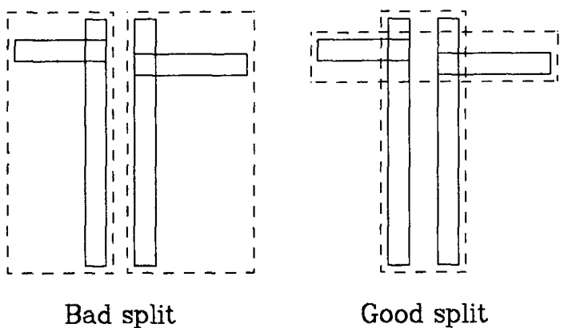

## 一、前言

空间数据对象通常覆盖多维空间中的区域，难以用点位置准确表示。例如，县、人口普查区等地图对象在二维空间中占据非零大小的区域。

常见的空间数据操作包括区域搜索（如查找特定点20英里内的所有县），这类操作在计算机辅助设计（CAD）和地理数据应用中频繁出现，因此需根据空间位置高效检索对象。

现有数据结构对于表示空间体或多或少有对应的缺点：

+ 传统的一维数据库索引结构（如哈希表、B树）无法满足多维空间搜索需求；哈希表基于精确匹配，不适用于范围查询；
+ 一维有序结构难以处理多维搜索空间。
+ 现有方法如单元分解、四叉树、k-d树等均存在局限性：或需预先划分边界，或未考虑外存分页，或仅支持点数据。

## 二、Rtree树定义

R-tree是一种高度平衡树，其结构与B树类似，在叶节点中存储指向数据对象的索引记录。若索引存储在磁盘上，则节点对应磁盘页，且该结构的设计确保空间搜索只需访问少量节点。该索引完全支持动态操作——插入和删除操作可与搜索混合执行，且无需定期重组。

空间数据库由表示空间对象的元组集合组成，每个元组具有可用于检索的唯一标识符。总体上Rtree分为叶子节点和非叶子节点。

### 2.1 叶子节点

R树中的叶节点中的主体形式为“（最小边界矩形，标识符）”的索引记录条目，其中 “标识符” 指向数据库中的空间对象，“最小边界矩形” 则是覆盖该对象的最小轴对齐矩形。

$$
(I, tuple-identifier)
$$

最小边界矩形是一个n维超矩体：

$$
I = (I_0, I_1, ..., I_{n - 1})
$$

### 2.2 非叶子节点

$$
(I, child-pointer)
$$

其中$I$ 和叶子节点是一样的，都是最小边界矩形，$child-pointer$ 是一个指针，且它指向下一级节点的地址。

### 2.3 性质

令 $M$ 为rtree树中一个节点所能存储的最大元素个数，通常指定$m \leq M$，以满足一个节点中至少需要有多少个节点。

一般而言，Rtree树满足如下性质：

1. 除了根节点之外，每一个叶子节点为 $N_{leaf}$:  
    $m \leq N_{leaf} \leq M$

2. 对于叶子节点中每一个索引记录 $(I, tuple-identifier)$，$I$是能够囊括 $tuple-identifier$ 的一系列空间元素的最小体积的矩形体。

3. 除了根节点之外，对于每一个非叶子节点而言，其存储的节点数量$N_{noleaf}$需要满足：  
    $m \leq N_{noleaf} \leq M$

4. 对于存储在非叶子节点中的元素，$(I, child-identifier)$，$I$是能够囊括 $child-identifier$ 的一系列空间元素的最小体积的矩形体。

5. 根节点是非叶子节点时，必须要有两个以上的子代。即根节点必须存储了两个以上$(I, child-identifier)$。

6. 所有叶子节点都在同一高度上。

类比于红黑树，其他对其平衡操作也就意味着这些操作需要满足保证操作之后无论是子树还是整个树仍然能够满足上面这些性质。

## 三、搜索数据

### 3.1 定义

R-tree搜索的核心目标是：给定一个查询矩形，快速找出空间中所有与该矩形相交的数据对象矩形。这一需求直接推动了R-tree的设计——通过分层组织空间数据（用最小边界矩形近似表示对象），在搜索时逐层过滤不重叠的节点，最终高效返回所有相交对象，避免暴力遍历全部数据。

__定义：给定一个R-tree树T，查看树中哪些矩形待搜索的矩形S是相交的。__

论文中针对子树和叶子节点分别设计了递归处理流程，具体步骤如下：

1. 判断节点类型：检查当前子树 subTree 是否为叶子节点。
    + 若 subTree 不是叶子节点，转至步骤2。
    + 若 subTree 是叶子节点，转至步骤3。

2. 处理非叶子节点：
    + 遍历 subTree 中的每个元素 E。
    + 检查元素 E 所对应的矩形范围 E.I 是否与查询矩形 S 相交。
    + 若相交，则将 E 视为一个新的子树 subTree_new，并递归跳回步骤1进行处理。

3. 处理叶子节点：
    + 依次检查 subTree 中每个元素 E 是否与查询矩形 S 相交。
    + 若相交，将 E 记录为查询结果。

## 四、数据插入

R-tree 的插入算法仿照 B 树设计：新索引项首先被插入到适当的叶子节点中；若该节点发生溢出，则进行分裂操作，而分裂可能沿路径向上传播，直至根节点。

插入算法过程整体如下：

1. 找到插入位置的叶子节点：  
    调用<b>选择叶子算法</b>，找到放置存储元素R的叶子节点L中的位置E。

2. 添加自选元素到叶子节点中：  
    + 如何叶子节点L还有剩余空间来放置存储元素R，那就直接将其放到位置E。
    + 否则调用<b>分裂节点算法</b>，将当前叶子节点分为L和LL两部分。L包含的是以前的元素，而LL是包含了新存储元素R。

3. 向上传递变化：  
    在子树L上，调用<b>调整树算法</b>，并且对子树LL也要调用调整树算法。

4. 提升树的高度：  
    如果节点分裂传播导致根节点分裂，则创建一个新根节点，其子节点为分裂后生成的两个节点。

在插入的整个过程中，涉及了三个子算法：

+ 选择叶子算法
+ 分裂节点算法
+ 调整树算法

接下来一一讲述这三个算法的实现方式。

### 4.1 选择叶子算法

它的目的是找到新存储元素R在R-tree树中的哪一个叶子节点的哪一个索引位置。

1. 初始化：  
    令N为整个树的根节点。

2. 叶子节点判断：  
    判断N是否为叶子节点。如果是直接返回，如果不是，执行第三步。

3. 选择子树：  
    为了让整个子树增加的面积最小，依次判断N中的存储的子树$E_i$，选择子树$E_i$中的为了包含新存储元素 $R$ 之后，增加的超矩形体的体积最小的。如果是新增面积一致，选择超矩形体最小的。

4. 向下遍历直到叶子节点：  
    设置N为第三步中选择的子树，跳转到第二步。

### 4.2 调整树算法

它的目的是让树平衡。整个过程是从叶节点$L$，向上遍历至根节点，根据需要调整覆盖矩形并传播节点分裂。

1. 初始化：  
    令$N = L$，其中L是叶子节点。如果L在之前被分裂过，则将 $NN$ 设置为分裂后生成的第二个节点。

2. 检查调整过程是否完毕：  
    如果N是根节点，那么结束调整。

3. 调整父条目中的覆盖矩形：  
    令P为节点N的父节点，$E_N$为 $N$ 在P中的元素表示，调整$E_N.I$，使其能够紧密包含$E_N$中的所有元素。

4. 向上传播节点分裂：  
    + 前提条件：  
        当前节点有一个<b>同伴节点</b> $NN$ ——— (即因之前调整（如插入数据过多）而分裂后产生的第二个新节点)。  
    + 创建新的条目：  
        - 为 $NN$ 创建一个新的条目$E_{NN}$，其中$E_{NN}.P$（指针字段）指向节点 $NN$。  
        - 其中$E_{NN}.I$（最小边界矩形）需要重新计算，使其紧密覆盖 $NN$ 中所有子条目的实际空间范围（若 $NN$ 是叶节点，则覆盖其数据矩形；若 $NN$ 是非叶节点，则覆盖其子条目的 超矩体）。  
    + 尝试将$E_{NN}$加入到父节点P中：  
        - 检查父节点 P 是否还有空闲容量（即未超过最大条目数）。
        - 如果有剩余空间，直接将新条目 $E_{NN}.I$ 插入父节点 P。
    + 处理父节点溢出：  
        如果父节点 P 已满（无剩余空间），则调用分裂节点算法：  
        - 将 $P$ 的原有条目与新条目 $E_{NN}$ 一起重新分配，分裂成两个新节点 $P$ 和 $PP$.
        - $P$ 和 $PP$ 分别包含原条目和新条目的一个子集，且各自生成新的 MBR 覆盖其子节点范围。

5. 移至上一级：  
    令$N = P$，并且设置$NN = PP$，如果分裂产生了，然后跳转至第二步。

### 4.3 节点分裂算法

Anonim Guttman认为分裂节点算法应该具有如下初步设想：

> 在向已包含M个条目的满节点添加新条目时，需要将M+1个条目的集合分割到两个节点中。这种划分方式应尽可能降低后续搜索过程中需要同时检查两个新节点的概率。由于是否访问某个节点取决于其覆盖矩形是否与搜索区域重叠，因此，分割后两个覆盖矩形的总面积应当最小化。

> 图4-1直观展示了这一点——"差分割"情况下的覆盖矩形面积远大于"好分割"情况。

> 该准则与ChooseLeaf过程选择索引条目插入位置时使用的逻辑一致：在树的每一层级，选择的是需要扩展其覆盖矩形面积最小的子树。  

> 接下来我们将探讨将M+1个条目集合划分为两组（每组对应一个新节点）的算法实现。  

  
   
  <small>图4-1</small>

原文提出了三种分割算法：

1. 穷举算法  
    最直接的寻找最小面积节点分割的方法是生成所有可能的分组并选择最优解。然而，可能的组合数量约为 $2^{M-1}$，而$\pmb{M}$ 的合理值为 $50^{\bullet}$，因此可能的划分方案数量非常庞大。我们实现了一种改进的穷举算法变体，作为与其他算法比较的基准，但该算法在处理较大节点规模时速度过慢，无法实际应用。

2. 二次代价算法  
    __该算法的核心思想是通过启发式策略（非全局最优）实现高效且相对合理的节点分割.__

3. 线性代价算法  
    该算法（Linear Split）的核心思想是通过线性复杂度的高效策略选择初始种子条目，以快速启动节点分裂过程。

本文主要涉及二次代价算法和线性代价算法。

#### 4.3.1 二次代价算法

二次代价算法试图进行一个小范围的分割，但并不保证每一个元素都划分到最小覆盖体积内。其代价是$M$的二次，元素本身维度的一次。

其大致思想为：把这M+1个元素一分为二，先在这些元素中挑选出两个最不适合放在一起的元素，然后再将剩余元素分别放入这这些元素内部。怎么评判最不适合呢？那就是如何两个元素放到一起时，覆盖它的超矩形体的体积是最大的，那么它就是最不适合的。对于剩余的元素而言，每一步计算将每个剩余条目加入每组所需的面积扩展量，并选择两组扩展需求差异最大的条目进行分配。

具体流程和细节如下：

1. 为每组选择首个条目：    
    使用<b>PickSeeds</b>算法选择出两组中首个元素。并且将他们放入到这两个组中。

2. 检查是否分配完成：  
    如果所有的元素都被分配了，那么就停止。  
    如果一个组的元素很少，少于预设定的值m，那么就将它们填充到一个组中，然后停止。

3. 选择一个元素赋值：  
    调用<b>PickNext</b>算法，挑选出下一个条目进行赋值的。将其添加到需要最小扩展覆盖矩形即可容纳该条目的组中（即选择扩展面积代价最小的组）。若出现平局（即扩展代价相同），则按以下优先级解决：  
    + 优先添加到当前覆盖面积较小的组；
    + 若面积相同，则添加到条目数量较少的组；
    + 若仍相同，可任意选择一组。  
        完成后从步骤 2 开始重复此过程。

上面涉及到的<b>PickSeeds</b>算法和<b>PickNext</b>算法，先说明<b>PickSeeds</b>算法。

<b>PickSeeds算法</b>：

1. 计算将两个条目分到同一组的效率损失值：  
    对于每对条目 $E_1$ 和 $E_2$，构造一个同时包含 $E_1$ 和 $E_2$ 的最小矩形 J的面积。并同时计算效率  
        $d = area(J) - area(E_1) - area(E_2)$.

2. 挑选出最浪费的一对：  
    选择出最大的一个d.

<b>PickNext算法</b>：

1. 计算将每个条目分配到每个组的成本：  
    对于每个尚未分组的条目 E，计算将其包含到组 1 的覆盖矩形中所需增加的面积 d1。同样地，计算将其包含到组 2 的覆盖矩形中所需增加的面积 d2。

2. 选择对某一组偏好最强的条目：  
    选择任意一个在 $d_1$ 和 $d_2$ 之间具有最大差异的条目。

#### 4.3.2 线性代价算法

线性代价算法是与M和一个元素本身具有的维度是线性的。线性代价算法除了<b>PickSeeds算法</b>不一样以外，其他都是一致的。

<b>$linear Pick Seeds$ 算法</b>：

1. 沿每个维度寻找极端矩形：  
    + 沿着每个维度找出所有条目中矩形下界（low side）最大值对应的条目 $E_{high_low}$.
    + 找出所有条目中矩形上界（high side）最小值对应的条目 $E_{low_high}$.
    + 计算该维度上的间隔值（separation）:  
        $separation = E_{low_high}.high_k - E_{high_low}.low_k$

2. 根据矩形簇的形状调整:  
    将每个维度 k 上计算得到的间隔值（$separation_k$）除以整个条目集合在该维度上的总宽度（即所有条目在该维度上的最大上界与最小下界之差），进行归一化：  
        $normalized_separation_k = \frac{separation_k}{max(high_k) - min(low_k)}$  
    其中：  
        - $max(high_k)$:所有条目在维度 k 上矩形上界的最大值.
        - $min(low_k)$:所有条目在维度 k 上矩形下界的最小值。
​
3. 选择最极端的配对:  
    在所有维度中，选择归一化间隔值（$normalized_separation_k$）最大的维度 k, 并将该维度对应的两个极端条目（即 LPS1 中记录的 $E_{high_low}$ 和 $E_{low_high}$作为初始分组的种子。

## 五、数据删除

删除算法是找到想要删除的元素E，然后将其从树中移除。

1. 找到包含元素E的叶子节点：  
    使用findleaf算法定位出元素E所在的叶子节点L。如果没有找到的话就直接返回。

2. 删除节点：  
    从叶子节点L中移除对E的索引。

3. 传播改变：  
    调用$condenseTree$算法，并传递参数为L。

4. 减低树的高度：  
    如果经过调整，整个树的根节点有且仅有一个子代，那么就让这个子代作为新的根节点。

下面介绍上面过程中涉及到的 $findLeaf$ 算法和 $condenseTree$ 算法。

### 5.1 findLeaf算法

目的：给定树的根节点T，然后找到索引元素E所在的叶子节点L。

步骤如下：

1. 搜索子树：  
    + 检查T中存储的每一个元素F是否覆盖待搜索元素L，使用$F.I$ 是否完全覆盖 $E.I$。  
    + 如果覆盖，那么将当前覆盖的元素F作为新的根节点，然后调用FindLeaf算法，否则跳过，选择下一个元素。  
    + 退出条件：直到当前子树的根节点T中所有元素都检查完毕或者是已经找到了元素E所在的叶子节点。

2. 搜索叶子节点：
    如果T是一个叶子节点，检查T中的每一个元素，判断存储元素是否相等。如果相等就返回叶子节点T。

### 5.2 condenseTree算法

给定一个已删除条目的叶子节点 L，若该节点剩余条目过少则将其消除并重新安置其条目。必要时向上传播节点消除操作，并调整根节点路径上的所有覆盖矩形，尽可能缩小其范围。

步骤如下：

1. 初始化：  
    设$N = L$。设定空集Q，这个空集Q用于放置重新放置的节点。

2. 查找父节点：  
    如果N是根节点，就跳转到第六步。否则，取名N的父节点为P，N节点在P中的位置为$E_N$.

3. 删除空节点：
    如果节点N存储的元素少于m个，那么就从P中删除$E_N$的索引，并且将N放入到Q中。

4. 调整覆盖的矩形：
    如果N并没有被删除，那么就调整 $E_N.I$，使得 $E_N.I$ 刚好覆盖住其存储的所有元素。

5. 移动至上一级进行调整：  
    设 $N = P$，跳转至第二步执行。

6. 重新插入存储在Q中孤儿条目：  
    + 从已消除的叶子节点中取出的条目，按照插入算法（Algorithm Insert）的描述重新插入到树的叶子节点中。  
    + 从更高层级节点（非叶子节点）中取出的条目，必须被放置在树中更高的层级，以确保其依赖子树中的叶子节点与主树的叶子节点处于同一层级。  

上述处理节点条目过少（under-full）的方法与B树中的对应操作（即合并两个或多个相邻节点）不同。尽管在R树中无法像B树那样定义“相邻节点”，但类似B树的方法仍是可行的：例如，可以将条目过少的节点与使其面积增加最小的兄弟节点合并，或者将孤儿条目重新分布到兄弟节点中。这两种方法均可能引发节点分裂。

我们选择重新插入（re-insertion）而非合并或重分布，主要基于以下两个原因：

1. 实现简便性与功能等效性：  
    重新插入操作能达到相同的优化效果（调整树结构、平衡节点负载），且更易于实现——可直接复用现有的插入例程（Insert routine）。
    效率上应相当：因为重新插入过程中所需的页（节点）通常已在内存中（这些页正是此前搜索操作所访问过的）。

2. 空间结构的渐进优化：  
    重新插入能够逐步优化树的空间结构（如减少矩形重叠、改善分区），避免因条目永久固定于同一父节点下而可能导致的树结构逐渐退化（例如局部密度过高或矩形膨胀）。

__关键对比__：

+ B树式合并：依赖“相邻”概念（如键值相邻），但R树中无显式相邻关系，需通过几何启发式（如最小面积增加）选择合并目标。
+ 重新插入：通过动态重分布条目，主动优化全局结构，更适合多维空间数据的动态特性。

此设计体现了R树在平衡操作复杂性与长期性能之间的权衡。

## 六、数据多样化方向

如果数据元组被更新导致其覆盖矩形发生变化，则必须删除其索引记录，更新后再重新插入，以确保其能定位到树中的正确位置。

除了上述搜索类型外，其他类型的搜索也可能很有用，例如查找完全包含在搜索区域内的所有数据对象，或包含搜索区域的所有对象。这些操作可通过上述算法的直接变体来实现。删除算法需要根据已知标识搜索特定条目，该功能由算法 FindLeaf 实现。R树也能良好支持区域范围删除的变体操作，即移除特定区域内所有数据对象的索引条目。

