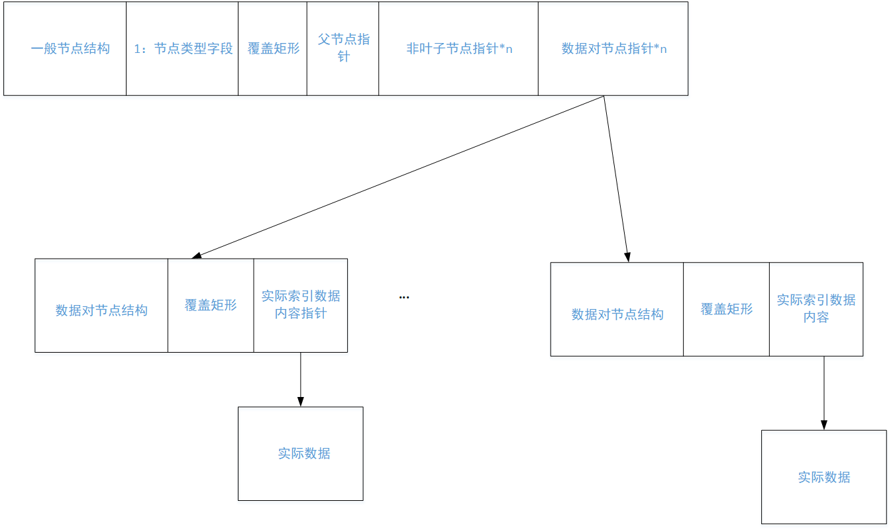
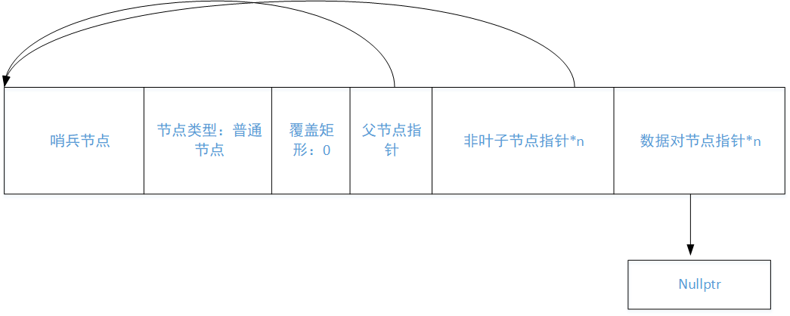
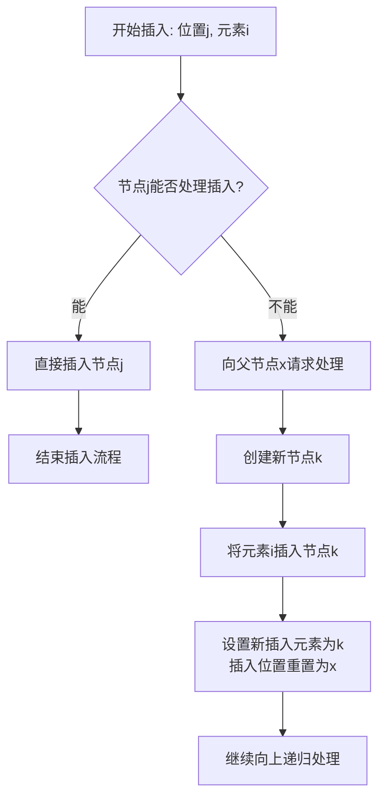

## 一、树结构设计

首先看看对于Rtree树本身而言，用户有哪些常见的需求。

1. 理论上是支持n维的几何体搜索，因为我们需要设计它可以根据用户需要设计为任意的维度。

2. 它可以支持用户自定义维度坐标中的数据类型，例如int, double, long double等等，也支持自定义的类型，只要它满足数据计算即可。

3. 它支持用户自己存储时一个节点最大多少个。

4. 能够自定义实际存储的几何体的数据结构，例如有的想要使用std::vector来表示，有的想要使用std::array来表示。

因此根据上面的要求，常见的模板类标头如下：

```c++
/**
 * @brief 通用 N 维 R-tree 空间索引结构
 *
 * @tparam CoordinateType_t  坐标值的数据类型（必须支持比较与算术运算）
 * @tparam Dimension_t       空间维度（如 2D, 3D, N-D），编译期常量
 * @tparam MaxEntries        每个节点最大子节点/条目数量（影响树高与查询性能）
 * @tparam IndexType_t       几何索引项的类型
 *
 * 示例：
 *   RTree<double, 3, 16, MyBox> rtree; // 3D空间，double坐标，每节点最多16个条目
 */
template<typename CoordinateType_t, std::size_t Dimension_t, std::size_t MaxEntries, typename IndexType_t>
class RTree;
```

## 二、节点设计

在[rtree理论设计](2025-08-26-数据结构R_tree(一).md)可以看到，rtree树与b树有很多相似之处。它们都是实际存储的元素是放在叶子节点中，二非叶子节点不存储元素，只是放下层树的索引地址。

首先看看叶子节点有哪些需求：

1. 保有一个固定大小的数组。数组中的元素为一个pair，pair的第一个字段表示存储的元素可以用一般的n维超矩体表示，第二个字段就是表示实际几何体存放的位置。
2. 表示当前实际存储了多少个元素。
3. 保有指向父指针。（主要是方便实现）
4. 覆盖当前存储的所有几何体的超矩体表示。

再来看看非叶子节点的需求：

1. 保有一个固定大小的数组。数组中的元素是指向下一级的子树的地址。
2. 表示当前实际存储了多少个元素。
3. 保有指向父指针。（主要是方便实现）
4. 覆盖当前存储的所有几何体的超矩体表示。

综上可以得到一个既能表示叶子节点，又能表示非叶子的一般节点，它通过一个bool值区分。

一般节点：

1. 保有一个固定大小的数组。数组中的元素为一个pair，pair的第一个字段表示存储的元素可以用一般的n维超矩体表示，第二个字段就是表示实际几何体存放的位置。
2. 保有一个固定大小的数组。数组中的元素是指向下一级的子树的地址。
3. 表示当前实际存储了多少个元素。
4. 保有指向父指针。（主要是方便实现）
5. 覆盖当前存储的所有几何体的超矩体表示。
6. 表示当前节点是叶子节点还是非叶子节点的bool值。

并且为了方便可以实现如下一个模板类的超矩体。

```c++
template<typename T, std::size_t Dimensions = 2>
struct Hyperrectangle {
    std::array<T, Dimensions> min_corner; // 最小角点（左下）
    std::array<T, Dimensions> max_corner; // 最大角点（右上）

    using value_type = std::array<T, Dimensions>;

    Hyperrectangle(value_type & _max, value_type & _min) 
        : min_corner(_min), max_corner(_max)
    {}
};

template<typename T, size_t N>
Hyperrectangle(std::array<T, N>, std::array<T, N>) -> Hyperrectangle<T, N>;
```

实际存储的类型和表示的维数是由构造rtree树时，用户设定的。当然也可以使用别名模板方便用户使用。

根据前面的内容可以设计节点为：

```c++
struct Node_t {
    using leaf_type = typename std::pair<RTree::mapped_type *, RTree::key_type>;
    using leaf_type_pointer = leaf_type *;
    using node_type = Node_t;
    using node_type_pointer = Node_t *;

    RTree::key_type m_Hyperrectangle;
    std::array<leaf_type_pointer, RTree::k_maxSize> m_Data;
    std::array<node_type_pointer, RTree::k_maxSize> m_node;

    std::size_t m_size;
    bool m_isLeaf;
    Node_t * m_parent;

    /*其他字段要求*/
}

```

对于单个叶子节点而言，其字段如图2-1所示：

<div align="center">
  
  <br>
  <small>图2-1</small>
</div>


即内部包含的是数据对节点的指针，它指向的是数据对结构体，目的是让描述这个元素的矩形和实际元素绑定在一起。数据对中绑定的是实际数据的指针，但也可以直接是数据。

整体的树结构如图2-2所示：

<div align="center">
  
  <br>
  <small>图2-2</small>
</div>

## 三、边界处理

如果处理没有数据的情况呢，或者是分别出边界呢？一种流行的方法是，使用哨兵节点。

哨兵节点并不直接参与数据的存储，通常是利用哨兵节点构造出树被包围的感觉。

一种朴素的想法是，如果根节点的父节点和叶子节点的不存储数据的字段都存储的是哨兵节点的地址，那么整个树都被哨兵包围了。

### 3.1 哨兵初始化

哨兵节点是作为边界节点，那么就需要确定它被初始化时各个字段的内容。

1. 节点类型  
    普通节点，理由：由于非空树的父节点是哨兵节点，而由于数据都放在叶子节点中，所以为了不和一般的准则相悖，设置为非叶子节点。

2. 覆盖矩形  
    为零，任意

3. 父节点指针  
    指向哨兵节点的地址，可通过父节点和自身节点均是哨兵节点判定当前节点是哨兵节点

4. 非叶子节点指针  
    指向哨兵节点的地址，可通过字节点和自身节点均是哨兵节点判定当前节点是哨兵节点

5. 数据对节点指针
    赋值为空，因为不知道如何默认构造，所以选择为空节点。

那么整体结构如图3-1所示：

<div align="center">
  
  <br>
  <small>图3-1</small>
</div>

### 3.2 节点初始化

叶子节点和非叶子是字段节点类型来进行区分的。

那么什么时候会出现构建叶子节点呢？有如下情况：

1. 当前树没有任何东西

2. 插入位置的叶子节点已经存满了，需要构造一个新的叶子节点，从而让数据对节点插入


什么时候会出现构建非叶子节点呢？

假设准备插入的节点位置是j，插入的元素是i，对于节点j来说，无论它是准备叶子节点的插入还是非叶子节点的插入，就是节点j存储的位置满足，此时它处理不了，一般处理方式是向树的父节点请求处理这个情况，假设节点j的父节点是x。也就是说，需要构建一个新的节点k，将节点i插入到节点k中，然后再将插入的元素重新设置为k，然后插入位置重新设置为x。



根据上面的分析，可以如下处理一般构建时各个字段的初始化内容：

1. 节点类型：  
    可选参数，根据传入参数设置。也可以默认为叶子节点，根据实际情况在外部调整。

2. 覆盖矩形：  
    为零或者是任意。

3. 父节点指针：  
    指向哨兵节点，表示边界。

4. 非叶子节点指针：  
    指向哨兵节点的地址，为了处理树第一次插入数据时存储实际数据的根节点。

5. 数据对节点指针：  
    赋值为空，因为不知道如何默认构造，所以选择为空节点。

## 四、删除节点初探

在前面的文章中，删除节点之后，其平衡的策略的主要思想为，收集不满足要求的节点，然后调整覆盖矩形，然后递归调整上一级节点。

在理论篇时，整体讲述了删除节点之后调整的过程，需要注意如下点。

1. 删除节点之后，重新收集的节点类型：  
    + 整个过程只会在删除节点之后，第一次判定该叶子节点是否满足最小数量要求时，收集到的元素都是元素对，其余时候向根节点递归判定时，都是一般的子树。
    + 这也就意味着，可以将这些节点分别放置，一般元素对为集合Q1，子树节点的归置集合为Q2。

2. 什么时候就不需要再判定节点中存储的数量是否满足最小数量要求：  
    当我们删除一个叶子节点中的元素对之后，什么时候就可以停止收集节点了呢？模拟一下整个过程：  
    + 第一步，实际索引的元素都是在叶子节点中存储，当叶子节点中的元素少于最小要求，此时把叶子节点中所有元素放入归置结合Q1。  
    + 第二步，然后将当前叶子节点从它的父结点中去除索引，然后再检查父节点中的元素是否满足最小元素要求。此时父节点已经是普通节点了，那么它存储的元素都是子树。  
    + 第三步，假设这个时候的父节点仍然不满足要求，那么就将父节点中的所有元素放入到归置集合Q2中，然后按照这个逻辑重新检查父节点的父节点，以此类推。
    + 第四步，如果这个是否发现某一层节点去除待删除节点之后仍然满足最小要求，那么这个时候就可以退出对数量最小化的要求判定了。  

3. 什么时候将待归置元素重新插入到树中呢？  
    在理论篇中，作者认为需要检查到根节点之后，在将这些待归置元素重新插入到树中，但作者同时强调了一个原则：  
    <b>从更高层级节点（非叶子节点）中取出的条目，必须被放置在树中更高的层级，以确保其依赖子树中的叶子节点与主树的叶子节点处于同一层级。</b>  
    因此，重插入的时机应该选择在当不再收集元素之后，立即以该节点作为根节点，再将这些收集到的元素插入到以该节点为根节点的子树中。

4. 如何进行插入呢？即回答这四个问题：  
    + 先插入大的子树还是小的子树或者是元素对呢？  
        个人认为先插入大子树，因为收集到的元素至少是当前索引节点的下一级节点，各类树的思想都是以广度优先，即尽量将节点插入到离根节点的地方。而重插入时尽量将归置节点放到同一高度下，因此先将大节点插入。  
    + 如何判定当前节点表达的是大子树还是小子树呢？  
        需要在节点中增加一个字段，表示当前节点的高度，离根节点越近的节点，那么它的高度值就越大。  
    + 如何判定搜索位置呢？  
        根据节点中的高度判定是否需要下一级节点搜索。
    + 重插入是否会导致插入的根节点呢？  
        不会，因为插入之前，以停止收集的节点做为根节点的子树已经具有容纳当前所有节点所有元素的能力，当重新插入之后，最多重新生成之前去除索引的节点，而不会导致当前根节点不能容纳的情况。

5. 高度值如何计算？  
    以当前索引节点中高度值最大的，然后+1就能够表示它的高度。

## 五、插入操作

### 5.1 寻找合适节点

首先明确下寻找到合适的插入位置都有哪些场景需求。前面分析到整个树既有叶子节点，也有普通节点的情况。插入时会在存在着直接插入数据对的情况，也存在着插入子树的情况。数据对是可能是由于用户插入数据导致的，也有可能是删除操作导致整个树节点的重平衡导致的。

1. 查找元素对插入位置

2. 查找子树插入位置

前面提到，为了保证插入子树在同一高度，那么在字段中引入了高度值。那么为了写出一般化的查找节点算法，可以引入下面的变量情况：

1. 插入节点的矩形描述
2. 插入节点的高度
3. 被插入的子树根节点


先考虑只有数据对插入时的查找要求。

```c++
Node_t * ChooseLeaf(const key_type & _key, Node_t * _root, std::size_t _height) {
    if (isSentinel(_root->m_parent)) {
        return _root;
    }
    Node_t * rootNode_i = _root;

    while(1) {
        if (rootNode_i->_height == _height) {
            break;
        }

        auto bestNode = std::min_element(
            rootNode_i->m_node,
            rootNode_i->m_node + rootNode_i->m_size,
            [R = std::cref(rootNode_i-> m_Hyperrectangle)] (const typename Node_t::data_type & val1, const typename Node_t::data_type & val2) {
                // 计算 val1 的 MBR 包含 R 后的新体积
                auto enlargedRect1 = combine(val1.first, R);  // combine 返回包含两个矩形的新矩形
                auto growth1 = volume(enlargedRect1) - volume(val1.rect);

                // 计算 val2 的 MBR 包含 R 后的新体积
                auto enlargedRect2 = combine(val2.first, R);
                auto growth2 = volume(enlargedRect2) - volume(val2.rect);

                // 优先比较扩张体积：越小越好
                if (growth1 != growth2) {
                    return growth1 < growth2;
                }

                // 若扩张体积相同，选择原始体积更小的节点（更紧凑）
                return volume(val1.rect) < volume(val2.rect);
            }
        );
    }

    return rootNode_i;
}
```

### 5.2 插入调整算法  

当前面节点查找算法已经为我们找到一个合适的位置，那么此时只需要将节点尝试插入。那么想要插入的节点超限了，那么就需要构造一个插入节点的兄弟节点，然后将待插入元素根据一定的算法插入到这两个节点中。

在3.2节的节点初始化已经说明了如何进行分配。

那么整体上插入一个元素步骤如下：

1. 找到插入节点的位置，设为P。

2. 尝试将待插入元素i加入到待插入节点P中。  
    + 插入节点为哨兵节点：即为空树的第一次插入或者是需要增加树的高度。
    + 插入节点的容量不足：跳转到第三步。
    + 插入节点元素满足，可以直接插入，完成插入。

3. 构建一个新的兄弟节点N，调用分裂节点算法将节点P和节点N中的元素以及待插入元素i重新分配到P和N中。

4. 将待插入元素设为N，并将插入节点P设为P的父节点，跳转到第二步。

5. 申请一个节点，将待插入元素插入其中，并且将整个树的根节点更新，结束插入过程。

在这里，可以看出来仅仅是为了让节点能够正常插入到树中。在插入过程中，需要维护两个字段：

+ 一个是整个子树（包括叶子节点和非叶子节点）的矩形描述。  
    这个基本就是调用覆盖算法得到一个覆盖所有存储元素的矩形即可。

+ 子树的高度：  
    这个就是获取存储的元素的高度的最大值。

那么子树的矩形描述可以在计算前后其矩阵描述未发生变化的情况下，终止执行。

树的高度变化就是在高度值不再变化之后既可以终止执行，那么它和插入过程的终止有关系吗？好像没有。

那么子树高度是在哪里变化的呢？它是由于根节点传入新的不可插入的节点之后从而增加的。

```c++
template<typename T>
void adajustTree(Node_t * pInsertNode, T * pElement) {

    bool kIsElementPair = std::is_same_v<T, typename Node_t::leaf_type>;
}

```

## 六、删除操作

待续

