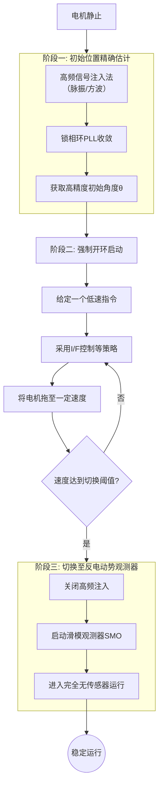

## 一、概述

无感电机控制（Sensorless Motor Control）是指在不使用物理位置传感器（如编码器、旋转变压器）的情况下，通过电机本身的电气特性来估算转子位置和速度，实现高性能控制的技术。

## 二、核心技术架构

启动策略三阶段流程如下所示：

### 2.1 初始位置估计

1. 状态特征
    + 转子处于完全静止状态
    + 反电动势信号为零，无法直接检测

2. 核心目标
    + 获得高精度初始转子位置（误差<10°电角度）
    + 准确识别磁极极性（N/S极）

3. 技术实现
    + 高频脉振电压注入法：注入高频电压信号，通过电流响应解调位置信息
    + 高频方波注入法：采用方波信号激励，提高信噪比
    + 锁相环收敛：驱动观测器收敛至真实位置

### 2.2 强制开环启动

1. 状态过渡
    + 已完成初始位置精确估计
    + 转子开始从静止状态启动

2. 控制策略
    + I/F控制原理：电流与频率成正比（I ∝ F）
    + 加速度斜坡：预设加速度曲线实现平稳启动
    + 同步旋转控制：强制拖动转子同步旋转

### 2.3 观测器切换与闭环运行

1. 换条件判断
    + 速度达到预设阈值（反电动势信号足够强）
    + 观测器收敛状态良好

2. 观测器技术选项
    + 滑模观测器：鲁棒性强，适用于中高速范围
    + 龙贝格观测器：动态响应快，精度高
    + 扩展卡尔曼滤波器：抗噪声能力强，适用于复杂工况

