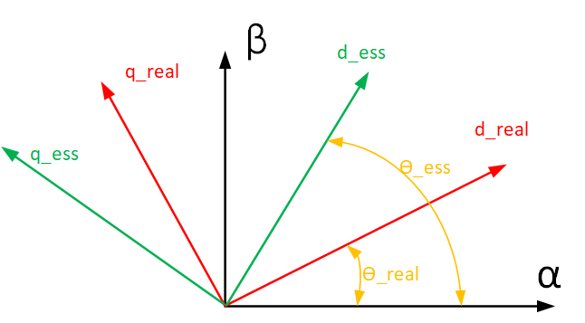

## 一、问题背景

高频脉冲注入技术旨在解决电动机在低速运行时，因反电动势等有用信号幅值过小、信噪比极低，导致传统无传感器方法无法准确提取转子位置信息的难题。它通过主动注入高频激励信号，利用电机在高频下的响应特性来估计位置，从而突破了零速和极低速下无感控制的技术瓶颈。

## 二、基本原理解析

高频脉冲注入就是向电机的d轴注入持续输入一段电压，这个电压的频率和幅值是自己定义的。主要参考的是，线性系统的输出响应是频率有关的函数，当频率越大时，其响应的幅值波动就越大。

`pmsm` 的电压方程如下：

$$
\begin{align}
u_d = R i_d + \frac{d{\varphi_d}}{dt} - \omega \varphi_q \tag{2-1}
\end{align}
$$

$$
\begin{align}
u_q = R i_q + \frac{d{\varphi_q}}{dt} + \omega \varphi_d \tag{2-2}
\end{align}
$$

dq坐标轴里磁链矢量和电流矢量之间的数学关系：

$$
\begin{align}
\varphi_d = L_d i_d + \varphi_f \tag{2-3}
\end{align}
$$

$$
\begin{align}
\varphi_q = L_q i_q \tag{2-4}
\end{align}
$$

因为在高频注入中，并不关心磁链，只关心电压电流之间的关系，因为电压是输入，这个是已知，电流可以采集到，这个也是已知的，通过这俩来获取转子的位置信息。将这两者联立可以得到如下方程：

$$
\begin{align}
u_d = R i_d + L_d \frac{d{i_d}}{dt} - \omega L_q i_q \tag{2-5}
\end{align}
$$

$$
\begin{align}
u_q = R i_q + L_q \frac{d{i_q}}{dt} - \omega (L_d i_d + \varphi_f) \tag{2-6}
\end{align}
$$

这两个公式中$\omega$是转子转动的电角速度。如果将此时注入一个高频电压信号，将这个和原本的控制电机dq轴的输出电压相叠加。

由于我们注入的电压信号频率非常高，远高于电机正常运行的基波频率，因此在分析高频响应时，电压方程中的电阻项 R*id 与电感产生的感抗项相比，其影响小得多，可以忽略不计。

$$
\omega L_q i_q \approx 0 
$$

同样因为高频信号频率远高于基波频率，那些与基波频率相关的电压项（即反电动势项）也可以忽略不计。

$$
Ri_d \approx 0
$$

所以原来的电压电流方程简化后如下：

$$
\begin{align}
u_{dhfi} \approx  L_d \frac{d{i_{dhfi}}}{dt} \tag{2-7}
\end{align}
$$

$$
\begin{align}
u_{qhfi} \approx  L_q \frac{d{i_{qhfi}}}{dt} \tag{2-8}
\end{align}
$$

式7和式8得到了高频信号下，dq坐标系的响应。但是实际并不知道真实的dq坐标系，只能自己预先估计一个dq轴的坐标系，如图2-1所示：

  
   
  <small>图2-1</small>

其中坐标系$d_{real}$-$q_{real}$表示转子的真实dq轴坐标系位置，而 $d_{ess}$-$q_{ess}$ 表示我们估计的坐标系位置。一般来说，估计坐标系 $d_{ess}$-$q_{ess}$ 和真实的坐标系 $d_{real}$-$q_{real}$ 是由较大差异的。

所以令误差变量为

$$
\begin{align}
\theta_s = \theta_{real} - \theta_{ess}
\end{align}
$$

初步设想是，通过输入电压和采集到的电流信息，将估计坐标系 $d_{ess}$-$q_{ess}$ 慢慢收敛到 $d_{real}$-$q_{real}$ 坐标系，那么也就获取到了真实位置了。

那么需要解决两个问题：

1. 如何将估计坐标系 $d_{ess}$-$q_{ess}$ 向 $d_{real}$-$q_{real}$ 坐标系收敛。
2. 如何判断估计坐标系 $d_{ess}$-$q_{ess}$ 已经收敛到了 $d_{real}$-$q_{real}$ 坐标系了。

首先，先看看如何进行收敛。一群大牛们发现，如何通过向d轴注入高频电压，然后观测q轴的电流，当q轴的电流能够慢慢减小，此时也就意味着向 $d_{real}$-$q_{real}$ 坐标系收敛了。并且，如果当q轴坐标系的电流接近于零时，那么也就意味着它已经收敛到了坐标系了。

首先建立真实的 $d_{real}$-$q_{real}$ 轴坐标系与估计的 $d_{ess}$-$q_{ess}$ 之间的关系。将高频脉冲电流通过旋转矩阵变换到估计坐标系下

$$
\begin{bmatrix}
    \frac{di_{dhfi}}{dt} \\
    \frac{di_{qhfi}}{dt}
\end{bmatrix}
= A^{-1}
\begin{bmatrix}
    \frac{1}{l_d} & 0 \\
    0 & \frac{1}{l_q}
\end{bmatrix}
A
\begin{bmatrix}
    u_{dhfi} \\
    u_{qhfi}
\end{bmatrix} \tag{2-9}
$$

其中A为旋转矩阵，描述的是 $d_{ess}$-$q_{ess}$ 到 $d_{real}$-$q_{real}$ 的旋转动作.

$$
A =
\begin{bmatrix}
    cos(\theta_s) & sin(\theta_s) \\
    -sin(\theta_s)& cos(\theta_s) 
\end{bmatrix}
$$

经过化简之后，可以得到如下等式：

$$
\begin{align}
\frac{di_{dhfi}}{dt} = \frac{(L + \Delta Lcos(2\theta_s))u_{dhfi} + \Delta L u_{qhfi} sin(2\theta_s)} {L^2 - \Delta L^2} \tag{2-10}
\end{align}
$$

$$
\begin{align}
\frac{di_{qhfi}}{dt} = \frac{(L - \Delta L cos(2\theta_s))u_{qhfi} + \Delta L u_{dhfi} sin(2\theta_s)} {L^2 - \Delta L^2} \tag{2-11}
\end{align}
$$

其中，$L$ 是平均电感，$\Delta L$是半差电感：

$$
\begin{align}
L = \frac{L_q + L_d} {2} \\
\Delta L = \frac{L_q - L_d} {2}
\end{align}
$$

看起来似乎可以选择任意一个让其为零，但实际上为了比较好的效果，往往选择是d轴注入，这样q轴就没有输入，这样也会让转子静止下来，去收敛一个静态目标往往比收敛一个动态目标更好。

因此注入电压信号为

$$
\begin{align}
u_{dhfi} = |u_{dhfi}|cos(\omega_{hfi}t)
\end{align}
$$

$$
\begin{align}
u_{qhfi} = 0
\end{align}
$$

将上面两个式子带入并进行时间t的积分后有

$$
\begin{align}
i_{dhfi} = \frac{|u_{dhfi}| sin(\omega_{hfi}t)(L + \Delta L cos(2\theta_s))}{\omega_{hfi}(L^2 - \Delta L^2)}
\end{align}
$$

$$
\begin{align}
i_{qhfi} = \frac{|u_{dhfi}| sin(\omega_{hfi}t)\Delta L sin(2\theta_s)}{\omega_{hfi}(L^2 - \Delta L^2)}
\end{align}
$$

上面的q轴电流表达式已经携带了转子的位置信息，并且其式中仅有变量 $\theta_s$ 未知，其他都是已知的。

我们希望的是追踪一个静态量，那么可以对采集到的 $i_{qhfi}$ 乘以注入信号$sin(\omega_{hfi}t)$ ，这样导致 $i_{qhfi}$ 的频率进一步放大两倍。

$$
\begin{align}
i_{qhfi} sin(\omega_{hfi}t) = \frac{\Delta L |u_{dhfi}| (1 - cos(2\omega_{hfi}))sin(2\theta_s)}{\omega_{hfi}(L^2 - \Delta L^2)}
\end{align}
$$

将其做一个低通滤波器，过滤高频部分

$$
\begin{align}
LPF(i_{qhfi} sin(\omega_{hfi}t)) = K_{hfi} sin(2\theta_s)
\end{align}
$$

其中

$$
\begin{align}
K_{hfi} = \frac{\Delta L |u_{dhfi}|}{\omega_{hfi}(L^2 - \Delta L^2)}
\end{align}
$$

那么此时，当误差角度 $\theta_s$ 小于一定范围内时，他都是正比于 $\theta_s$，即

$$
\begin{align}
\lim_{\theta_s \to 0} LPF(i_{qhfi} sin(\omega_{hfi}t)) = K_{hfi} \theta_s
\end{align}
$$

$\theta_s$ 反应的是角度差，也就反应了速度差，那么通过PI控制器就可以估计一个速度，然后积分得到角度，从而估计得到转子的真实位置。

## 三、参数依赖

在第二章中看到，最终存在一个参数 $K_{hfi}$ 它依赖于电机参数，以及注入的弦波的频率。但是实际上可以把它看作是一个未知的放大系数，当获取到明显的电流变化时，可以通过调整PI参数来等效调整。

另外由于表贴式永磁同步电机会利用到饱和凸极效应，这会导致其会随着注入的d轴的电流而变化，此时使用平时测量的dq各自的电感也会受到较大的影响。因此反而将其认定为一个不变的增益，通过调节PI参数来等效的放大缩小，也就等效的估计了误差角度了。

详细参看[使用脉振高频注入法的位置估计](https://blog.csdn.net/linzhe_deep/article/details/118117211)的第二章永磁同步电机的凸极效应。

## 参考文章

1. [高频注入（HFI）原理分析Part1](https://zhuanlan.zhihu.com/p/362399772)
2. [Simulink永磁同步电机控制仿真系列七：使用脉振高频注入法的位置估计](https://blog.csdn.net/linzhe_deep/article/details/118117211)
3. [PMSM高频注入法学习笔记](https://zhuanlan.zhihu.com/p/1944362288527179852)

